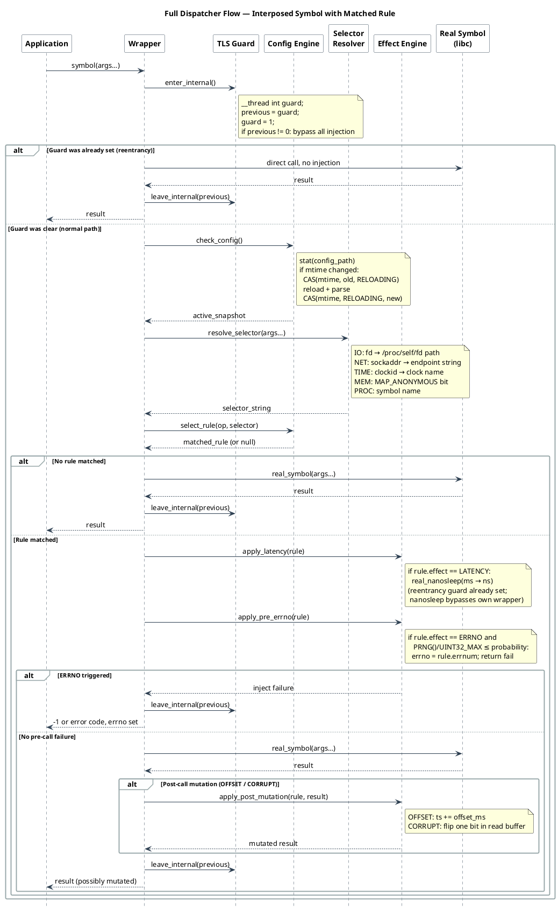
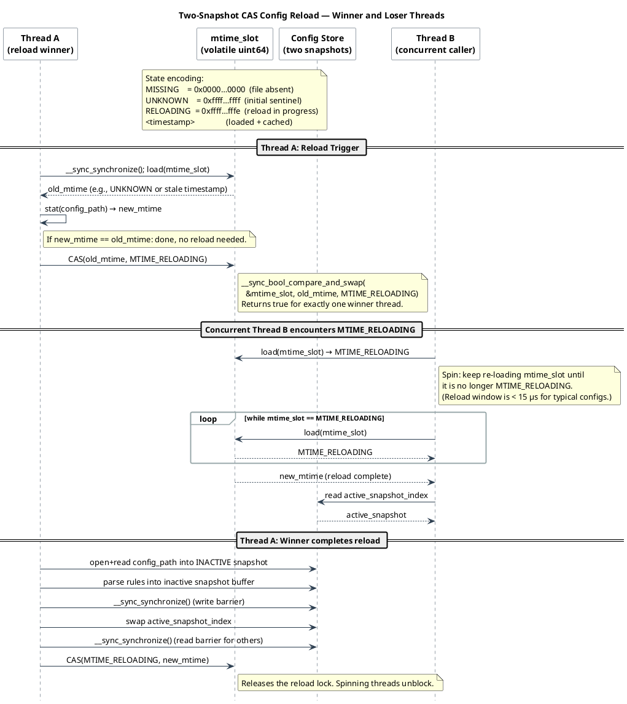
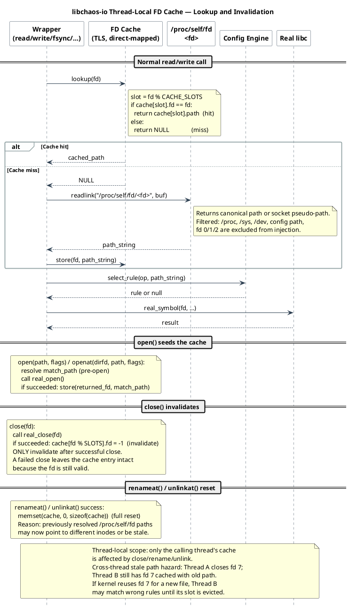

<!--
━━━━━━━━━━━━━━━━━━━━━━━━━━━━━━━━━━━━━━━━━━━━━━━━━━━━━━━━━━━━━
  Engineered by  Christian Schnapka
                 Embedded Principal+ Engineer
                 Macstab GmbH · Hamburg, Germany
                 https://macstab.com
━━━━━━━━━━━━━━━━━━━━━━━━━━━━━━━━━━━━━━━━━━━━━━━━━━━━━━━━━━━━━
-->

# Architecture

> *Engineered by* **[Christian Schnapka](https://macstab.com)** — Embedded Principal+ Engineer · [Macstab GmbH](https://macstab.com) · Hamburg, Germany

---

This document describes the repository-wide preload architecture and uses
`libchaos-io` as the reference implementation for the common execution model.
The repository also ships implemented `libchaos-net`, `libchaos-dns`,
`libchaos-time`, `libchaos-memory`, and `libchaos-process` libraries.
Each of those libraries has its own current-state technical reference:

- `libchaos-net` in
[`docs/NETWORK.md`](NETWORK.md)
- `libchaos-dns` in
[`docs/DNS.md`](DNS.md),
- `libchaos-time` in
[`docs/TIME.md`](TIME.md),
- `libchaos-memory` in
[`docs/MEMORY.md`](MEMORY.md),
- `libchaos-process` in
[`docs/PROCESS.md`](PROCESS.md).

## Table of Contents

- [Purpose](#purpose)
- [Execution Model](#execution-model)
- [Config Reloading](#config-reloading)
- [FD Path Resolution](#fd-path-resolution)
- [Fault Effects](#fault-effects)
- [Testing Strategy](#testing-strategy)
- [Platform Internals and Symbol Resolution](#platform-internals-and-symbol-resolution)
- [Formal Symbol-Ownership Theorem](#formal-symbol-ownership-theorem)
- [Maintenance Rules](#maintenance-rules)

## Purpose

Repository-wide, these libraries exist to inject controlled Linux libc-boundary
failures through small `LD_PRELOAD` shared objects. The sections below describe
that shared architecture through the `libchaos-io` implementation, because it
is still the clearest example of the common preload model.

The code stays intentionally narrow:

- no public SDK
- no config daemon
- no background thread
- no allocator-heavy data structures

## Execution Model

### Library initialization

[`src/core/chaos_io.c`](../src/core/chaos_io.c)

- Resolves the real libc symbols with `dlsym(RTLD_NEXT, ...)`.
- Seeds process entropy from `/dev/urandom`, with a deterministic fallback when that read fails.
- Seeds the current thread PRNG.
- Resets config and fd-cache state.
- Shares common fd-rule matching used by the wrapper translation units.

### Request flow

For each intercepted operation:

1. If the thread is already inside library internals, call straight through.
2. Ignore excluded paths and excluded fds.
3. Refresh config if the config mtime changed.
4. Match the path and operation against the active rules.
5. Apply latency, errno injection, torn writes, or read corruption.
6. Call the real libc symbol.
7. Update the fd cache when needed.

Wrapper families are split by responsibility:

- [`src/wrappers/chaos_io_fsops.c`](../src/wrappers/chaos_io_fsops.c)
  owns `ftruncate()`, Linux `fallocate()`, `unlinkat()`, and `renameat()`.
- [`src/wrappers/chaos_io_open.c`](../src/wrappers/chaos_io_open.c)
  owns `open()` and `openat()`.
- [`src/wrappers/chaos_io_rw.c`](../src/wrappers/chaos_io_rw.c)
  owns `read()`, `readv()`, `write()`, `writev()`, `pread()`, `preadv()`,
  `pwrite()`, `pwritev()`, and Linux `sendfile()` plus `copy_file_range()`.
- [`src/wrappers/chaos_io_sync.c`](../src/wrappers/chaos_io_sync.c)
  owns `close()`, `fsync()`, and `fdatasync()`.

Diagram — full dispatcher call flow ([source](diagrams/dispatch.puml)):

## Config Reloading

[`src/config/chaos_io_config.c`](../src/config/chaos_io_config.c)

- The config cache uses two snapshots.
- Reload writes into the inactive snapshot, then atomically flips the active index.
- Missing config means empty passthrough state.
- Invalid config means empty passthrough state.
- Matching uses longest-prefix wins with path-boundary checks.

That boundary rule is important:

- `/data` matches `/data/file`
- `/data` does not match `/database`

Diagram — two-snapshot CAS config reload ([source](diagrams/config_reload.puml)):

## FD Path Resolution

[`src/config/chaos_io_fdcache.c`](../src/config/chaos_io_fdcache.c)

- `read`, `readv`, `write`, `writev`, `fsync`, `fdatasync`, `pread`, `preadv`, `pwrite`, `pwritev`, `ftruncate`, and Linux `fallocate` operate on fds, not paths.
- The library resolves each fd through `/proc/self/fd/<fd>`.
- Resolved paths are cached in thread-local direct-mapped slots.
- Successful `close` invalidates the cache entry.
- Successful `unlinkat` and `renameat` reset the current thread cache because
  previously resolved path identities may now be stale.

Diagram — thread-local FD cache lookup and invalidation ([source](diagrams/fdcache.puml)):

## Fault Effects

[`src/effects/chaos_io_actions.c`](../src/effects/chaos_io_actions.c)

- `ERRNO`: fail before calling libc.
- `LATENCY`: sleep before calling libc.
- `TORN`: reduce the write length to a positive partial write.
- `CORRUPT`: call libc, then flip one bit in the returned buffer.

## Testing Strategy

### Unit tests

The unit tests include the implementation files directly where it improves reach:

- static helpers are exercised directly
- wrapper branches are tested without needing a real preload environment
- the production library remains unchanged apart from small testability hooks

That is why coverage can stay strict without adding exported test-only symbols.

### Coverage gate

[`test/runtime/check_coverage.sh`](../test/runtime/check_coverage.sh)

- Builds an instrumented tree in `build-coverage/`
- Runs all unit binaries
- Verifies `100.00%` line coverage for the shipped `libchaos-io`,
  `libchaos-net`, `libchaos-time`, `libchaos-memory`, and
  `libchaos-process` sources
- Verifies an enforced source-line coverage floor for the shipped
  `libchaos-dns` sources

### Style gate

[`test/runtime/check_format.sh`](../test/runtime/check_format.sh)

- Resolves `clang-format` from `PATH`, `CLANG_FORMAT`, or `xcrun`
- Checks or rewrites all shipped C sources and tests against the repository
  `.clang-format`

### Integration checks

[`test/runtime/test_integration.sh`](../test/runtime/test_integration.sh)

- Linux-only
- Builds the real shared object
- Verifies passthrough, injected errno failure, measured latency, and
  `openat()`, `readv()`, `writev()`, `preadv()`, `pwritev()`, `ftruncate()`,
  Linux `fallocate()`, `unlinkat()`, `renameat()`, and Linux `sendfile()` plus
  `copy_file_range()` runtime interposition on Linux hosts

[`test/runtime/test_glibc.sh`](../test/runtime/test_glibc.sh)

- Verifies the glibc Debian Docker build and runtime path, including direct
  `openat()`, `readv()`, `writev()`, `preadv()`, `pwritev()`, `ftruncate()`,
  Linux `fallocate()`, `unlinkat()`, `renameat()`, and Linux `sendfile()` plus
  `copy_file_range()` probes
- Accepts `linux/amd64` or `linux/arm64` as an optional explicit Docker target

[`test/runtime/test_alpine.sh`](../test/runtime/test_alpine.sh)

- Verifies the musl Alpine Docker build and runtime path, including direct
  `openat()`, `readv()`, `writev()`, `preadv()`, `pwritev()`, `ftruncate()`,
  Linux `fallocate()`, `unlinkat()`, `renameat()`, and Linux `sendfile()` plus
  `copy_file_range()` probes
- Accepts `linux/amd64` or `linux/arm64` as an optional explicit Docker target

[`test/runtime/test_net_glibc.sh`](../test/runtime/test_net_glibc.sh)
and [`test/runtime/test_net_alpine.sh`](../test/runtime/test_net_alpine.sh)

- Build and run the real `libchaos-net` shared object under glibc and musl
- Exercise `socket`, `bind`, `listen`, `connect`, `accept`, `shutdown`,
  `send`, `recv`, and readiness waits with endpoint-based rules
- Accept `linux/amd64` or `linux/arm64` as explicit Docker targets

[`test/runtime/test_dns_glibc.sh`](../test/runtime/test_dns_glibc.sh)
and [`test/runtime/test_dns_alpine.sh`](../test/runtime/test_dns_alpine.sh)

- Build and run the real `libchaos-dns` shared object under glibc and musl
- Exercise `getaddrinfo` failure injection, rewrite, service rewrite, latency,
  and synthetic answer manipulation
- Accept `linux/amd64` or `linux/arm64` as explicit Docker targets

[`test/runtime/test_time_glibc.sh`](../test/runtime/test_time_glibc.sh),
[`test/runtime/test_time_alpine.sh`](../test/runtime/test_time_alpine.sh),
[`test/runtime/test_memory_glibc.sh`](../test/runtime/test_memory_glibc.sh),
[`test/runtime/test_memory_alpine.sh`](../test/runtime/test_memory_alpine.sh),
[`test/runtime/test_process_glibc.sh`](../test/runtime/test_process_glibc.sh),
and [`test/runtime/test_process_alpine.sh`](../test/runtime/test_process_alpine.sh)

- Build and run the real `libchaos-time`, `libchaos-memory`, and
  `libchaos-process` shared objects under glibc and musl
- Exercise their dedicated runtime probes on both supported architectures
- Accept `linux/amd64` or `linux/arm64` as explicit Docker targets

## Platform Internals and Symbol Resolution

The detailed mechanics of ELF link-map ordering, PLT/GOT lazy binding, vDSO
dispatch, `AT_SECURE` stripping, `STT_GNU_IFUNC` resolver phases, and the
glibc/musl divergence matrix are documented in [`docs/PLATFORM.md`](PLATFORM.md).

Key facts that affect every wrapper in this repository:

**Link-map order and RTLD_NEXT:** `dlsym(RTLD_NEXT, name)` walks the link-map
starting from the DSO _after_ the caller. LD_PRELOAD libraries appear before
`DT_NEEDED` entries in the link-map. Therefore `RTLD_NEXT` from any chaos library
always reaches glibc/musl, regardless of LD_PRELOAD load order — provided no two
chaos libraries own the same symbol (the `one symbol, one owner` rule).

**PLT hot path cost:** After the first call (cold resolver dance), the GOT slot
for an interposed symbol points directly to the chaos library wrapper. The hot
path overhead is one indirect branch into the wrapper. See `docs/diagrams/linkmap.puml`.

**IFUNC and dlsym:** glibc uses `STT_GNU_IFUNC` (indirect function resolver) for
`clock_gettime`, `memcpy`, `strlen`, and similar. The IFUNC resolver fires at
`dl_open` time and resolves the function pointer to an architecture-optimal
implementation. `dlsym(RTLD_NEXT, "clock_gettime")` returns the post-IFUNC
resolved address, which is the vDSO-backed or syscall implementation. This is
correct. The chaos wrapper caches this resolved pointer.

## Formal Symbol-Ownership Theorem

This theorem is the mathematical basis for the architecture. See §17 of
[`docs/SYSTEM.md`](SYSTEM.md) for the complete proof. Short form:

> The interposition is correct if and only if every symbol is owned by at most
> one chaos library. If two libraries export the same symbol, RTLD_NEXT from the
> losing library resolves to the winning library's wrapper, not to glibc, causing
> double injection and preload-order-dependent behaviour.

The theorem's contrapositive is a direct rationale for the domain split:
`libchaos-net` must not own `read()` or `write()` because they are owned by
`libchaos-io`, and double ownership would make behaviour depend on LD_PRELOAD
order.

## Maintenance Rules

If you extend this library, keep these bars in place:

- preserve the no-public-API model
- preserve small output size
- keep new logic in C99
- extend unit coverage to 100% for any changed source file
- prefer boring, explicit code over generic abstractions

For the file-by-file maintenance map and wrapper-specific guidance, see
[`docs/ENGINEERING.md`](ENGINEERING.md).

---

*Architecture, implementation, and documentation crafted with Love and Passion by*

**[Christian Schnapka](https://macstab.com)**  
Embedded Principal+ Engineer  
[Macstab GmbH](https://macstab.com) · Hamburg, Germany

*Building systems that operate correctly at the edges — including the ones you deliberately break.*

