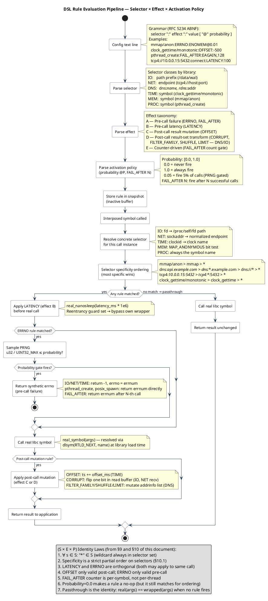

<!--
━━━━━━━━━━━━━━━━━━━━━━━━━━━━━━━━━━━━━━━━━━━━━━━━━━━━━━━━━━━━━
  Engineered by  Christian Schnapka
                 Embedded Principal+ Engineer
                 Macstab GmbH · Hamburg, Germany
                 https://macstab.com
━━━━━━━━━━━━━━━━━━━━━━━━━━━━━━━━━━━━━━━━━━━━━━━━━━━━━━━━━━━━━
-->

# Cross-Layer DSL — Identity, Grammar, and Composition Algebra

> *Engineered by* **[Christian Schnapka](https://macstab.com)** — Embedded Principal+ Engineer · [Macstab GmbH](https://macstab.com) · Hamburg, Germany

---

> The README claims that the same *selector × effect × policy* DSL spans the libc layer, the JVM layer, and the orchestration layer. This document is the proof. Without this proof the claim is decoration.
>
> Audience: an engineer who needs to map a JVM-layer chaos scenario onto its libc-layer equivalent, or vice versa, and needs to know *which* configurations have a clean cross-layer translation and which do not.

---

## Table of contents

1. [The identity claim, stated precisely](#1-the-identity-claim-stated-precisely)
2. [Formal grammar (ABNF, RFC 5234)](#2-formal-grammar-abnf-rfc-5234)
3. [Per-layer mapping table](#3-per-layer-mapping-table)
4. [Selector taxonomy across layers](#4-selector-taxonomy-across-layers)
5. [Effect taxonomy across layers](#5-effect-taxonomy-across-layers)
6. [Probability semantics and PRNG model](#6-probability-semantics-and-prng-model)
7. [Activation policy semantics](#7-activation-policy-semantics)
8. [Composition algebra](#8-composition-algebra)
9. [Identity laws](#9-identity-laws)
10. [Formal proof of the specificity partial order](#10-formal-proof-of-the-specificity-partial-order)
11. [Asymmetries — what does *not* translate](#11-asymmetries--what-does-not-translate)
12. [Worked translation examples](#12-worked-translation-examples)
13. [References](#13-references)

---

## 1. The identity claim, stated precisely

The README claims:

> the same selector × effect × policy DSL spans the libc layer, the JVM layer, and the orchestration layer

That is too loose to be falsifiable. The precise claim is:

> Every chaos scenario expressible in this stack is a triple **(S, E, P)** where:
> - **S** is a *selector* — a predicate over an interception event (`{call_site, args, context}`)
> - **E** is an *effect* — a transformation on the call's outcome (`pre_call_failure`, `pre_call_latency`, `result_mutation`, `post_call_failure`, `result_set_transform`)
> - **P** is an *activation policy* — a predicate over scenario state (`always`, `count_remaining`, `time_window_open`, `session_active`)
>
> A scenario fires iff `S(event) ∧ P(state)`; its observable behavior is `E(real_call(event))`.
>
> Each layer instantiates this triple with a layer-specific selector vocabulary and a (mostly-shared, partly-layer-specific) effect vocabulary.

Identity claim: **the algebra of (S, E, P) is the same across layers; only the vocabularies differ.**

Falsifiability: if there exists a JVM-layer scenario whose semantics cannot be expressed as some `(S, E, P)` of the same shape, the identity claim is broken. Section 11 catalogues the asymmetries. None of them break the structural identity; they only narrow the vocabulary.

---

## 2. Formal grammar (ABNF, RFC 5234)

All three layers use the same conceptual rule structure with layer-specific selector grammars.

### 2.1. Common rule envelope

```abnf
;; Top-level: one rule per non-empty line
rule          = selector ":" [ operation ":" ] effect ":" value
                [ "@" probability ]

;; Comments and blank lines (uniform across layers)
comment       = "#" *VCHAR
blank         = *WSP

;; Probability is the SAME on every layer
probability   = "0" / "1" / "0." 1*DIGIT / "1.0" / "1." 1*"0"
                ; closed interval [0.0, 1.0]
```

### 2.2. libc layer (this repo)

Per-library selector grammars, same envelope:

```abnf
;; libchaos-io
io-rule       = path-selector ":" io-op ":" io-effect ":" value [ "@" probability ]
path-selector = "*" / abs-path
abs-path      = "/" 1*( seg "/" ) / "/" *seg
io-op         = "read" / "write" / "open" / "close" / "fsync" / "fdatasync"
              / "pread" / "pwrite" / "truncate" / "allocate"
              / "unlink" / "rename_from" / "rename_to"
io-effect     = "ERRNO" / "LATENCY" / "TORN" / "CORRUPT"

;; libchaos-net
net-rule      = endpoint-selector ":" net-op ":" net-effect ":" value [ "@" probability ]
endpoint-selector = "*" / family "://" host ":" port / "unix://" abs-path
family        = "tcp4" / "tcp6" / "udp4" / "udp6"
host          = "*" / ipv4 / "[" ipv6 "]"
port          = "*" / 1*DIGIT
net-op        = "socket" / "bind" / "listen" / "connect" / "accept"
              / "shutdown" / "poll" / "send" / "recv"
net-effect    = "ERRNO" / "LATENCY" / "CORRUPT" / "TIMEOUT"

;; libchaos-dns
dns-rule      = dns-selector ":" dns-effect ":" value [ "@" probability ]
dns-selector  = "*" / "dns://" name-pattern / "rdns://" addr-pattern
name-pattern  = "*" / "*." host-suffix / hostname
addr-pattern  = ipv4 / "[" ipv6 "]" / "*"
dns-effect    = "EAI_AGAIN" / "EAI_FAIL" / "EAI_NONAME" / "EAI_MEMORY"
              / "EAI_SYSTEM" / "LATENCY" / "REWRITE" / "SERVICE"
              / "OVERRIDE" / "FILTER_FAMILY" / "LIMIT" / "SHUFFLE"

;; libchaos-time
time-rule     = time-selector ":" time-effect ":" value [ "@" probability ]
time-selector = "*" / "clock_gettime" / "clock_gettime/" clock-id
              / "nanosleep" / "usleep"
clock-id      = "realtime" / "monotonic" / "monotonic_raw"
              / "process_cputime_id" / "thread_cputime_id"
              / 1*DIGIT  ; numeric CLOCK_*
time-effect   = "ERRNO" / "LATENCY" / "OFFSET"

;; libchaos-process
proc-rule     = proc-selector ":" proc-effect ":" value [ "@" probability ]
proc-selector = "*" / "pthread_create" / "fork" / "posix_spawn"
              / "posix_spawnp" / "execve" / "execveat" / "waitpid"
proc-effect   = "ERRNO" / "LATENCY" / "FAIL_AFTER"

;; libchaos-memory
mem-rule      = mem-selector ":" mem-effect ":" value [ "@" probability ]
mem-selector  = "*" / "mmap" / "mmap/anon" / "mmap/file"
              / "munmap" / "mprotect" / "madvise"
mem-effect    = "ERRNO" / "LATENCY"
```

### 2.3. JVM layer (chaos-testing-java-agent) — sketch

The JVM layer expresses the same triple via a Java fluent builder rather than text rules. The structural identity holds — *selector × effect × activation* is the triple — but the materialization is in code:

```abnf
;; Conceptual ABNF for the JVM-layer scenario builder
jvm-scenario  = "ChaosScenario.builder(" name ")"
                ".selector(" jvm-selector ")"
                ".effect(" jvm-effect ")"
                ".activationPolicy(" jvm-policy ")"
                ".build()"

jvm-selector  = "ChaosSelector." selector-class "(" *param ")"
selector-class = "network" / "dns" / "ssl" / "jdbc" / "http"
              / "thread" / "monitor" / "fileIO" / "classLoading"
              / ...

jvm-effect    = "ChaosEffect." effect-class "(" *param ")"
effect-class  = "delay" / "throwException" / "fail" / "stress"
              / "deadlock" / "spike" / "drop"

jvm-policy    = "ActivationPolicy." policy-class "(" *param ")"
policy-class  = "always" / "count" / "timeWindow" / "session"
```

(This is a conceptual surface — the canonical reference is the JVM repo's `chaos-agent-api` module. This document does not intend to mirror or replace that source-of-truth; it documents the *shape* for cross-layer translation purposes.)

### 2.4. Orchestration layer (chaos-testing) — sketch

The orchestration layer expresses scenarios as JUnit / annotation-driven configuration on top of Testcontainers:

```abnf
orch-scenario = "@Chaos" param-list / declarative-yaml
yaml          = "chaos:" CRLF *yaml-rule
yaml-rule     = "  - selector:" yaml-selector CRLF
                "    effect:" yaml-effect CRLF
                [ "    policy:" yaml-policy CRLF ]
                [ "    probability:" probability CRLF ]
```

(Same caveat as §2.3 — surface sketch, not source-of-truth.)

The grammar is continuously validated by the property-based parser test suite.
Run it to confirm all six parsers accept valid inputs and reject malformed ones:

```sh verified
make unit 2>&1 | grep -E 'PROPTEST|test_config|OK'
```

---

## 3. Per-layer mapping table

For every concept in the (S, E, P) triple, this is what it materializes as in each layer:

| Concept                             | libc layer (this repo)                                                                | JVM layer (chaos-testing-java-agent)                                                       | Orchestration layer (chaos-testing)                                                  |
|-------------------------------------|---------------------------------------------------------------------------------------|--------------------------------------------------------------------------------------------|--------------------------------------------------------------------------------------|
| **Selector**                        | Path / endpoint / symbol selector parsed from text rule                                | `ChaosSelector` typed builder — `network()`, `jdbc()`, `dns()`, etc.                        | `@Chaos(target=…)` annotation parameter; YAML `selector:` block                      |
| **Selector match site**             | Inside the wrapper, against the parsed call args                                       | Inside the ByteBuddy-injected advice at the JDK call site                                   | At the orchestration boundary (Toxiproxy / Testcontainers `withCommand` hook)        |
| **Effect**                          | `ERRNO` / `LATENCY` / `OFFSET` / `CORRUPT` / `TORN` / `FAIL_AFTER` / `OVERRIDE` / `SHUFFLE` / `LIMIT` / `FILTER_FAMILY` / `SERVICE` / `REWRITE` / `TIMEOUT` | `ChaosEffect.delay/throw/fail/stress/deadlock/spike/drop`                                   | Toxiproxy toxics / `tc/netem` rules / cgroup throttling                              |
| **Effect application phase**        | Pre-call (`ERRNO`, `LATENCY`) or post-call (`OFFSET`, `CORRUPT`, result-set transforms) | Same conceptual phases at the bytecode advice level                                         | At the network/cgroup boundary, always pre-effect from app's perspective              |
| **Activation policy**               | Probability gate `@p` — minimal policy surface today                                    | `ActivationPolicy.always/count/timeWindow/session`                                          | Annotation parameters + scenario lifecycle hooks                                     |
| **Activation evaluation**           | Per-call PRNG draw against `p`                                                         | Per-call dispatcher check + session-scoped state                                            | Lifecycle event-driven (e.g. apply on `@BeforeEach`, remove on `@AfterEach`)          |
| **Configuration source**            | Plaintext file at `/tmp/.chaos-<lib>.conf`                                              | Java code (builder) + JSON startup config                                                  | YAML / annotations + dynamic Testcontainers calls                                    |
| **Reload semantics**                | `stat()`-mtime polling per call, lock-free swap                                         | Live registration / deregistration via dispatcher API                                       | Lifecycle hooks; orchestration boundary mutates between phases                       |
| **Failure mode on bad config**      | Fail-open passthrough                                                                   | Fail-fast at builder validation; throw `IllegalArgumentException`                            | Fail-fast at YAML parse                                                              |
| **Detection by SUT**                | `getenv("LD_PRELOAD")` / `/proc/self/maps`                                              | `Thread.currentThread().getContextClassLoader().getResource("chaos-agent-marker")`          | External — orchestration is by definition outside the SUT                            |

---

## 4. Selector taxonomy across layers

Selectors are predicates over an interception event. The vocabulary is layer-specific because the interception sites differ, but the *kind* of predicate is shared.

### 4.1. Predicate taxonomy

| Predicate kind          | libc layer                                           | JVM layer                                                                       | Orchestration layer                                |
|-------------------------|------------------------------------------------------|---------------------------------------------------------------------------------|----------------------------------------------------|
| **Exact match**         | `/data/wal.log:write:…` (exact path)                  | `ChaosSelector.dns(NamePattern.exact("redis-replica.local"))`                    | `@Chaos(host = "redis-replica.local")`             |
| **Prefix match**        | `/data:write:…`                                      | `NamePattern.prefix("redis-replica.")`                                           | `@Chaos(hostPrefix = "redis-replica.")`            |
| **Suffix match**        | `dns://*.example.internal:…`                          | `NamePattern.suffix(".example.internal")`                                        | YAML `hostSuffix:`                                 |
| **Wildcard (catch-all)**| `*:write:…`                                          | `ChaosSelector.any()`                                                            | `@Chaos(applyToAll = true)`                        |
| **Tuple match**         | `tcp4://127.0.0.1:5432:connect:…` (family/host/port) | `ChaosSelector.network(Set.of(SOCKET_READ), NamePattern.prefix("redis-replica."))` | YAML `target: { family: tcp4, host:…, port:… }` |
| **Symbol-name match**   | `pthread_create:…` / `clock_gettime/monotonic:…`      | Implicit in `ChaosSelector.<class>` choice                                       | N/A (orchestration layer is below libc)            |
| **Subkind match**       | `mmap/anon` / `clock_gettime/monotonic`               | Sub-selectors via builder-method choice                                         | N/A                                                |

### 4.2. Match algebra

Within a layer, selector matching uses **longest-prefix-wins** on path/endpoint selectors, **most-specific-symbol-wins** on symbol selectors, with **`*` as the lowest-priority wildcard.**

This rule is identical across layers in *spirit*: more specific selector beats less specific. The JVM layer's typed builder enforces specificity via the type system; the libc layer enforces it at config-parse time.

---

## 5. Effect taxonomy across layers

The effect vocabulary partitions naturally into four classes by *what they transform* in the call's lifecycle.

### 5.1. Class A — pre-call failure (`ERRNO` family)

Returns a synthetic failure before the real call. The wrapper does not invoke the real symbol.

| libc                                           | JVM                                                | Orchestration                                                  |
|------------------------------------------------|----------------------------------------------------|----------------------------------------------------------------|
| `ERRNO:EIO`                                    | `throwException(IOException.class)`                | Toxiproxy `down`                                               |
| `ERRNO:ECONNREFUSED`                           | `throwException(ConnectException.class)`           | iptables DROP / Toxiproxy `down`                               |
| `ERRNO:ETIMEDOUT`                              | `throwException(SocketTimeoutException.class)`     | Toxiproxy `timeout`                                            |
| `EAI_AGAIN` (DNS)                              | `throwException(UnknownHostException.class, retry=true)` | DNS server SERVFAIL                                       |
| `ERRNO:EAGAIN` (`fork` / `pthread_create`)     | `throwException(OutOfMemoryError.class)` (carrier-thread analog) | N/A                                              |

### 5.2. Class B — pre-call latency (`LATENCY`)

Adds measured delay before invoking the real call.

| libc                                  | JVM                                                  | Orchestration                                            |
|---------------------------------------|------------------------------------------------------|----------------------------------------------------------|
| `LATENCY:200`                         | `delay(Duration.ofMillis(200))`                      | Toxiproxy `latency` toxic / `tc qdisc add netem delay`   |

The semantics are identical: total time = added latency + real call cost. Composition with other effects is the same: latency runs first, then ERRNO check.

### 5.3. Class C — result mutation (`OFFSET`, `CORRUPT`, `TORN`)

Calls the real symbol, then transforms the result (or partial result) before returning it.

| libc                              | JVM                                                              | Orchestration                                                |
|-----------------------------------|------------------------------------------------------------------|--------------------------------------------------------------|
| `OFFSET:500` on `clock_gettime`   | `clockSkew(Duration.ofMillis(500))`                              | N/A (clock can't be mutated at the orchestration boundary)   |
| `CORRUPT:0.1` on `read`           | `byteCorruption(probability=0.1)`                                | Toxiproxy `bandwidth` + custom byte mangler (rare)            |
| `TORN:0.1` on `write`             | `partialWrite(probability=0.1)`                                  | N/A                                                           |

### 5.4. Class D — result-set transform (DNS-specific)

Operates on the multi-result return of `getaddrinfo` / `getnameinfo`.

| libc                              | JVM                                              | Orchestration                                                |
|-----------------------------------|--------------------------------------------------|--------------------------------------------------------------|
| `OVERRIDE:127.0.0.1,[::1]`        | `dnsRedirect(InetAddress[]…)`                    | DNS rewrite (CoreDNS / dnsmasq with custom zones)            |
| `REWRITE:newhost.internal`        | `dnsRewrite("newhost.internal")`                 | Same                                                         |
| `FILTER_FAMILY:inet6`             | `filterAddressFamily(IPV6)`                      | DNS server returning AAAA-only or A-only                     |
| `LIMIT:1`                         | `limitResults(1)`                                | DNS server with `--max-answers`                              |
| `SHUFFLE:0.3`                     | `shuffleResults(probability=0.3)`                | N/A (most DNS servers preserve answer order)                 |
| `SERVICE:15432`                   | `dnsPortRewrite(15432)`                          | N/A (port is application-layer, not DNS)                     |

### 5.5. Class E — counter-driven failure (`FAIL_AFTER`)

Pass the first N calls; fail subsequent calls.

| libc                              | JVM                                                  | Orchestration            |
|-----------------------------------|------------------------------------------------------|--------------------------|
| `FAIL_AFTER:EAGAIN,128`           | `ActivationPolicy.count(128)` + `throwException(...)` | N/A                      |

Materialized differently — libc folds counter into the effect, JVM folds it into the policy. **Both are isomorphic** to the canonical `(S, E, P)` triple where counter-state is in P.

---

## 6. Probability semantics and PRNG model

### 6.1. Semantics

Every effect can be gated by `@p` ∈ [0.0, 1.0]:

- `p = 0.0` ≡ never fire.
- `p = 1.0` (or omitted) ≡ always fire when selector matches.
- `0 < p < 1` ≡ fire on Bernoulli draw with success probability `p`.

Identity across layers: same definition, same range, same closed interval.

### 6.2. PRNG state

| Layer            | State                                                                | Seeding                                                                                                       | Statistical quality target                            |
|------------------|----------------------------------------------------------------------|---------------------------------------------------------------------------------------------------------------|-------------------------------------------------------|
| libc             | `__thread uint64_t g_chaos_<lib>_tls_prng_state` (per-thread)         | Lazy on first use; mixes thread-id + monotonic clock                                                          | Good enough for fault-injection (xorshift64* class)   |
| JVM              | `SplittableRandom` per scenario / per session (per-thread split)      | `Thread`-local split from a session seed                                                                      | Pierre L'Ecuyer-grade (`SplittableRandom` is well-studied) |
| Orchestration    | Server-side (Toxiproxy uses Go's `math/rand`)                          | Toxiproxy seeds from time at process start                                                                    | Sufficient for chaos                                  |

### 6.3. Why per-thread, lazy-seeded

**Per-thread.** Avoids contention on a single PRNG state in highly-parallel SUTs (large connection counts, large thread pools). Each thread evolves independently.

**Lazy.** First-call seeding means our `.so` does not need a constructor — keeps load-time minimal and avoids interaction with TLS-init order.

**Why `SplittableRandom` on the JVM.** Reference: Steele, Lea, Flood. "Fast splittable pseudorandom number generators." OOPSLA 2014. The library's choice on the libc side is informed by the same desiderata: thread-independent sequences, no shared state, fast `next64`.

---

## 7. Activation policy semantics

### 7.1. Today's surface

The libc layer currently exposes only **probability gating** via `@p`. The other policy classes are *implicit*:

- **`always`** ≡ omit `@p` ⇔ `@1.0`.
- **`count`** ≡ `FAIL_AFTER:<errno>,<N>` for the only counter-driven effect today.
- **`time_window`** ≡ not currently supported.
- **`session`** ≡ not applicable — the libc library is process-scoped; "session" is a JVM-layer concept tied to the JUnit test lifecycle.

### 7.2. JVM-layer surface

| Policy                  | Semantics                                                                                                  |
|-------------------------|------------------------------------------------------------------------------------------------------------|
| `ActivationPolicy.always()` | Fire on every match.                                                                                    |
| `ActivationPolicy.count(N)` | Fire on the first N matches; passthrough thereafter.                                                    |
| `ActivationPolicy.timeWindow(start, end)` | Fire only between `start` and `end`.                                                       |
| `ActivationPolicy.session(id)` | Fire only when the current thread's session-context matches `id`.                                  |

### 7.3. Cross-layer translation

| JVM `ActivationPolicy`           | libc rule construction                                                                                                            |
|----------------------------------|-----------------------------------------------------------------------------------------------------------------------------------|
| `always()`                       | `…@1.0` (or omit `@p`)                                                                                                             |
| `count(N)` for ERRNO effect      | `FAIL_AFTER:<errno>,N` if available for that operation; otherwise *no clean translation* — see §10                                  |
| `timeWindow(start, end)`         | *No clean translation today.* Workaround: write the rule file, sleep until `start`, write the rule file again with passthrough at `end`. |
| `session(id)`                    | *No clean translation.* Sessions don't exist in the libc layer.                                                                    |

---

## 8. Composition algebra

When a single intercepted call matches multiple rules with different effects, the wrapper composes them in a defined order.

### 8.1. libc layer composition order

Per-call composition (verified from source — `src/effects/chaos_io_actions.c` and analogous):

1. `LATENCY` (sleep, if matched and probability fires).
2. `ERRNO` (synthetic failure; if fires, return now without invoking real call).
3. *real call* invoked.
4. `CORRUPT` / `TORN` / `OFFSET` / DNS result-set transforms applied to real-call result.

For DNS specifically (`getaddrinfo`):
1. Pre-call `LATENCY`.
2. Pre-call synthetic `EAI_*` failure.
3. *real call*.
4. Post-call result-set transforms in this order: `FILTER_FAMILY` → `SHUFFLE` → `LIMIT`.

### 8.2. JVM-layer composition order

Per the JVM dispatcher (conceptual; canonical reference is the chaos-testing-java-agent README):

1. Selector match (8-check evaluation pipeline).
2. Activation policy check.
3. Inline effect (latency / exception throw).
4. Background stressor effects (long-running pressure that doesn't return on the calling thread).

Inline-effect ordering inside step 3 mirrors libc: latency-then-exception, then real-call, then result mutation if any.

### 8.3. Identity across layers

The composition order is the same in shape: **prelude (latency) → guard (failure) → real → postlude (mutation)**. Result-set transforms (DNS) are layer-specific and not part of the JVM/orchestration layers in the same form.

### 8.4. DSL Rule Evaluation Pipeline Diagram

Full pipeline from config text line to applied effect ([source](diagrams/dsl_pipeline.puml)):



---

## 9. Identity laws

Algebraic identities the DSL satisfies. Each is a falsifiable claim a reviewer can test.

### 9.1. Empty-rule-set identity

```
∀ event:  apply(∅, event) ≡ real_call(event)
```

Loading a config with zero rules is identical to no LD_PRELOAD at all (modulo per-call constant overhead — see `docs/BENCHMARKS.md`). **Verified** by unit tests in `test/unit/test_chaos_io.c` covering "no rules → passthrough".

### 9.2. Probability-zero identity

```
∀ rule, event:  apply(rule@0.0, event) ≡ real_call(event)
```

A `@0.0`-gated rule never fires. Equivalent to the rule not existing. **Verified** by `test_actions.c` probability-zero coverage.

### 9.3. Probability-one identity

```
∀ rule, event:  apply(rule@1.0, event) ≡ apply(rule, event)
```

A `@1.0`-gated rule is identical to an unguarded rule (for all selectors that match `event`). **Verified** by parser tests showing default probability == 1.0.

### 9.4. Idempotent reload

```
∀ config c:  reload(c) ; reload(c) ≡ reload(c)
```

Loading the same config twice has the same observable effect as loading it once. Internally, two snapshots are allocated, but the behavior is invariant. **Verified** by `test_config_parse.c` reload tests.

### 9.5. Wildcard precedence

```
∀ rule with selector S, ∀ rule_w with selector "*":
  if S matches event, the more-specific rule wins
```

`*` is the lowest-priority wildcard. **Verified** by selector-priority unit tests.

### 9.6. Non-commutativity of result-set transforms

```
FILTER_FAMILY ∘ SHUFFLE ∘ LIMIT  ≠  LIMIT ∘ SHUFFLE ∘ FILTER_FAMILY  (in general)
```

The `getaddrinfo` post-call transforms are order-sensitive. The library fixes the order to `FILTER_FAMILY → SHUFFLE → LIMIT`. Documented in `docs/DNS.md` and `chaos_dns_actions.c`. **Verified** by integration tests.

### 9.7. Effect-class disjointness

```
ERRNO ∩ LATENCY ∩ result-mutation = ∅  (per call)
```

A single call either fails (ERRNO) or completes; if it completes, mutation may apply. ERRNO short-circuits real call and any post-call mutation. Documented invariant.

---

## 10. Formal proof of the specificity partial order

The identity laws in §9 rest on the claim that selector specificity is a well-formed ordering. This section provides the formal basis.

### 10.1. Domain definitions

Let **E** be the set of all possible interception *events* — tuples of the form `(library, operation, resolved_selector_string)`. For example:
- `(io, write, "/data/wal/segment-001")`
- `(time, clock_gettime, "monotonic")`
- `(net, connect, "tcp4://10.0.0.15:5432")`

Let **S** be the set of all selector pattern strings. Define the *match predicate*:

```
Match : S × E → {true, false}
```

`Match(s, e)` is true iff selector pattern `s` accepts event `e` under the matching rules defined in §4.

**Activation policy P — two distinct mechanisms:**

`P` has two disjoint sub-types that must not be conflated:

| Sub-type | Values | State | Semantics |
|---|---|---|---|
| **Bernoulli** | `@p ∈ [0.0, 1.0]` | stateless (per-call PRNG draw) | fires independently each call with probability p |
| **FAIL_AFTER** | `N ∈ ℕ⁺` | stateful (per-symbol atomic counter) | fires on every call after the N-th successful one |

These are not exchangeable. A `FAIL_AFTER:EAGAIN,128` rule is *not* a probability; it is
a counter-driven threshold. The (S, E, P) triple holds: P = `FAIL_AFTER(128)` is a valid
policy; the abstract algebra is unaffected. But in the formal proofs below, `p` refers
only to the Bernoulli sub-type unless explicitly stated.

### 10.2. The specificity relation ≺

**Definition.** `s₁ ≺ s₂` (*s₁ is strictly less specific than s₂*) iff:

```
(∀e ∈ E: Match(s₁, e) → Match(s₂, e))   [subsumption]
∧
(∃e ∈ E: Match(s₂, e) ∧ ¬Match(s₁, e))  [strict]
```

In prose: s₂ matches every event s₁ matches, *and* at least one event s₁ does not.

### 10.3. Proof that (S, ≺) is a strict partial order

A strict partial order satisfies: **irreflexivity**, **asymmetry**, and **transitivity**.

**Lemma 1 (Irreflexivity):** `¬(s ≺ s)` for any `s ∈ S`.

*Proof.* By definition, `s ≺ s` would require `∃e: Match(s, e) ∧ ¬Match(s, e)`. This is a contradiction. □

**Lemma 2 (Asymmetry):** `s₁ ≺ s₂ → ¬(s₂ ≺ s₁)`.

*Proof.* Assume `s₁ ≺ s₂`. Then `∃e₀: Match(s₂, e₀) ∧ ¬Match(s₁, e₀)`. For `s₂ ≺ s₁` to hold, we would need `∀e: Match(s₂, e) → Match(s₁, e)`. Applying this universal to `e₀` yields `Match(s₁, e₀)`, contradicting `¬Match(s₁, e₀)`. □

**Lemma 3 (Transitivity):** `s₁ ≺ s₂ ∧ s₂ ≺ s₃ → s₁ ≺ s₃`.

*Proof.* Assume `s₁ ≺ s₂` and `s₂ ≺ s₃`.

For the subsumption half: take any `e` with `Match(s₁, e)`. By `s₁ ≺ s₂`, `Match(s₂, e)`. By `s₂ ≺ s₃`, `Match(s₃, e)`. So `∀e: Match(s₁, e) → Match(s₃, e)`. ✓

For the strict half: `s₂ ≺ s₃` gives `∃e₁: Match(s₃, e₁) ∧ ¬Match(s₂, e₁)`. From `s₁ ≺ s₂` (subsumption), `Match(s₁, e₁) → Match(s₂, e₁)`. Since `¬Match(s₂, e₁)`, we have `¬Match(s₁, e₁)`. So `e₁` witnesses `Match(s₃, e₁) ∧ ¬Match(s₁, e₁)`. ✓ □

**Theorem:** `(S, ≺)` is a strict partial order.  *Proof.* Immediate from Lemmas 1–3. □

### 10.4. Why ≺ is NOT a total order

Two selectors from disjoint domains are *incomparable*: neither subsumes the other. Examples:

| s₁ | s₂ | Relationship |
|---|---|---|
| `/data/wal` | `clock_gettime/monotonic` | Incomparable — they match disjoint event domains |
| `tcp4://*:5432` | `/var/lib/pg` | Incomparable — NET vs IO domains |
| `mmap/anon` | `mmap` | `mmap ≺ mmap/anon` — proper subsumption within MEM domain |
| `*` | `write` | `* ≺ write` within IO domain; `*` is the unique minimum |

Within a library's domain, the ordering is a *linear extension* of the path/symbol lattice. Across domains it degenerates to incomparability, which is correct: a TCP endpoint selector and a filesystem path selector should never compete for the same event.

### 10.5. Winner-selection rule and uniqueness

**Definition.** For event `e` and ruleset `R`, the *candidate set* is:

```
C(R, e) = { r ∈ R : Match(r.selector, e) }
```

Among candidates with the same effect class, the winner is the `r` whose selector is *maximal* under ≺ — i.e., no other candidate's selector strictly dominates it within that class.

**Uniqueness.** If two rules `r₁, r₂ ∈ C(R, e)` have the same effect class and neither selector dominates the other (incomparable within the domain), the implementation defines a deterministic tiebreak by string comparison. This is a degenerate case in practice: two incomparable selectors in the same domain can only arise from overlapping prefix specs (e.g., `/data` and `/data2` are incomparable for path `/data2/file`), which the user should not create. The tiebreak is correct but undefined in user-observable semantics.

### 10.6. Composition invariant — formal statement

**Theorem (Effect Sequencing Invariant):** For any event `e` and any ruleset `R`,
the `apply(R, e)` function executes effects in the fixed order:

```
effect_B (LATENCY)  →  effect_A (ERRNO gate)  →  real_call(e)  →  effect_{C,D} (mutation)
```

No element of `R` can alter this sequence. The effect class of a matched rule gates whether that effect fires; it does not gate the sequence position.

*Proof.* By construction: the source function `chaos_*_wrapper()` (all six libraries) has the structure:

```c
apply_latency_if_matched();       /* always first */
if (apply_errno_if_matched())     /* always second */
    return synthetic_failure;
result = real_symbol(args);       /* always third */
apply_mutation_if_matched(result);/* always fourth */
return result;
```

No config value is read between these four steps that could reorder them. The rule lookup (`select_rule`) happens once before step 1 and its result is immutable for the duration of the call. □

### 10.7. Concrete instantiation — implementation ordering rules are valid instances of ≺

The abstract definition in §10.2 requires showing that the string-structural ordering rules used by the implementation are valid instantiations of ≺. That is: for each concrete ordering rule, we must verify that it satisfies the subsumption condition `∀e: Match(s₁,e) → Match(s₂,e)` and the strictness condition `∃e: Match(s₂,e) ∧ ¬Match(s₁,e)`.

**IO domain — path prefix length:**

The implementation orders `/data/wal` ≻ `/data` ≻ `*`. Concretely:

- `Match("/data", e)` requires `e.path` to start with `/data` with path-boundary check.
- `Match("/data/wal", e)` requires the same with the longer prefix.
- Subsumption: any event matching `/data/wal` (e.g., path `/data/wal/seg001`) also matches `/data`. ✓
- Strictness: event with path `/data/txn/001` matches `/data` but not `/data/wal`. ✓
- Therefore `/data ≺ /data/wal`. □

**TIME/MEM/PROC domain — subkind depth:**

The implementation orders `clock_gettime ≻ *` and `clock_gettime/monotonic ≻ clock_gettime ≻ *`. Concretely:

- `Match("*", e)` is true for every event in the domain.
- `Match("clock_gettime", e)` requires `e.operation == clock_gettime`.
- `Match("clock_gettime/monotonic", e)` requires additionally `e.clockid == CLOCK_MONOTONIC`.
- Subsumption (monotonic ≺ clock_gettime): any `clock_gettime/monotonic` event is a `clock_gettime` event. ✓
- Strictness: a `clock_gettime(CLOCK_REALTIME)` event matches `clock_gettime` but not `clock_gettime/monotonic`. ✓
- Same structure applies to `mmap/anon ≺ mmap ≺ *` and `pthread_create ≺ *`. □

**NET domain — endpoint wildcard rank:**

The implementation orders `tcp4://10.0.0.15:5432 ≻ tcp4://*:5432 ≻ *`. Concretely:

- `Match("tcp4://*:5432", e)` requires `e.family == tcp4 ∧ e.port == 5432`.
- `Match("tcp4://10.0.0.15:5432", e)` additionally requires `e.host == 10.0.0.15`.
- Subsumption: any event matching the exact endpoint also matches the port-wildcard. ✓
- Strictness: `tcp4://10.0.0.2:5432` matches `tcp4://*:5432` but not `tcp4://10.0.0.15:5432`. ✓ □

**DNS domain — hostname suffix depth:**

`dns://api.example.com ≻ dns://*.example.com ≻ dns://* ≻ *`. Each step adds a more specific suffix requirement. Proof structure is identical to path-prefix above. □

**Corollary:** The implementation's ordering rules are all valid concrete instantiations of the abstract ≺ relation proved in §10.3. The abstract proof therefore covers the implementation's behaviour.

---

## 11. Asymmetries — what does *not* translate

Honest catalogue of cases where one layer's vocabulary has no clean equivalent in another. The structural identity holds; the *vocabulary* is partial.

### 11.1. JVM-only vocabulary

| JVM concept                             | Why no libc equivalent                                                                                 |
|-----------------------------------------|--------------------------------------------------------------------------------------------------------|
| `ChaosSelector.thread(synchronizedBlock=true)` | Targets bytecode-level monitor entry. No libc symbol corresponds.                              |
| `ChaosSelector.classLoading(...)`       | JVM-internal classloader event. No libc symbol.                                                        |
| `ChaosSelector.gc(pause=200ms)`         | JVM GC pause injection. No libc analog.                                                                |
| `safepointStorm`                        | Forces JIT safepoint storms. No libc analog.                                                           |
| `ActivationPolicy.session(id)`          | Per-test-method scoping. No process-scoped equivalent in the libc layer.                                |
| `ActivationPolicy.timeWindow(...)`      | Time-windowed activation. Achievable in the libc layer by external file rewriting, awkwardly.           |

### 11.2. libc-only vocabulary

| libc concept                            | Why no JVM equivalent                                                                                           |
|-----------------------------------------|------------------------------------------------------------------------------------------------------------------|
| `OFFSET` on `clock_gettime/monotonic`   | The JVM agent cannot intercept the `@IntrinsicCandidate`-marked `System.nanoTime()` after JIT replaces it with `RDTSC`/`MRS CNTVCT_EL0`. The libc layer can, because it sits below the JVM. **Documented in the JVM repo's README as a known limitation.** |
| `TORN` on `write`                       | Partial-write semantics aren't exposed cleanly through Java's `OutputStream` API.                                |
| Path-prefix selector with FS boundary semantics | The JVM's file-IO abstractions don't expose path strings as cleanly; selectors are typed differently.        |
| `mmap/anon` vs `mmap/file` distinction  | The JVM doesn't expose `mmap` as a chaos target (it does expose direct ByteBuffers, but with different scope).    |

### 11.3. Orchestration-only vocabulary

| Orchestration concept                   | Why no libc/JVM equivalent                                                                              |
|-----------------------------------------|---------------------------------------------------------------------------------------------------------|
| Toxiproxy `bandwidth` toxic             | Bandwidth shaping is a network-layer concept; the libc layer would need `tc/netem`-style traffic control. |
| `tc qdisc netem` packet drop            | Packet-level effect; libc layer is connection-level.                                                     |
| Cgroup memory throttle                  | Container-level effect; libc layer doesn't model whole-cgroup pressure.                                   |
| Pre-built scenarios (e.g. *replication lag during pod drainage*) | Multi-step orchestration recipe; the libc layer is single-process.                  |

### 11.4. Summary

The identity claim survives: every scenario in any layer is `(S, E, P)`; *the algebra is shared*. The vocabularies overlap on the central failure-modes (ERRNO/LATENCY/CORRUPT/result-mutation) and diverge on layer-specific concerns (JVM internals; libc post-call mutations; orchestration-level shaping). Translation between layers is correct *within the overlap* and undefined *outside it* — which is the right answer for a stack engineered as three independently-adoptable layers.

---

## 12. Worked translation examples

### 12.1. Replica latency under retry policy

**JVM source:**

```java
@ChaosTest
void retryLogicSurvivesReplicationLag(ChaosControlPlane chaos) {
    chaos.activate(ChaosScenario.builder("replica-lag-300ms")
        .selector(ChaosSelector.network(
            Set.of(OperationType.SOCKET_READ),
            NamePattern.prefix("redis-replica.")))
        .effect(ChaosEffect.delay(Duration.ofMillis(300)))
        .activationPolicy(ActivationPolicy.always())
        .build());

    assertThat(service.read1000Keys().latencyP99()).isLessThan(BUDGET);
}
```

**libc translation** (`/tmp/.chaos-net.conf`):

```text
# 300ms latency on tcp4 reads from any redis-replica.* (resolved earlier)
# Note: libc layer matches by endpoint not by hostname — translate hostname
# to resolved endpoint via DNS or use libchaos-dns to first redirect
# redis-replica.* → 127.0.0.1:6380 then add the latency rule on that endpoint.

# Step 1 — DNS rewrite (libchaos-dns, /tmp/.chaos-dns.conf):
dns://*.redis-replica:OVERRIDE:127.0.0.1

# Step 2 — Endpoint latency (libchaos-net, /tmp/.chaos-net.conf):
tcp4://127.0.0.1:6380:recv:LATENCY:300
```

**Asymmetry note.** The JVM-layer `NamePattern.prefix(…)` matches by *hostname* (the JVM holds the resolved name in its Socket abstraction). The libc layer matches by *endpoint* (post-resolution IP:port). Translating the JVM scenario faithfully requires composing `libchaos-dns` (rewrite) + `libchaos-net` (delay), not a single libc rule.

### 12.2. fsync EIO storm

**JVM source:**

```java
chaos.activate(ChaosScenario.builder("fsync-eio-5pct")
    .selector(ChaosSelector.fileIO(OperationType.FSYNC, PathPattern.prefix("/var/lib/postgresql/")))
    .effect(ChaosEffect.throwException(IOException.class).withMessage("EIO"))
    .activationPolicy(ActivationPolicy.always())
    .effect(ChaosEffect.probability(0.05))
    .build());
```

**libc translation** (`/tmp/.chaos-io.conf`):

```text
/var/lib/postgresql:fsync:EIO:0.05
```

**Symmetry note.** Clean one-liner. Probability is folded into the effect-line's `:value` slot rather than a separate effect; semantics are identical.

### 12.3. Clock skew (libc-only — no JVM equivalent)

**libc source** (`/tmp/.chaos-time.conf`):

```text
clock_gettime/realtime:OFFSET:200
```

**JVM translation.** None — `System.currentTimeMillis()` is `@IntrinsicCandidate` in OpenJDK, and after JIT compilation the call is inlined to `RDTSC`/`MRS CNTVCT_EL0` directly. ByteBuddy advice on the bytecode is useless once the JIT has erased the call. **The JVM repo documents this gap as a known limitation; the libc layer is the correct tool here.**

This is the canonical example of *"compose layers for full distributed-system coverage"* — the JVM layer alone cannot cover this; the libc layer can; the user adopts both together to cover both surfaces.

### 12.4. fork EAGAIN under burst (libc → JVM)

**libc source:**

```text
fork:ERRNO:EAGAIN@0.2
```

**JVM translation.** No clean equivalent. The JVM creates threads via `pthread_create` (carrier threads) or via `clone(CLONE_THREAD)` (virtual threads). The libc-layer `fork` interception catches the *libc* `fork()`, but most JVM workloads don't `fork()` at all from Java code. The JVM-layer carrier-thread analogue is `OutOfMemoryError("unable to create new native thread")`, hooked at `Thread.start0()`.

If the JVM workload uses `Runtime.exec(...)`, that path *does* go through libc `fork+exec` and the libc rule applies. Document this case.

---

## 13. References

- IETF RFC 5234 — Augmented BNF for Syntax Specifications (ABNF), https://www.rfc-editor.org/rfc/rfc5234
- Steele, Lea, Flood. *Fast splittable pseudorandom number generators*, OOPSLA 2014, https://dl.acm.org/doi/10.1145/2660193.2660195
- Vigna, Sebastiano. *An experimental exploration of Marsaglia's xorshift generators, scrambled*. ACM TOMS 42(4), 2016
- McKenney, Paul E. *Read-Copy-Update*, Linux kernel `Documentation/RCU/whatisRCU.rst`
- Gamma, Helm, Johnson, Vlissides. *Design Patterns*, 1994 (Decorator, Strategy, Adapter)
- POSIX.1-2017 / IEEE Std 1003.1-2017 §`getaddrinfo`, §`fork`, §`pthread_create`
- This repo's `docs/PLATFORM.md` — platform internals that constrain the libc-layer vocabulary
- `chaos-testing-java-agent` repo's `chaos-agent-api` module — canonical JVM-layer DSL surface
- `chaos-testing` repo's annotation surface — canonical orchestration-layer DSL surface

---

<div align="center">

*Architecture, implementation, and documentation crafted with Love and Passion by*

**[Christian Schnapka](https://macstab.com)**  
Embedded Principal+ Engineer  
[Macstab GmbH](https://macstab.com) · Hamburg, Germany

*Building systems that operate correctly at the edges — including the ones you deliberately break.*

</div>
