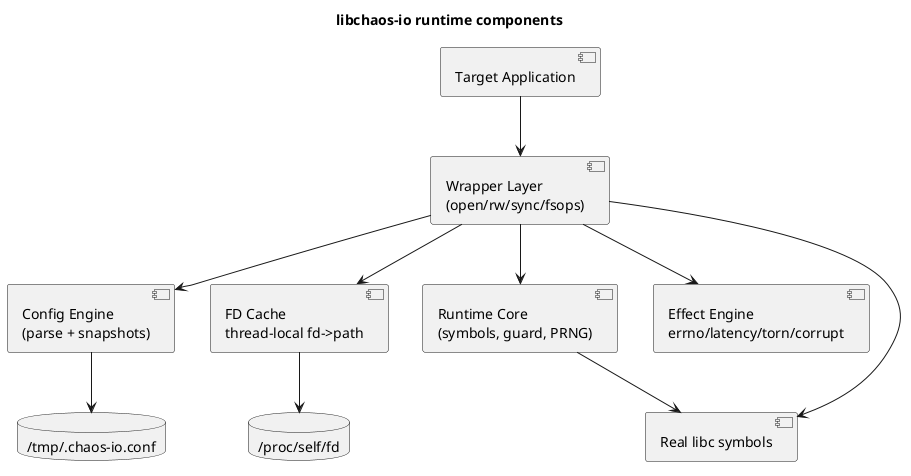
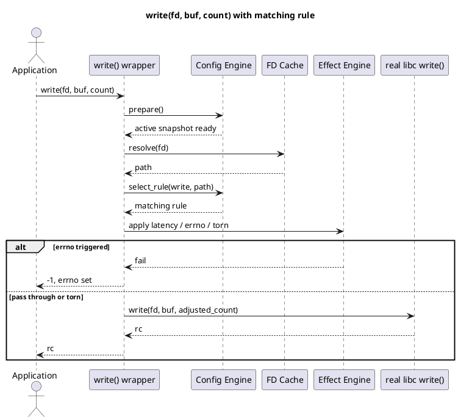
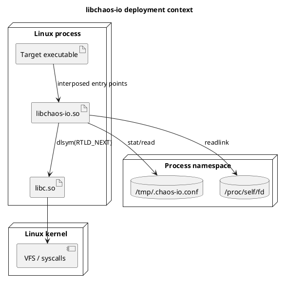

# libchaos-io Technical Reference

This document is the authoritative engineering reference for the implemented
`libchaos-io` runtime in this repository. It describes the current code, not an
aspirational design. Where behavior depends on Linux, glibc, musl, or `LD_PRELOAD`
mechanics, those dependencies are called out explicitly.

## 1. Overview

### Purpose

`libchaos-io` injects controlled filesystem and file-descriptor I/O faults into
Linux processes by interposing selected libc entry points through `LD_PRELOAD`.

The library exists to make real applications observe storage failure modes they
normally only encounter in production:

- syscall-style failures such as `EIO`, `ENOSPC`, or `EMFILE`
- deterministic latency before an operation reaches libc
- short successful writes
- successful reads whose returned data is corrupted after the fact

The library is intentionally small. It is not a general failure framework and
it does not try to simulate every kernel or filesystem behavior.

### Scope

The implemented logical operation surface is:

- `open`
  Backed by `open()` and `openat()`
- `read`
  Backed by `read()` and `readv()`
- `write`
  Backed by `write()`, `writev()`, Linux `sendfile()`, and Linux
  `copy_file_range()`
- `close`
- `fsync`
- `fdatasync`
- `pread`
  Backed by `pread()` and `preadv()`
- `pwrite`
  Backed by `pwrite()` and `pwritev()`
- `truncate`
  Backed by `ftruncate()`
- `allocate`
  Backed by Linux `fallocate()`
- `unlink`
  Backed by `unlinkat()`
- `rename_from`
  Backed by `renameat()` source-path matching
- `rename_to`
  Backed by `renameat()` destination-path matching

### Assumptions

- The target process is dynamically linked and honors `LD_PRELOAD`.
- The target process goes through intercepted libc symbols rather than direct
  raw syscalls.
- Linux `/proc/self/fd` is available for descriptor-to-path recovery.
- Path-based matching is acceptable even though the kernel ultimately executes
  on file descriptors and inodes.
- Safe degradation is preferred over partial or ambiguous injection.

### Non-Goals

- Static binary support.
- Full syscall-level coverage.
- Inode-identity matching.
- Packet, network, time, process, or memory chaos.
- Modeling `mmap()`-driven writes.
- Covering every alternate copy path such as `splice()`.
- Providing a public SDK or embedding API.

## 2. Architectural Context

### System boundaries

`libchaos-io` sits inside the target process address space. Its boundary is the
dynamic linker and the libc symbol table:

- Upstream boundary: the application calls libc APIs such as `write()` or
  `openat()`.
- Internal boundary: `libchaos-io` evaluates configuration and decides whether
  to pass through or inject.
- Downstream boundary: the library delegates to the real libc symbol obtained
  through `dlsym(RTLD_NEXT, ...)`.
- Kernel boundary: the real libc symbol eventually issues the actual system
  call sequence.

### Dependencies

Hard runtime dependencies are deliberately narrow:

- libc
- `libdl`
- Linux `/proc`
- `/tmp/.chaos-io.conf`

The library does not require a sidecar process, daemon, socket, IPC channel, or
control service.

### Trust boundaries

This library is not a security boundary. It runs with the same privilege as the
target process. The effective trust boundaries are:

- The config file is fully trusted by the target process.
- The library trusts libc symbol resolution after load time.
- The library does not protect the target process from malicious config input;
  it only guarantees that invalid config causes global passthrough instead of
  partial activation.

### Deployment and runtime context

Typical deployment is a process launch like:

```sh
LD_PRELOAD=/path/to/libchaos-io-glibc-amd64.so my-process
```

In containers, the same pattern applies. The library observes the container's
namespace view of:

- filesystem paths
- `/tmp/.chaos-io.conf`
- `/proc/self/fd`

That means matching is scoped to the container's view of the world, not the
host's.

### Stable versus internal contracts

Stable operational contract:

- the preload model
- the config file path
- the config grammar
- the logical operation names
- the effect semantics documented here

Internal implementation detail:

- file layout under `src/`
- exact helper names
- direct-mapped cache size
- exact PRNG implementation
- constructor ordering details

## 3. Key Concepts and Terminology

- Rule
  One parsed config line.
- Logical operation
  The config-level operation name such as `write` or `truncate`; multiple libc
  entry points may map to one logical operation.
- Effect
  One of `ERRNO`, `LATENCY`, `TORN`, or `CORRUPT`.
- Path prefix
  The path selector in a rule. Matching is longest-prefix-wins and
  path-boundary aware.
- Active snapshot
  The currently published in-memory config state used by readers.
- Inactive snapshot
  The alternate config buffer used during reload before publication.
- Internal mode
  The thread-local recursion guard state that suppresses re-interposition when
  the library itself calls into libc.
- FD cache
  The thread-local mapping from file descriptor number to resolved path string.
- Excluded path
  A path the library will never inject into: the config file, `/proc`, `/sys`,
  `/dev`, or an empty/invalid path.
- Torn write
  A successful short write. This is not an error and not buffer corruption.
- Corrupt read
  A successful read whose returned buffer has one bit flipped after the real
  libc call returns.

## 4. End-to-End Behavior

### What happens on an intercepted call

For a typical descriptor-backed call such as `write(fd, buf, count)`:

1. The interposed symbol in `libchaos-io` is entered instead of libc.
2. The wrapper checks the thread-local recursion guard.
3. If the thread is already inside library internals, the wrapper delegates
   directly to the real libc symbol.
4. Otherwise the wrapper asks the config module whether a rule exists:
   - `stat()` the config file
   - reload if the file changed
   - resolve `fd -> path` through the thread-local cache or `/proc/self/fd`
   - scan the active snapshot for the longest matching rule
5. If no rule matches, the wrapper delegates unchanged.
6. If a rule matches:
   - `LATENCY` sleeps before the real call
   - `ERRNO` may fail before the real call
   - `TORN` may shorten the byte count before the real call
   - `CORRUPT` is deferred until after a successful read returns
7. The wrapper enters internal mode and calls the real libc symbol.
8. The wrapper restores the previous recursion state.
9. Any post-call state updates occur:
   - `CORRUPT` may mutate the returned read buffer
   - successful `close()` invalidates the current thread's fd-cache entry
   - successful `renameat()` and `unlinkat()` reset the current thread cache

### What happens on `open()` and `openat()`

`open`-style calls are special because they begin with a path rather than an
already-open fd.

The path flow is:

1. Decode varargs correctly if `mode_t` is present.
2. Resolve a textual match path:
   - absolute path: use as-is
   - `AT_FDCWD` relative path: join with current working directory
   - other relative path: resolve directory fd through `/proc/self/fd`, then
     join lexically
3. Match the resolved path against config.
4. Apply pre-call effects if a rule matches.
5. Call the real libc `open()` or `openat()`.
6. Seed the fd cache for the returned fd:
   - use the pre-resolved path if available
   - otherwise recover it through `/proc/self/fd/<fd>`

Important constraint: path resolution is lexical. The library does not
canonicalize `.` or `..` and does not normalize symlinks. Rule matching is
therefore based on textual path identity, not canonical inode identity.

### What happens on `renameat()`

`renameat()` is the only operation with two path identities in scope at once.

The rule-selection algorithm is:

1. Resolve source and destination paths textually.
2. Prepare config once.
3. Match `rename_from` against the source path.
4. Match `rename_to` against the destination path.
5. If both match, choose the longer prefix.
6. If both prefixes are the same length, prefer `rename_to`.

That destination tie-break is intentional. Atomic replace flows usually care
more about the final pathname being updated than about the temporary source.

## 5. Architecture Diagrams

### Component Diagram

Question answered: What are the major runtime components and how do they depend
on each other?



Main takeaway: the wrappers are intentionally thin. Rule parsing, effect
evaluation, path recovery, and recursion control are all separate concerns.

### Sequence Diagram

Question answered: What actually happens for a matched descriptor-backed call?



Main takeaway: all rule decisions happen before libc is called except
post-success read corruption.

### Deployment Diagram

Question answered: Where does the library live at runtime and which external
objects does it rely on?



Main takeaway: the implementation is process-local and namespace-scoped. It is
not a privileged sidecar and it does not observe host-global state.

## 6. Component Breakdown

### Runtime core

Files:

- `src/core/chaos_io.c`
- `src/core/chaos_io_internal.h`
- `src/core/chaos_io_wrappers.h`

Responsibility:

- resolve real libc symbols
- own process-global state
- seed the PRNG
- provide recursion-guard helpers
- centralize fd-backed rule matching

Owned concerns:

- `dlsym(RTLD_NEXT, ...)` symbol lookup
- constructor sequencing
- thread-local recursion guard
- process seed and thread-local PRNG state

Design shape:

- no dynamic registration
- no background threads
- no function-pointer tables beyond resolved libc symbols

Why this design exists:

- constructor logic must be auditable and small
- wrappers need one common recursion and symbol-resolution contract
- keeping shared state in one place avoids divergent preload behavior

### Config engine

Files:

- `src/config/chaos_io_config.c`
- `src/config/chaos_io_config.h`

Responsibility:

- parse config text into typed rules
- maintain a two-snapshot active/inactive cache
- publish new config lock-free
- perform longest-prefix rule selection

Owned concerns:

- grammar validation
- operation/effect legality
- config reload eligibility
- path-prefix semantics

Pattern used:

- double-buffer snapshot publication

Why it is used here:

- readers stay simple and fast
- one thread can reload without blocking all callers
- invalid config can be rejected wholesale before publication

Trade-off:

- every intercepted call still pays for `stat()`
- readers do not get a fully transactional view of the filesystem, only a
  stable in-memory rule snapshot

### FD cache

Files:

- `src/config/chaos_io_fdcache.c`
- `src/config/chaos_io_fdcache.h`

Responsibility:

- recover a path string for fd-backed operations
- avoid repeated `readlink("/proc/self/fd/<fd>")` calls on hot fds

Owned concerns:

- thread-local direct-mapped cache slots
- fd-number hashing
- exclusion filtering before storing

Why this design exists:

- path-based config is the user-facing contract
- many target libc functions operate only on fds
- direct mapping keeps the code small and allocation-free

Trade-off:

- cache correctness is only thread-local, not process-global
- collisions are possible by construction
- fd reuse across threads can observe stale path identity

### Effect engine

Files:

- `src/effects/chaos_io_actions.c`
- `src/effects/chaos_io_actions.h`

Responsibility:

- probability sampling
- latency sleep behavior
- torn-write count derivation
- buffer corruption

Owned concerns:

- one probability sample per rule evaluation
- byte-count reduction for torn writes
- single-bit corruption semantics

Why this design exists:

- wrappers should decide when an effect applies, not reimplement effect logic
- test coverage is easier when the mechanics are isolated from interception

### Wrapper families

Files:

- `src/wrappers/chaos_io_open.c`
- `src/wrappers/chaos_io_rw.c`
- `src/wrappers/chaos_io_sync.c`
- `src/wrappers/chaos_io_fsops.c`

Responsibility:

- preserve ABI-compatible delegation to the real libc symbol
- translate raw libc calls into logical config operations
- apply effect ordering correctly

Why the wrappers are split this way:

- `open()` and `openat()` share varargs and path-resolution semantics
- read/write-style wrappers share fd-backed matching and effect ordering
- sync wrappers share simple pre-call-only behavior
- rename/unlink/truncate/allocate operations share path-identity and lifecycle
  concerns

## 7. Data Model and State

### Rule structure

The parsed rule type contains:

- `path_prefix`
- `path_len`
- `operation`
- `effect`
- `errnum`
- `probability`
- `latency_ms`

Key invariants:

- path prefixes are bounded by `CHAOS_IO_MAX_RULE_PATH`
- at most `CHAOS_IO_MAX_RULES` rules are loaded
- a rule is rejected if the selected effect is illegal for the chosen logical
  operation
- invalid config invalidates the entire load, not only the bad line

### Global state

Process-global mutable state:

- resolved libc function pointers
- process seed
- active config index
- cached config mtime hash
- two config snapshots

Thread-local mutable state:

- recursion guard
- PRNG state
- fd cache
- config read buffer used during reload

### State transitions

Config state transitions:

1. unknown at startup
2. empty passthrough snapshot after initialization
3. active parsed snapshot after a successful load
4. back to empty passthrough if the config disappears or becomes invalid

FD-cache entry transitions:

1. empty
2. populated on successful open or first `/proc/self/fd` resolution
3. invalidated by same-thread successful `close()`
4. fully reset by same-thread successful `renameat()` or `unlinkat()`

### Consistency model

The config snapshot model is eventually consistent at call boundaries:

- a given wrapper invocation sees one published snapshot
- different threads may observe the new snapshot at slightly different times
- no wrapper sees a half-parsed snapshot

The fd-cache model is intentionally weaker:

- cache entries are thread-local
- no cross-thread invalidation exists
- the cache is an optimization, not a source of truth

## 8. Concurrency and Threading Model

### Execution model

All wrapper logic is synchronous on the caller's thread. The library creates no
worker threads and does not use signal handlers.

### Mutable state ownership

- Config snapshots are process-global and published lock-free.
- Recursion guard, PRNG state, config read buffer, and fd cache are thread-local.

### Synchronization strategy

The config engine uses GCC `__sync_*` builtins and full memory barriers rather
than C11 atomics. That is a deliberate portability choice in this codebase.

Publication model:

- one thread wins reload ownership through CAS on the cached mtime sentinel
- the reloader fills the inactive snapshot
- the reloader publishes the active index
- readers then observe the new mtime hash

This is enough for the current design because snapshot contents are written
before the active index becomes visible.

### Race and visibility caveats

Important limitation: the fd cache is per-thread, so path identity is not
globally coherent across threads.

Examples:

- Thread A closes fd `7`; only thread A invalidates its cache entry.
- Thread B may still hold a cached path for fd `7`.
- If the kernel later reuses fd `7` for a different file, thread B can observe
  stale path identity until it misses cache or resets.

This is not a theoretical purity issue. It materially affects correctness for
applications that share and rapidly recycle file descriptors across threads.

### JMM relevance

The Java Memory Model is not relevant here. This is a C99 preload library. The
relevant memory-ordering contract is compiler and CPU ordering around the
`__sync_*` builtins used in the config publication path.

## 9. Error Handling and Failure Modes

### Expected failure behavior

- Missing config: global passthrough.
- Invalid config: global passthrough.
- Unsupported operation/effect combination in config: config load rejected.
- Rule not matched: passthrough.
- Config too large: config load rejected.
- Path resolution failure for `openat()`/`unlinkat()`/`renameat()`: pre-call
  path injection is bypassed and real libc behavior proceeds.

### Unexpected failure behavior

- Failure to resolve a real libc symbol in the constructor aborts the process.
- Failure to read `/dev/urandom` at startup falls back to deterministic seed
  derivation from `getpid()`.
- `usleep()` interruption is ignored; the code continues decrementing remaining
  latency budget.

### Retry and idempotency semantics

The library does not retry real libc operations. That is intentional:

- retries would alter application-observed behavior
- retries would hide precisely the failure mode the library is meant to expose

Idempotency is entirely the application's concern.

### Overload and backpressure

The library does not implement backpressure. Under heavy call volume, the main
costs are:

- `stat()` on every intercepted call
- possible `readlink()` on fd-cache miss
- linear rule scan
- deliberate latency sleeps when configured

### Misuse examples

Misuse:

```text
/data:read:TORN:1.0
```

Why it fails:

- `TORN` is illegal for `read`
- config parsing rejects the full file
- the library falls back to global passthrough

Misuse:

```text
/database:write:EIO:0.5
```

Expected-but-wrong assumption:

- this does not match `/data/database/file`
- matching is prefix-based, not substring-based

### Safe degradation behavior

The library consistently chooses passthrough over ambiguous injection. This is
one of its most important operational properties.

## 10. Security Model

### Threat-oriented explanation

`libchaos-io` is not a hardening feature. It increases the ability to force
failures inside a process. From a security perspective, its main concerns are
containment of self-interference and predictable control-plane behavior.

### Self-protection boundaries

The library will never inject into:

- `/tmp/.chaos-io.conf`
- `/proc`
- `/sys`
- `/dev`
- fd `0`, `1`, or `2`

This prevents trivial self-destruction such as faulting reads of the config
file or breaking stdout/stderr during diagnostics.

### Authentication and authorization

None. The library inherits process privileges and has no auth surface.

### Sensitive data handling

- No network exposure.
- No secrets are stored in memory beyond whatever file paths the target process
  already uses.
- The library does not emit logs, so it also does not redact.

### Input validation

The config parser is the only input-validation surface. Its design is strict:

- fixed four-field grammar
- bounded line and file sizes
- explicit operation/effect whitelist
- explicit errno whitelist

## 11. Performance Model

### Hot path

The hot path for fd-backed operations is:

1. recursion-guard check
2. `stat()` on the config file
3. fd-cache lookup
4. optional `readlink("/proc/self/fd/<fd>")`
5. linear rule scan
6. effect handling
7. real libc call

### Complexity notes

- rule scan: `O(rule_count)`, bounded by `CHAOS_IO_MAX_RULES`
- fd-cache lookup: `O(1)`
- cache miss recovery: dominated by `readlink()`

### Allocation behavior

There are no heap allocations on the hot path. Buffers are fixed-size globals,
TLS storage, or stack objects.

### Memory footprint

Footprint is intentionally dominated by:

- two fixed config snapshots
- thread-local fd cache
- thread-local config read buffer

This is larger than a purely stateless wrapper, but it avoids heap allocation
and external runtime dependencies.

### Performance-sensitive trade-offs

- `stat()` on every call is expensive, but it gives immediate config pickup
  without a daemon or polling thread.
- thread-local fd caching reduces repeated `readlink()` cost but weakens
  cross-thread path coherence.
- no logs or metrics keeps the library small, but also reduces observability.

## 12. Observability and Operations

### Built-in observability

The library intentionally provides almost none:

- no logs
- no metrics
- no traces
- no health endpoint

That is a size and determinism trade-off, not an omission by accident.

### Operator-visible signals

The main signals are application-observed outcomes:

- injected errno values
- increased latency
- short write return values
- corrupted read payloads

### Debugging workflow

Recommended workflow when validating behavior:

1. Verify the target process is dynamically linked.
2. Verify the correct tuple-specific shared object is loaded.
3. Verify the config file path exists inside the target namespace.
4. Use a direct probe that exercises the intended libc entry point.
5. Use `strace` to confirm which libc/syscall path the target command actually
   takes.

That last step matters. `cp` previously demonstrated why: a command can look
like a write workload while actually using `sendfile()` or another alternate
copy path.

### Runbook-relevant notes

- If the config contains one invalid line, the full file becomes passthrough.
- If behavior is unexpectedly absent, confirm the program is not using
  `splice()`, `mmap()`, or direct syscalls.
- If behavior is unexpectedly wrong in multithreaded workloads, suspect stale
  thread-local fd-cache state.

## 13. Configuration Reference

### Config path

`/tmp/.chaos-io.conf`

### Grammar

```text
<path-prefix>:<operation>:<errno|action>:<value>
```

Examples:

```text
/data:write:EIO:0.3
/data/wal.log:fsync:EIO:0.1
/data:write:LATENCY:200
/data:write:TORN:0.1
/data:read:CORRUPT:0.5
*:open:EMFILE:0.05
```

### Matching rules

- longest prefix wins
- `*` is the lowest-priority wildcard
- matching is path-boundary aware
- no globbing
- no regex
- no canonicalization

### Effect semantics

- `ERRNO`
  Pre-call failure with configured probability.
- `LATENCY`
  Pre-call sleep, always applied when the rule matches.
- `TORN`
  Pre-call write-length reduction with configured probability.
- `CORRUPT`
  Post-success single-bit corruption with configured probability.

### Supported errno names

- `EIO`
- `ENOSPC`
- `EDQUOT`
- `EROFS`
- `EACCES`
- `EMFILE`
- `ENFILE`
- `ENOENT`

### Safe and unsafe operational values

Safe defaults:

- low error probabilities
- low-latency injections
- narrow path prefixes

Operationally risky values:

- `*:open:EMFILE:1.0`
- high `LATENCY` on hot write paths
- broad wildcard rules combined with high probabilities

### Minimal usage example

Force occasional write failures under `/data`:

```text
/data:write:EIO:0.05
```

### Typical usage example

Exercise WAL durability edges:

```text
/srv/app/wal:write:TORN:0.10
/srv/app/wal:fdatasync:EIO:0.05
/srv/app/wal:fdatasync:LATENCY:250
```

### Anti-pattern example

Using one broad wildcard rule to simulate an entire filesystem:

```text
*:write:EIO:0.5
```

Why it is unsafe:

- it collapses unrelated control files and data files into one fault domain
- it makes failures difficult to diagnose
- it can destabilize the target process before the intended scenario is reached

## 14. Extension Points and Compatibility Guarantees

### Supported extension points

Reasonable future extensions inside `libchaos-io`:

- additional file-oriented libc entry points
- new logical operations with explicit config names
- more Linux-specific copy or lifecycle operations

### Compatibility expectations

The repository's release gate for this library is:

- glibc amd64
- glibc arm64
- musl amd64
- musl arm64

No new wrapper is considered complete until runtime behavior is validated across
that matrix.

### What callers must not assume

- They must not assume inode-level identity matching.
- They must not assume cross-thread fd-cache coherence.
- They must not assume coverage of non-interposed syscall paths.
- They must not assume the library affects static binaries.

### What maintainers should preserve

- safe-pass-through on invalid config
- explicit logical operation mapping
- no-public-API model
- small, auditable code size

## 15. Stack Walkdown

### API and framework level

Materially relevant.

The library intercepts libc entry points, not application frameworks directly.
Any higher-level framework influence is only through which libc functions it
chooses to call.

### Application and runtime level

Materially relevant.

Every target call enters an interposed wrapper first. The wrapper decides
whether to inject or delegate and therefore becomes part of the application's
runtime control flow.

### JVM level

Not materially relevant to this document.

This repository is pure C99 and operates below the JVM. A JVM-based application
can still be affected indirectly if its native runtime ultimately calls the
interposed libc symbols, but there is no Java-specific contract here.

### Memory and concurrency level

Materially relevant.

The recursion guard, PRNG state, fd cache, and config read buffer are
thread-local. Config publication uses full barriers. Those choices determine
which races are avoided and which stale-cache cases remain possible.

### OS, kernel, network, and container level

Materially relevant.

Key OS interactions:

- dynamic linker loads the shared object and resolves the interposed symbols
- `dlsym(RTLD_NEXT, ...)` resolves the downstream libc symbols
- `stat()` determines config freshness
- `readlink("/proc/self/fd/<fd>")` recovers path identity
- real libc calls cross into the kernel

Container relevance:

- path matching and config lookup are namespace-scoped
- `/proc/self/fd` reflects the target container's fd view

Network is not materially relevant beyond the fact that this library does not
own network semantics.

### Infrastructure level

Materially relevant only for build and verification.

The repository validates runtime behavior in Docker across:

- glibc
- musl
- amd64
- arm64

That matrix is part of the library's engineering contract because preload
behavior is sensitive to libc and architecture differences.

## 16. References

- Reference: POSIX.1-2017
- Reference: Linux man-pages project
- Reference: `ld.so(8)`
- Reference: `dlsym(3)`
- Reference: `open(2)`
- Reference: `openat(2)`
- Reference: `read(2)`
- Reference: `readv(2)`
- Reference: `write(2)`
- Reference: `writev(2)`
- Reference: `pread(2)`
- Reference: `preadv(2)`
- Reference: `pwrite(2)`
- Reference: `pwritev(2)`
- Reference: `close(2)`
- Reference: `fsync(2)`
- Reference: `fdatasync(2)`
- Reference: `sendfile(2)`
- Reference: `copy_file_range(2)`
- Reference: `ftruncate(2)`
- Reference: `fallocate(2)`
- Reference: `unlinkat(2)`
- Reference: `renameat(2)`
- Reference: `readlink(2)`
- Reference: `stat(2)`
