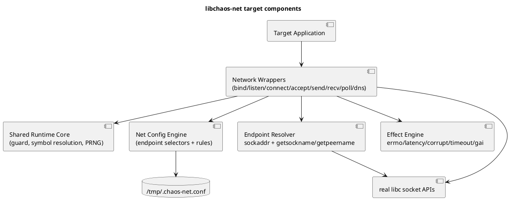
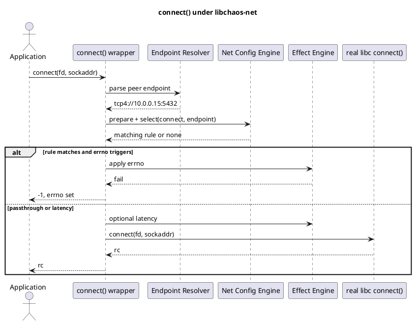
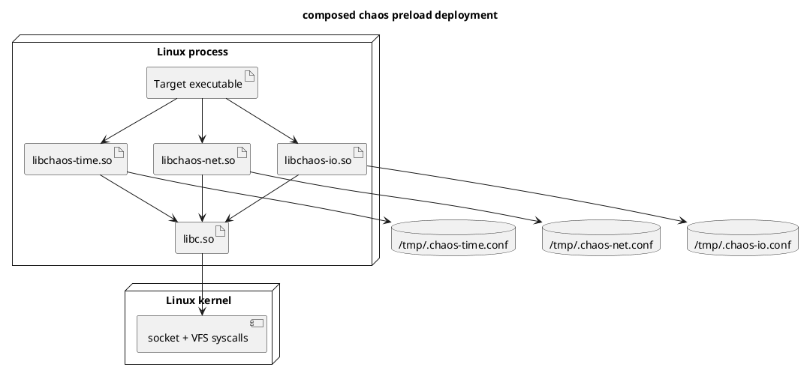

# libchaos-net Technical Reference

This document is the engineering reference for the current `libchaos-net`
implementation and its explicit extension boundary. The repository-wide
ownership, loader, libc, kernel, distro, and documentation model is defined in
[`docs/SYSTEM.md`](/Users/nolem/dev/macstab/projects/oss/chaos-testing-libraries/docs/SYSTEM.md). That
global document is authoritative when subsystem references would otherwise
drift.

Status is important:

- Current implementation status: implemented network surface shipped
- Current runtime behavior: endpoint-based network fault injection at the libc
  socket and readiness-wait boundary
- Implemented hooks today:
  - `socket`
  - `socketpair`
  - `bind`
  - `listen`
  - `connect`
  - `accept`
  - Linux `accept4`
  - `shutdown`
  - `send`
  - `sendto`
  - `sendmsg`
  - Linux `sendmmsg`
  - `recv`
  - `recvfrom`
  - `recvmsg`
  - Linux `recvmmsg`
  - `poll`
  - `ppoll`
  - `select`
  - `pselect`
  - Linux `epoll_wait`
  - Linux `epoll_pwait`
- Implemented effects today:
  - `ERRNO`
  - `LATENCY`
  - `CORRUPT` for receive-side buffers
  - `TIMEOUT` for readiness waits

Current ownership note:

- resolver interposition moved to `libchaos-dns`
- `libchaos-net` no longer owns `getaddrinfo()`
- treat any deeper DNS-specific design notes in this file as historical context,
  not current behavior

Deferred behavior described here remains explicitly future work:

- any ownership of `read()`, `write()`, or `close()`
- transport-layer or TLS-aware mutation
- broader socket metadata ownership than per-call endpoint derivation

### Global ownership rule

`libchaos-net` is subordinate to the repository-wide symbol ownership rule:

- one symbol, one owner
- no overlapping interposition across chaos libraries

That means:

- `libchaos-net` owns socket and readiness-wait symbols
- `libchaos-io` owns generic fd/file symbols
- `libchaos-net` must not interpose `read()`, `write()`, `readv()`, `writev()`,
  or `close()`

This is true even when the fd is a socket. If an application uses generic
`read()` or `write()` on a socket, `libchaos-net` does not own that traffic.
That is a declared architectural boundary, not an implementation omission.

## 1. Overview

### Purpose

`libchaos-net` injects controlled network-facing failures into Linux processes
through `LD_PRELOAD`, in the same style that `libchaos-io` injects filesystem
faults.

The library's value is not packet capture or traffic shaping. Its value is
making user-space code observe failure modes at the libc boundary it actually
calls:

- connection failures
- bind/listen failures
- delayed connect, send, or receive operations
- successful receives with corrupted payload bytes

### DNS Boundary and Coexistence

Process-local DNS behavior now lives in `libchaos-dns`, not `libchaos-net`.
This document keeps DNS notes only where socket behavior and resolver behavior
interact operationally.

Current resolver-hook boundary is exact:

- implemented today in `libchaos-dns`: `getaddrinfo()` and `getnameinfo()`
- not interposed today: `gethostbyname*()`, `gethostbyaddr*()`, and `res_*()`

That means it is valid to use this library together with a separate
stack-level or container-level DNS chaos mechanism. The two modes test
different layers:

- preload DNS in this library:
  - acts before libc resolver work continues beyond `getaddrinfo()` or
    `getnameinfo()`
  - good for deterministic per-process failure and latency
  - no `NET_ADMIN` required
- stack-level DNS outside this library:
  - acts below the process, for example through iptables redirect or an
    injected resolver
  - good for synthetic answers, NXDOMAIN, SERVFAIL, REFUSED, rewrites, and
    broader resolver-path realism

If both are active, `libchaos-dns` runs first because it owns the process-local
resolver boundary. Only successful passthrough reaches the lower DNS stack.

This is not a conflict. It is layered fault injection at two different
contracts.

### Scope

The shipped network surface is endpoint-driven and socket-API-specific.

Implemented logical operations:

- `socket`
  Backed by `socket()` and `socketpair()`
- `bind`
- `listen`
- `connect`
- `accept`
  Backed by `accept()` and `accept4()`
- `shutdown`
  Backed by `shutdown()`
- `poll`
  Backed by `poll()`, `ppoll()`, `select()`, `pselect()`, `epoll_wait()`, and
  `epoll_pwait()`
- `send`
  Backed by `send()`, `sendto()`, `sendmsg()`, and `sendmmsg()`
- `recv`
  Backed by `recv()`, `recvfrom()`, `recvmsg()`, and `recvmmsg()`

Implemented effects:

- `ERRNO`
- `LATENCY`
- `CORRUPT`
  Only for `recv`
- `TIMEOUT`
  Only for `poll`

Deferred extension areas:

- owning `read()` and `write()` on sockets
- transport-aware mutation beyond byte corruption
- richer async-connect observation such as `getsockopt(SO_ERROR)`

### Assumptions

- The target process is dynamically linked and honors `LD_PRELOAD`.
- `libchaos-net` must coexist with `libchaos-io`, `libchaos-time`,
  `libchaos-process`, and `libchaos-memory` without overlapping symbol
  ownership.
- Endpoint identity is the right user-facing selector, not raw fd number.
- Safe passthrough on ambiguity is preferable to partial or misleading network
  injection.
- Endpoint identity must be derivable from the current call, not from a shared
  socket cache owned through `close()`.

### Non-Goals

- Raw-packet injection.
- Kernel traffic control replacement.
- TLS handshake emulation.
- Stateful TCP reassembly.
- Interposing `read()` and `write()` on sockets.
- Owning `close()` or other symbols already better left to another library.
- Owning `read()` or `write()` on sockets in a way that collides with
  `libchaos-io`.

### Current implementation boundary

Current code:

- `src/net/chaos_net.c`
- `src/net/chaos_net_actions.c`
- `src/net/chaos_net_config.c`
- `src/net/chaos_net_endpoint.c`
- `src/net/chaos_net_extra.c`
- `src/net/chaos_net_socket.c`
- `src/net/chaos_net_wait.c`

Current runtime contract:

- the shared object builds for native, glibc, and musl target tuples
- the constructor resolves the real libc symbols and seeds the PRNG
- matching is endpoint-based, not fd-number-based
- `bind` and `connect` match the supplied sockaddr-derived endpoint
- `listen` and `accept` match the local endpoint
- `send` matches the peer endpoint or explicit destination sockaddr
- `recv` matches the local endpoint
- `socket` matches a wildcard endpoint derived from family and type
- `shutdown` matches the best available local or peer endpoint
- `poll` matches ready-set endpoints; Linux `epoll_*` derives watched fds from
  `/proc/self/fdinfo/<epfd>`
- DNS rule matching is owned by `libchaos-dns`, using `dns://...` for forward
  lookup and `rdns://...` for reverse lookup
- `libchaos-net` itself does not interpose resolver symbols
- lower resolver or packet-path DNS manipulation is outside this library and
  may be layered independently
- Docker runtime proof passes on glibc/musl and amd64/arm64
- the strict repository source-line coverage gate asserts both shipped
  libraries
- generic socket `read()` or `write()` traffic remains outside endpoint-aware
  `libchaos-net` matching by design

## 2. Architectural Context

### System boundaries

`libchaos-net` should sit in the same process-local boundary as `libchaos-io`,
but with a stricter composability requirement:

- it must own only network-domain symbols
- it must not overlap with `libchaos-io` on generic `read`, `write`, or
  `close`
- it must remain loadable alongside the other dedicated chaos libraries

### Dependencies

Planned hard dependencies:

- libc
- `libdl`
- `/tmp/.chaos-net.conf`
- Linux socket APIs

Optional internal dependency direction:

- reuse shared repository helpers for constructor scaffolding, config parsing
  patterns, probability logic, and test matrix
- do not reuse `libchaos-io` path-matching semantics directly

### Trust boundaries

Like `libchaos-io`, this is not a security boundary. It runs inside the target
process with the process's privilege.

Important trust statement:

- config is trusted input to the target process
- DNS names, socket addresses, and returned payloads are not trusted data; they
  are merely match or mutation subjects

### Deployment and runtime context

The target deployment model is composition through multiple preload objects:

```sh
LD_PRELOAD="/path/libchaos-time.so /path/libchaos-net.so /path/libchaos-io.so" my-process
```

Order matters, but the stronger rule is symbol ownership:

- one symbol
- one owner

`libchaos-net` should therefore avoid owning `read()`, `write()`, or `close()`
even though sockets can use those paths. That is a deliberate completeness
trade-off for composability.

For DNS specifically, a second layer may also exist below the process:

- preload DNS in `libchaos-net`
- stack-level DNS redirection or resolver replacement outside this repository

That is allowed. The ownership rule applies to symbols, not to every lower
layer in the Linux networking stack.

## 3. Key Concepts and Terminology

- Endpoint selector
  A config selector that identifies a socket identity such as
  `tcp4://10.0.0.15:5432`.
- Local endpoint
  The bound address and port of the local socket.
- Peer endpoint
  The connected or target remote address and port.
- DNS selector
  A selector in the form `dns://name`.
- Logical operation
  The config-level network operation name, not the raw libc symbol name.
- Timeout injection
  A synthetic readiness timeout that returns as though no events became ready.
- Receive corruption
  Post-success mutation of application-visible payload bytes.
- Wildcard selector
  The lowest-priority `*` selector.

## 4. End-to-End Behavior

### Call lifecycle

For `connect()`:

1. The interposed `connect()` wrapper receives the sockaddr.
2. The wrapper derives a peer endpoint selector from the sockaddr.
3. The config engine ensures the active snapshot is current.
4. The wrapper selects the best matching `connect` rule.
5. If no rule matches, the wrapper delegates unchanged.
6. If a rule matches:
   - `LATENCY` sleeps before the real call
   - `ERRNO` may fail before the real call
7. The wrapper enters internal mode and calls the real libc `connect()`.
8. The wrapper returns the real result unchanged.

For `recvmsg()`:

1. The wrapper resolves the socket's local endpoint and, where safely knowable,
   its peer identity.
2. The wrapper matches a `recv` rule.
3. Pre-call `LATENCY` or `ERRNO` may apply.
4. The real libc `recvmsg()` executes.
5. If the call succeeded and the matched effect is `CORRUPT`, the wrapper flips
   one bit inside the payload bytes exposed through `msg_iov`.
6. Control returns to the application with the same byte count but mutated data.

### Why endpoint matching exists

Ports alone are not enough. These must all be distinguishable:

- TCP port `5432`
- UDP port `5432`
- IPv4 `10.0.0.15:5432`
- IPv6 `[::1]:5432`
- Unix domain socket `/var/run/docker.sock`

The library should therefore react to full endpoint selectors, not bare port
numbers.

## 5. Architecture Diagrams

### Component Diagram

Question answered: What does the shipped `libchaos-net` architecture look like
without overlapping other preload libraries?



Main takeaway: endpoint resolution is a first-class subsystem. Unlike
`libchaos-io`, network matching cannot rely on paths recovered from `/proc`.

### Sequence Diagram

Question answered: What is the intended runtime contract for a matched
connection attempt?



Main takeaway: the injection point stays at the libc contract boundary. The
library is not trying to emulate the full kernel TCP state machine.

### Deployment Diagram

Question answered: How should multiple dedicated preload libraries compose in
one process?



Main takeaway: one repository can ship multiple small preload libraries without
turning them into one monolith, as long as symbol ownership does not overlap.

## 6. Component Breakdown

### Shared runtime core

Current responsibility:

- resolve real libc symbols for owned network entry points
- own recursion guard and PRNG state
- provide constructor lifecycle

Design rule:

- follow the same shape as `libchaos-io`
- keep common mechanics small and domain-neutral
- avoid a runtime dependency on a shared `libchaos-common.so`

### Net config engine

Current responsibility:

- parse endpoint selectors
- parse network logical operations and effects
- publish rules as lock-free snapshots
- provide deterministic longest-match rule selection

Why separate config from IO:

- path selectors and endpoint selectors are different domains
- network has `GAI` and `TIMEOUT`, which do not fit IO grammar
- a single mega-config file would couple unrelated fault domains and make
  reasoning harder

### Endpoint resolver

Current responsibility:

- convert sockaddr arguments into selector strings
- resolve socket local endpoints through `getsockname()`
- resolve connected peer endpoints through `getpeername()`
- preserve Unix-domain socket path identity where applicable

This component is the major architectural difference from `libchaos-io`.

### Wrapper families

Current wrapper families:

- socket lifecycle wrappers
  `socket`, `socketpair`, `bind`, `listen`, `connect`, `accept`, `accept4`,
  `shutdown`
- payload wrappers
  `send`, `sendto`, `sendmsg`, `sendmmsg`, `recv`, `recvfrom`, `recvmsg`,
  `recvmmsg`
- wait wrappers
  `poll`, `ppoll`, `select`, `pselect`, `epoll_wait`, `epoll_pwait`
- resolver wrappers moved to `libchaos-dns`
  `getaddrinfo`, `getnameinfo`

This exact wrapper inventory is the current preload shared-object surface.

The constructor also resolves helper symbols such as `getsockname()`,
`getpeername()`, and `getsockopt()` for endpoint derivation or future
extensibility. Those are internal passthrough helpers, not interposed wrapper
ownership.

Potential later families:

- async-connect observation helpers such as `getsockopt(SO_ERROR)`
- transport-aware mutation beyond byte corruption

### Why no shared fd cache

This is a critical design choice.

`libchaos-net` should not depend on a process- or thread-local socket cache that
requires `close()` ownership to remain correct. `close()` should remain outside
the network library to avoid overlapping `libchaos-io`.

So the implementation prefers:

- explicit sockaddr arguments when present
- `getsockname()` and `getpeername()` on demand
- passthrough when endpoint identity is ambiguous

This keeps `libchaos-net` composable with the other dedicated chaos libraries.

## 7. Data Model and State

### Selector grammar

Supported selector forms:

- `tcp4://10.0.0.15:5432`
- `tcp4://*:5432`
- `tcp6://[::1]:443`
- `udp4://8.8.8.8:53`
- `udp6://[2001:db8::1]:53`
- `unix:///var/run/docker.sock`
- `dns://api.example.com`
- `*`

### Rule grammar

```text
<endpoint-selector>:<operation>:<effect>:<value>
```

Examples:

```text
tcp4://10.0.0.15:5432:connect:ECONNREFUSED:0.2
tcp4://*:5432:accept:LATENCY:150
unix:///var/run/docker.sock:recv:CORRUPT:0.01
*:poll:TIMEOUT:0.1
```

### Logical operations

Current logical operations:

- `socket`
  Backed by `socket()` and `socketpair()`
- `bind`
- `listen`
- `connect`
- `accept`
  Backed by `accept()` and Linux `accept4()`
- `shutdown`
- `send`
  Backed by `send()`, `sendto()`, `sendmsg()`, and Linux `sendmmsg()`
- `recv`
  Backed by `recv()`, `recvfrom()`, `recvmsg()`, and Linux `recvmmsg()`
- `poll`
  Backed by `poll()`, `ppoll()`, `select()`, `pselect()`, Linux
  `epoll_wait()`, and Linux `epoll_pwait()`

### Effects

Current effects:

- `ERRNO`
- `LATENCY`
- `CORRUPT`
- `TIMEOUT`

Intentional omission:

- no `TORN`

Reason:

- partial send semantics are normal for stream sockets
- partial send semantics are wrong for datagrams
- one uniform `TORN` contract would be misleading

### Effect-to-operation validity

- `ERRNO`
  valid for `socket`, `bind`, `listen`, `connect`, `accept`, `shutdown`,
  `send`, `recv`, and `poll`
- `LATENCY`
  valid for all implemented operations
- `CORRUPT`
  valid only for `recv`
- `TIMEOUT`
  valid only for `poll`
- `GAI`
  valid only for `dns`

### Errno and GAI value sets

The config parser intentionally accepts an explicit network errno palette:

- `ECONNREFUSED`
- `ETIMEDOUT`
- `ECONNRESET`
- `EHOSTUNREACH`
- `ENETUNREACH`
- `EADDRINUSE`
- `EADDRNOTAVAIL`
- `EPIPE`
- `EMFILE`
- `ENFILE`
- `EAGAIN`

The `getaddrinfo()` palette is separate:

- `EAI_AGAIN`
- `EAI_FAIL`
- `EAI_NONAME`
- `EAI_MEMORY`
- `EAI_SYSTEM`

## 8. Concurrency and Threading Model

### Execution model

Like `libchaos-io`, `libchaos-net` executes entirely on the caller's
thread. There is no background thread in the shipped implementation.

### Mutable state ownership

Current ownership:

- config snapshots are process-global
- recursion guard and PRNG state are thread-local
- endpoint derivation is preferably per-call and stack-local

### Why endpoint resolution is mostly stateless

Network fd identity is harder than file path identity:

- sockets can be rebound or connected later
- datagram receive peers can vary by packet
- descriptor numbers can be reused quickly

A heavy cache would require invalidation hooks that collide with the
one-symbol-one-owner rule across multiple preload libraries. Stateless or
best-effort per-call resolution is therefore the safer shipped design.

### Future concurrency risks

If later phases introduce epoll membership tracking or socket metadata caches,
the design must explain:

- ownership of mutable watch state
- invalidation when watched fds disappear
- interaction with `fork()`, `dup*()`, and descriptor reuse

The current implementation avoids an owned epoll cache. It derives watched fd
membership on demand from `/proc/self/fdinfo/<epfd>` and fails open when that
resolution is unavailable.

### JMM relevance

Not relevant. This is a C99 preload library. Memory-ordering concerns live at
the C compiler and CPU barrier level, not the Java Memory Model.

## 9. Error Handling and Failure Modes

### Intended failure model

The library should preserve the same operational principle as `libchaos-io`:

- ambiguity leads to passthrough
- invalid config leads to full passthrough
- unsupported combinations are rejected at parse time

### Operation-specific caveats

`connect()`:

- nonblocking `connect()` already has real kernel and libc semantics around
  `EINPROGRESS`
- the implementation does not invent asynchronous completion semantics
- injection should stay at pre-call `ERRNO` or `LATENCY`

`accept()` and `accept4()`:

- Linux may already surface queued network errors on `accept()`
- the wrapper should not try to reinterpret or normalize them after the fact

`recvfrom()` and `recvmsg()`:

- pre-call peer identity is not reliably knowable for unconnected datagram
  sockets
- receive-side matching therefore keys primarily off the local endpoint

`poll()` and `ppoll()`:

- `TIMEOUT` should mean a synthetic zero-ready result
- it should not fabricate events
- it should not rewrite the caller's requested timeout value

Resolver behavior owned by `libchaos-dns`:

- `getaddrinfo()` and `getnameinfo()` failures are not `errno`-based
- injected failures return `EAI_*` codes directly
- an injected `EAI_*` prevents the lower resolver path from being reached
- if the wrapper passes through, lower resolver or packet-level DNS chaos may
  still apply outside this library

### Safe degradation behavior

Examples of required passthrough:

- unsupported socket family
- endpoint parse failure
- missing or malformed sockaddr
- receive operation where a peer-specific match is impossible without lying

## 10. Security Model

### Threat-oriented explanation

This library is not an access-control or traffic-filtering layer. It is a
failure injection layer.

Security-sensitive implications:

- it can force connection failures and corrupt received payload bytes
- it should therefore only run in explicitly controlled test or staging
  environments unless the operator knowingly wants chaos in production

### Trust assumptions

- config file is trusted by the operator of the target process
- DNS names and socket addresses come from untrusted application/runtime input
- the library must validate them before selector normalization

### Input validation needs

The parser validates:

- protocol/family prefix
- address syntax
- IPv6 bracket form
- port range
- Unix path length
- allowed effect/operation combinations
- `EAI_*` versus `errno` domains

### Auditability expectations

Like `libchaos-io`, the network library should stay small enough that symbol
ownership and effect ordering are human-auditable.

## 11. Performance Model

### Hot path expectations

Compared with `libchaos-io`, the network hot path will be dominated less by
filesystem metadata and more by endpoint derivation:

- parsing or normalizing sockaddr data
- `getsockname()` or `getpeername()` when necessary
- linear rule scan
- deliberate latency

### Why the shipped scope stays narrow

The biggest performance and correctness risk is not individual syscalls. It is
trying to model too much state:

- async connect completion
- epoll membership graphs
- packet-batch partial-success semantics
- peer-changing datagram receive flows

A smaller shipped scope is not just simpler. It is more correct.

### Likely bottlenecks

- repeated endpoint formatting
- frequent `getpeername()` on hot connected sockets
- large wildcard-heavy rule sets
- artificial latency on frequently called recv/send paths

### Memory behavior

The implementation direction is to avoid heap allocation in the hot path.
Endpoint formatting should stay on bounded stack or TLS buffers.

## 12. Observability and Operations

### Built-in observability target

The library follows the same minimalism as `libchaos-io`:

- no mandatory logs
- no background exporter
- no tracing integration

### Operational debugging guidance

When validating `libchaos-net` behavior, operators should prove:

1. which libc function the target actually calls
2. which endpoint the library should derive from that call
3. which logical operation that raw function maps to
4. whether the selected rule effect is even legal for that operation

This matters because apparently similar behaviors are not equivalent:

- `send()` versus `write()` on a socket
- `poll()` versus `epoll_wait()`
- connected UDP versus unconnected UDP
- `connect()` timeout perception versus `SO_ERROR` result checking

### Cross-target verification requirement

The same repository gate should apply:

- glibc amd64
- glibc arm64
- musl amd64
- musl arm64

And runtime proof must occur in Docker or equivalent CI runners, not only by
host-local builds.

## 13. Configuration Reference

### Config path

`/tmp/.chaos-net.conf`

### Why a separate config file is correct

This should not share `/tmp/.chaos-io.conf`.

Reasons:

- endpoint selectors are not path selectors
- network introduces `GAI` and `TIMEOUT`
- operators need independent rollout and blast-radius control
- separate files make troubleshooting composition simpler

### Selector semantics

Matching is deterministic:

- exact selector beats wildcard
- longer concrete selector beats shorter one
- `*` is lowest priority

Operation-specific selector side:

- `bind`
  local endpoint from call arguments
- `listen`
  local endpoint resolved from the socket
- `accept`
  local listening endpoint
- `connect`
  peer endpoint from call arguments
- `send`
  peer endpoint when explicit, otherwise connected peer if knowable
- `recv`
  local endpoint for pre-call matching
- `poll`
  any monitored endpoint that matches, with wildcard fallback
- `dns`
  queried name through `dns://name`

### Minimal usage example

Force occasional connect failure to one PostgreSQL target:

```text
tcp4://10.0.0.15:5432:connect:ECONNREFUSED:0.05
```

### Typical usage example

Exercise a slow listener and flaky DNS:

```text
tcp4://*:8443:accept:LATENCY:200
dns://api.internal.example:dns:EAI_AGAIN:0.10
```

### Layered DNS example

Use preload DNS for deterministic per-process lookup failure while still
allowing a lower stack-level DNS mechanism to handle every lookup that
successfully passes through:

```text
dns://api.internal.example:dns:EAI_AGAIN:0.10
```

Operational meaning:

- 10% of `getaddrinfo("api.internal.example", ...)` calls fail immediately in
  the process with `EAI_AGAIN`
- the remaining 90% continue into the normal resolver path, where a
  container-level DNS chaos system may still inject rewrites, NXDOMAIN,
  SERVFAIL, or delay

### Anti-pattern example

Using only bare wildcards for all network calls:

```text
*:send:EPIPE:0.5
*:recv:CORRUPT:0.5
```

Why it is unsafe:

- it destroys fault locality
- it makes it impossible to tell whether the target failure is endpoint-specific
  or library-global
- it can corrupt test harness and service-mesh traffic together

## 14. Extension Points and Compatibility Guarantees

### Stable operational contracts

The following should be treated as stable operational contracts:

- separate config file path
- endpoint-based selector model
- logical operation names
- effect validity rules
- four-tuple libc/arch verification gate

### Internal contracts that remain private

- exact helper layout
- endpoint formatting helper names
- any internal reusable parser scaffolding
- exact cacheless endpoint-derivation helpers and any future cache shape if one
  is ever added

### Explicitly deferred areas

- `read()` and `write()` on sockets
- transport-layer or TLS-aware mutation

These are deferred because they carry real semantic complexity, not because they
are unimportant.

## 15. Stack Walkdown

### API and framework level

Materially relevant.

The library will intercept libc socket and resolver entry points. Higher-level
frameworks matter only insofar as they choose one libc path over another.

### Application and runtime level

Materially relevant.

Application behavior depends heavily on whether it uses:

- `connect()` or async nonblocking connect patterns
- `send*`/`recv*` or plain `read()`/`write()` on sockets
- `poll()` or `epoll_*`
- `getaddrinfo()` / `getnameinfo()` or an internal resolver stack

Those choices determine how much of the network behavior is inside the fault
surface.

### JVM level

Not materially relevant to the library design itself.

A JVM-based process may still be affected if its native networking stack goes
through the interposed libc symbols, but there is no Java-specific contract in
this repository.

### Memory and concurrency level

Materially relevant.

The main concern is avoiding shared mutable socket state that would require
cross-library invalidation. That is why the design prefers per-call endpoint
resolution and small domain-local state.

### OS, kernel, network, and container level

Materially relevant.

Important OS and kernel interactions include:

- dynamic linker symbol interposition
- sockaddr parsing rules
- socket local and peer identity through `getsockname()` and `getpeername()`
- readiness wait semantics through `poll()` and `ppoll()`
- resolver behavior through `getaddrinfo()` and `getnameinfo()`

Container relevance:

- endpoint selectors observe the target namespace view
- Unix-domain socket paths and loopback behavior are namespace-local

### Infrastructure level

Materially relevant only for validation and execution environment.

Cross-libc and cross-architecture Docker validation is required because
preloading behavior, libc symbol exposure, and resolver behavior can diverge
between glibc and musl and between amd64 and arm64.

## 16. References

- Reference: POSIX.1-2017
- Reference: Linux man-pages project
- Reference: `ld.so(8)`
- Reference: `dlsym(3)`
- Reference: `socket(7)`
- Reference: `bind(2)`
- Reference: `listen(2)`
- Reference: `accept(2)`
- Reference: `accept4(2)`
- Reference: `connect(2)`
- Reference: `send(2)`
- Reference: `recv(2)`
- Reference: `poll(2)`
- Reference: `ppoll(2)`
- Reference: `getaddrinfo(3)`
- Reference: `sendmmsg(2)`
- Reference: `recvmmsg(2)`
