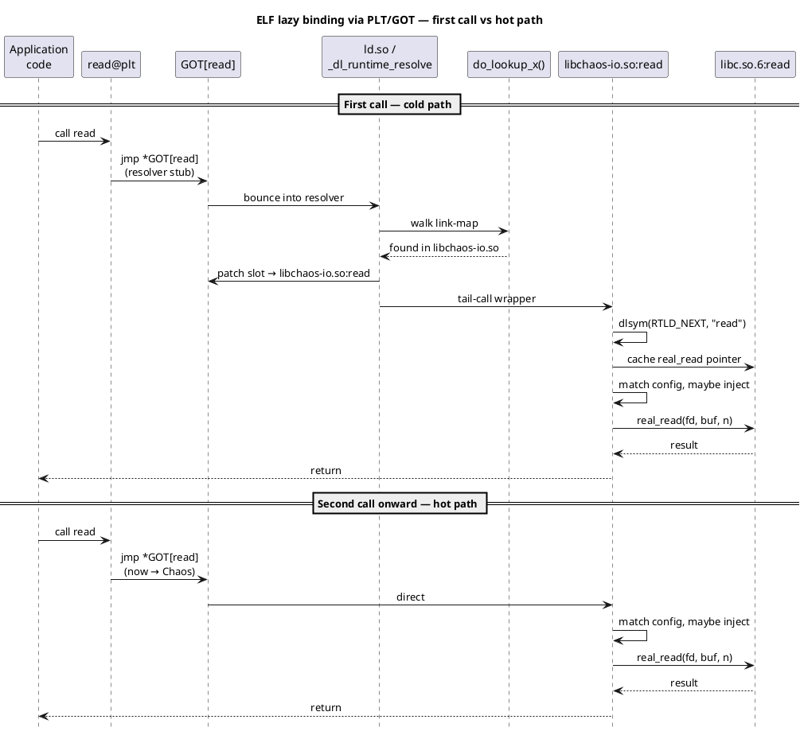
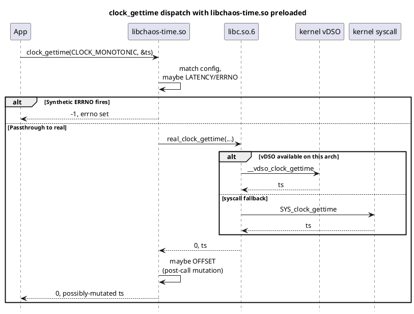

<!--
━━━━━━━━━━━━━━━━━━━━━━━━━━━━━━━━━━━━━━━━━━━━━━━━━━━━━━━━━━━━━
  Engineered by  Christian Schnapka
                 Embedded Principal+ Engineer
                 Macstab GmbH · Hamburg, Germany
                 https://macstab.com
━━━━━━━━━━━━━━━━━━━━━━━━━━━━━━━━━━━━━━━━━━━━━━━━━━━━━━━━━━━━━
-->

# Platform Internals Reference

> *Engineered by* **[Christian Schnapka](https://macstab.com)** — Embedded Principal+ Engineer · [Macstab GmbH](https://macstab.com) · Hamburg, Germany

---

> The layer below the per-library docs. Why the wrappers work, where they break, and what the kernel / dynamic loader / libc actually does when an `LD_PRELOAD` library defines `read`.
>
> Targets: ELF, glibc ≥ 2.27 / musl ≥ 1.1.20, Linux ≥ 4.x, x86_64 / aarch64. No Windows, no macOS, no Solaris, no FreeBSD `rtld(1)` semantics.

---

## Table of contents

1. [ELF symbol resolution at process start](#1-elf-symbol-resolution-at-process-start)
2. [The `dlsym(RTLD_NEXT, …)` idiom and the resolver pseudo-handles](#2-the-dlsymrtld_next--idiom-and-the-resolver-pseudo-handles)
3. [Symbol versioning: `dlsym` vs `dlvsym`](#3-symbol-versioning-dlsym-vs-dlvsym)
4. [`STT_GNU_IFUNC` and the resolver phase](#4-stt_gnu_ifunc-and-the-resolver-phase)
5. [The vDSO surface](#5-the-vdso-surface)
6. [`AT_SECURE` and the LD_PRELOAD strip](#6-at_secure-and-the-ld_preload-strip)
7. [Statically linked binaries](#7-statically-linked-binaries)
8. [Syscall-direct runtimes (Go, Rust `nostd`, Zig)](#8-syscall-direct-runtimes-go-rust-nostd-zig)
9. [glibc vs musl divergence matrix](#9-glibc-vs-musl-divergence-matrix)
10. [Kernel UAPI surfaces we deliberately do not interpose](#10-kernel-uapi-surfaces-we-deliberately-do-not-interpose)
11. [Detection vectors — we do not hide](#11-detection-vectors--we-do-not-hide)
12. [Memory ordering of the config snapshot swap](#12-memory-ordering-of-the-config-snapshot-swap)
13. [Design pattern catalogue](#13-design-pattern-catalogue)
14. [References](#14-references)

---

## 1. ELF symbol resolution at process start

A dynamically-linked Linux process is started by the kernel's `execve(2)` path. The kernel parses the ELF header, finds the `PT_INTERP` program header (typically `/lib64/ld-linux-x86-64.so.2` for glibc-amd64, `/lib/ld-musl-x86_64.so.1` for musl-amd64), maps it, and transfers control to the dynamic loader's entry point. The loader (`ld.so` from this point) is responsible for everything below.

**Reference.** ELF gABI Ch 5 "Program Loading and Dynamic Linking" — https://refspecs.linuxfoundation.org/elf/gabi4+/ch5.dynamic.html · `ld.so(8)` Linux man-pages · glibc `elf/rtld.c` (`_dl_start`, `dl_main`) · musl `src/ldso/dynlink.c` (`__dls2`, `__dls3`).

### 1.1. Building the link-map

`ld.so` constructs a *link-map* — an ordered, doubly-linked list of `struct link_map` (glibc `include/link.h`) or `struct dso` (musl `src/internal/dynlink.h`) — populated in this order:

1. The main executable.
2. `LD_PRELOAD` entries, parsed left-to-right from the env var (and additionally from `/etc/ld.so.preload`, which is process-tree-wide and root-controlled).
3. The executable's `DT_NEEDED` entries in declaration order (typically `libc.so.6` is one of them on glibc).
4. Each loaded object's `DT_NEEDED` transitively, breadth-first.

The order matters because *symbol lookup walks the link-map and returns the first match.* This is the entire load-bearing mechanism behind `LD_PRELOAD` interposition.

**Reference.** glibc `elf/dl-deps.c` `_dl_map_object_deps()` builds the dependency order; glibc `elf/dl-lookup.c` `do_lookup_x()` is the lookup walker. musl equivalent in `src/ldso/dynlink.c` `find_sym()` and `add_dso_to_global_ns()`.

### 1.2. Lazy binding via PLT/GOT

For each external symbol the application calls — say `read` — the linker emits at static-link time:

- A **PLT (Procedure Linkage Table) entry**: a small trampoline. On x86_64, it's a `jmp *got_slot`; on first call, the GOT slot points back into the PLT to a one-time resolver path.
- A **GOT (Global Offset Table) slot**: the indirect-call target. Initially populated with an address that lands the resolver.

On the first call to `read`, control flows: app → `read@plt` → GOT slot → resolver path → `_dl_runtime_resolve` (glibc, in `sysdeps/x86_64/dl-trampoline.S`) → `_dl_fixup` (`elf/dl-runtime.c`) → `do_lookup_x` (`elf/dl-lookup.c`) → walks link-map → finds `libchaos-io.so:read` first → patches the GOT slot to point directly at it → tail-jumps. From the second call onward, control flow is app → `read@plt` → GOT (now pointing at us) → us. **One indirect branch.**

The PLT/GOT mechanism is described in detail in the System V Application Binary Interface, AMD64 Architecture Processor Supplement §4.4.2 (https://gitlab.com/x86-psABIs/x86-64-ABI). For aarch64 the equivalent is the AArch64 Procedure Call Standard §6.1.1 (https://github.com/ARM-software/abi-aa).

### 1.3. What our wrapper does

Once dispatch reaches our `libchaos-io.so:read`, the wrapper needs the *real* glibc `read` to forward to. It calls:

```c
real_read = dlsym(RTLD_NEXT, "read");
```

`RTLD_NEXT` means: *resolve in the link-map starting from the entry **after** the calling shared object.* Because we're earlier in the link-map than libc, this finds glibc's `read`. We cache the resolved pointer (no per-call `dlsym` in the hot path):

```c
/* src/core/chaos_io.c — illustrative shape */
static read_fn_t real_read = NULL;
read_fn_t chaos_io_resolve_real_read(void) {
    if (real_read == NULL) {
        real_read = (read_fn_t) dlsym(RTLD_NEXT, "read");
    }
    return real_read;
}
```

The actual implementation in `src/core/chaos_io.c:chaos_io_resolve_symbol()` is one indirection more general — same shape. **One dlsym per symbol per process lifetime, race-tolerant** (concurrent first-callers redo the work, all converge on the same address).

### 1.4. Initial-call ordering (sequence)

Diagram source: [`docs/diagrams/linkmap.puml`](diagrams/linkmap.puml).



Cost of the hot path: one extra indirect branch (the patched GOT slot), plus the wrapper body. Everything else — the resolver dance, the dlsym — is one-time cold cost.

---

## 2. The `dlsym(RTLD_NEXT, …)` idiom and the resolver pseudo-handles

`dlsym(3)` accepts three classes of handle:

| Handle           | Meaning                                                                                                                                                                                                  |
|------------------|----------------------------------------------------------------------------------------------------------------------------------------------------------------------------------------------------------|
| Real handle      | The pointer returned by `dlopen(3)`. Lookup is rooted at that DSO and follows its dependency tree.                                                                                                        |
| `RTLD_DEFAULT`   | Resolve as if the lookup happened from the main executable: walks the *global* scope in load order. First match wins.                                                                                    |
| `RTLD_NEXT`      | Resolve in the link-map starting from the entry *after* the calling shared object. **The interposer's escape hatch.**                                                                                    |

**Reference.** `dlsym(3)` Linux man-pages §"Resolving function references"; glibc `elf/dl-sym.c` `_dl_sym()` and `_dl_vsym()`; musl `src/ldso/dlsym.c`.

### 2.1. Why `RTLD_NEXT` and not `RTLD_DEFAULT`

Using `RTLD_DEFAULT` in our wrapper would resolve back to *us* (we're earlier in the link-map than libc), causing infinite recursion. `RTLD_NEXT` skips the calling DSO and finds the next match — which, by construction, is the libc symbol we want to forward to.

### 2.2. Failure modes

`dlsym(RTLD_NEXT, "execveat")` on a musl build that doesn't expose `execveat` as a public libc symbol returns `NULL`. We check the cached pointer for `NULL` and either passthrough or synthesize `ENOSYS`. The actual policy is documented per-library; the platform-level rule is: **never crash on a `NULL` from `dlsym(RTLD_NEXT, …)`**.

```c
/* The defensive shape, present in every wrapper that hooks a possibly-absent symbol */
real_x = chaos_resolve_real_x();
if (real_x == NULL) {
    errno = ENOSYS;
    return -1;
}
```

### 2.3. `dlerror(3)` and thread safety

`dlerror(3)` is per-thread on both glibc (POSIX.1-2008 amendment) and musl. We do not call `dlerror` from the hot path; failure is detected by the `NULL` return from `dlsym`. This avoids the well-known race where two threads race to read `dlerror()` after a shared earlier failure.

### 2.4. Caching invariant

The cached `real_x` pointer, once set, is not re-resolved during the process's lifetime. ELF link-maps can in principle grow (via `dlopen` calls during runtime), but no path in this repo causes a relevant link-map mutation that would invalidate `RTLD_NEXT` resolution for our pre-resolved symbols. Documented invariant.

---

## 3. Symbol versioning: `dlsym` vs `dlvsym`

glibc uses GNU symbol versioning (an extension to the Sun gABI) to ship multiple ABI-incompatible variants of the same symbol name in a single library. The most-cited example is `pread`:

- glibc 2.0 → 2.1: `pread` was a 32-bit-offset variant.
- glibc 2.2+: introduced `pread64` (64-bit-offset on 32-bit-capable arches via `-D_FILE_OFFSET_BITS=64`); the *default* version of `pread@@GLIBC_2.2` is the LFS-clean variant.

The on-disk symbol table holds both `pread@GLIBC_2.0` and `pread@@GLIBC_2.2`. The double-`@` marks the **default version**. `dlsym(handle, "pread")` returns the default. `dlvsym(handle, "pread", "GLIBC_2.0")` returns the older-versioned symbol.

**Reference.** "How to Write Shared Libraries" Ulrich Drepper §3 https://www.akkadia.org/drepper/dsohowto.pdf · "Symbol Versioning" Ulrich Drepper https://www.akkadia.org/drepper/symbol-versioning · glibc `elf/Versions` files (per-DSO version maps) · `dlvsym(3)` Linux man-pages.

### 3.1. What this means for us

Our `dlsym(RTLD_NEXT, "pread")` returns `pread@@GLIBC_2.2` on modern glibc — the LFS variant. Application code linked against a normal modern toolchain also resolves to that variant by default, so we and the application are in agreement.

### 3.2. The skew case

If an application is *linked* against the older-versioned `pread@GLIBC_2.0` (rare but possible — `__asm__(".symver pread,pread@GLIBC_2.0")` at compile time), its PLT/GOT for that call site is still resolved through normal link-map order. We win. But the *types* differ — the older symbol takes a 32-bit `off_t`, the newer a 64-bit. Our wrapper's signature must match the application's expected ABI.

**Mitigation.** Our wrappers use the modern types throughout (`size_t`, `ssize_t`, `off_t` with `_FILE_OFFSET_BITS=64` defined in build flags). Applications linked to legacy versions on a 64-bit system would see a type mismatch — but on a 64-bit arch, both legacy and modern `off_t` are 64-bit, so the ABI matches by coincidence. On 32-bit arches the skew matters; we don't ship 32-bit binaries.

### 3.3. musl

musl does not use symbol versioning. There is one `pread`, period. `dlvsym` exists as an alias of `dlsym`. **Reference.** musl `src/ldso/dlsym.c`; "musl Wiki" https://wiki.musl-libc.org/.

---

## 4. `STT_GNU_IFUNC` and the resolver phase

Some hot-path libc symbols — `memcpy`, `memset`, `memmove`, `memcmp`, `strcpy`, `strlen`, `strchr`, `strstr`, on x86_64 also `strncpy`, `strcasecmp`, `strncasecmp`, etc. — are declared `STT_GNU_IFUNC` ("indirect function"). Their relocation type is `R_X86_64_IRELATIVE` (or equivalent). The dynamic loader resolves them by *calling a resolver function* that returns the address of the actual implementation (typically dispatched on CPU feature bits via `cpuid` / `getauxval(AT_HWCAP)`).

**Reference.** "Indirect functions in glibc" https://sourceware.org/glibc/wiki/GNU_IFUNC · LSB extension https://refspecs.linuxfoundation.org/LSB_5.0.0/LSB-Core-generic/LSB-Core-generic/symversion.html · glibc `sysdeps/x86_64/multiarch/memcpy.c` and friends · binutils `bfd/elf-ifunc.c`.

### 4.1. Why it matters for interposition

If `libchaos-io.so` declared `memcpy`, the *application's* `memcpy` calls would still go through us (the application's PLT/GOT is built normally; we win in link-map order). This is the same reasoning as elsewhere — `STT_GNU_IFUNC` does not bypass `LD_PRELOAD` interposition for the application's call sites.

### 4.2. The brittle case

glibc's *internal* code paths often call `memcpy` directly via internal dispatch rather than through the public PLT. Those internal calls do not go through `libchaos-io.so:memcpy`. This means a chaos-mem-string library that hopes to inject errors into `memcpy` would catch only the application's calls, not the libc-internal calls (e.g. `printf`'s buffer fill). The result is non-determinism — half the calls go through chaos, half don't, depending on *which* code path generated the `memcpy`.

### 4.3. Why we don't ship `libchaos-mem-string`

Documented decision: the fault-injection signal is too noisy because of the application/internal split. The hot-path memory primitives belong to a future surface that interposes at a different layer (e.g. via the function-instrumenting `-finstrument-functions` or via Pin/Valgrind), not via plain `LD_PRELOAD`. This is consistent with the "intentionally library-thin" design constraint in the README.

---

## 5. The vDSO surface

The Linux kernel exposes a small, position-independent shared object — the *virtual dynamic shared object* (vDSO) — at a kernel-mapped address per process. Some `.so` symbols are implemented in vDSO so user space can read them without a syscall trap (kernel→user transition costs typically 100–300 cycles).

**Reference.** `vdso(7)` Linux man-pages — https://man7.org/linux/man-pages/man7/vdso.7.html · kernel `arch/x86/entry/vdso/`, `arch/arm64/kernel/vdso/`.

### 5.1. Per-arch surface

**Exported vDSO symbols** (per `vdso(7)`, Linux 6.x):

| Arch          | Symbols exported by the vDSO                                                                                                                                                |
|---------------|-----------------------------------------------------------------------------------------------------------------------------------------------------------------------------|
| `x86_64`      | `__vdso_clock_gettime`, `__vdso_clock_getres`, `__vdso_gettimeofday`, `__vdso_time`, `__vdso_getcpu`                                                                        |
| `i386`        | `__vdso_clock_gettime`, `__vdso_gettimeofday`, `__vdso_time`, `__vdso_clock_getres` (Linux ≥ 4.20), `__vdso_clock_gettime64` (Linux ≥ 5.3)                                  |
| `aarch64`     | `__kernel_clock_gettime`, `__kernel_clock_getres`, `__kernel_gettimeofday`, `__kernel_rt_sigreturn`                                                                         |
| `arm`         | `__vdso_clock_gettime`, `__vdso_gettimeofday` (since Linux 4.5)                                                                                                             |
| `riscv`       | `__vdso_clock_gettime`, `__vdso_clock_getres`, `__vdso_gettimeofday`, `__vdso_getcpu`, `__vdso_rt_sigreturn`, `__vdso_flush_icache`                                         |
| `s390/s390x`  | `__kernel_gettimeofday`, `__kernel_clock_gettime`, `__kernel_clock_getres`                                                                                                  |
| `ppc/ppc64`   | `__kernel_clock_gettime`, `__kernel_clock_getres`, `__kernel_gettimeofday`, `__kernel_get_syscall_map`, `__kernel_get_tbfreq`, `__kernel_sync_dicache`, `__kernel_sigtramp_*` |

**Kernel source paths, hardware counters, and per-clock support** (ground-truth against
`include/vdso/datapage.h` and `arch/<arch>/*/vgettimeofday.c`, Linux 6.6 LTS):
see [`docs/TIME.md §2.1`](TIME.md#21-per-architecture-vdso-clock-support) — that table
maps each architecture to its kernel source file, hardware counter instruction, and the
exact set of clock IDs it accelerates. The key facts for this document:

- glibc's `clock_gettime` resolves `__vdso_clock_gettime` (or `__kernel_clock_gettime`
  on aarch64/ppc) via `getauxval(AT_SYSINFO_EHDR)` at startup and caches the function
  pointer. The PLT slot for libc's `clock_gettime` is patched to our wrapper. The vDSO
  call is therefore **downstream** of our interposition — we see the result after the
  vDSO returns it through glibc's wrapper.
- `CLOCK_PROCESS_CPUTIME_ID` and `CLOCK_THREAD_CPUTIME_ID` are not in the vDSO on any
  arch (Linux 6.6 LTS). They always trap to `SYS_clock_gettime`. Our interposition is
  still effective because we intercept the libc symbol, not the syscall.

### 5.2. Dispatch path for `clock_gettime`

Diagram source: [`docs/diagrams/vdso.puml`](diagrams/vdso.puml).



The vDSO call happens *inside* glibc, *after* our wrapper has already had its match. We are not bypassed.

### 5.3. Where we *are* bypassed

1. **Direct syscall.** `syscall(SYS_clock_gettime, CLOCK_MONOTONIC, &ts)` issues the syscall directly. Our wrapper is never called. Real-world callers: hardened daemons that want to avoid libc, the Go runtime (see §8), some sanitizer interceptors that want to measure unbiased time.
2. **Direct vDSO call.** Application-side `getauxval(AT_SYSINFO_EHDR)` parsing to find the vDSO's ELF header, then resolving `__vdso_clock_gettime` symbol manually and calling it. Vanishingly rare in user code; appears in glibc itself (which is not the kind of call we'd want to intercept anyway).
3. **Static binaries.** §7.
4. **Go-runtime callers.** §8.

### 5.4. What the docs must say

The docs must not claim "the chaos library catches all clock reads." It catches all clock reads *that route through libc*. That covers ≥ 99% of user code paths but not 100%. `docs/TIME.md` §"Bypass surfaces" must enumerate the exceptions verbatim, with the same examples as above. Anything else is dishonesty by omission.

---

## 6. `AT_SECURE` and the LD_PRELOAD strip

When `execve(2)` returns into a new image, the kernel populates the auxiliary vector (auxv) with diagnostic information. `AT_SECURE` is a flag that tells `ld.so` whether to operate in "secure mode."

**Reference.** `getauxval(3)` §AT_SECURE · `ld.so(8)` §"Secure-execution mode" · kernel `fs/exec.c` (`prepare_binprm()`, `bprm_caps_from_vfs_caps()`) · glibc `elf/dl-tunables.list` and `sysdeps/generic/unsecvars.h` · "Capabilities and File Capabilities" `capabilities(7)`.

### 6.1. When `AT_SECURE` is non-zero

The kernel sets `AT_SECURE` on a fresh image when **any** of:

1. The effective UID does not equal the real UID (set-UID transition).
2. The effective GID does not equal the real GID (set-GID transition).
3. The file's file capabilities (`CAP_*` set on the executable via `setcap(8)` / `xattr` `security.capability`) caused capability inheritance to differ.
4. A MAC subsystem (SELinux, AppArmor, Smack) caused a domain transition.

Stored as auxv entry; user code reads via `getauxval(AT_SECURE)`.

### 6.2. What `ld.so` does in secure mode

- **`LD_PRELOAD` is *partly* honored.** Entries containing `/` are accepted only if the file is in a system-trusted directory (`/etc/ld.so.conf.d/`, `/lib*`, `/usr/lib*`) and is not world-writable. Entries without `/` are looked up via the standard path.
- **Most `LD_*` env vars are stripped.** glibc's `sysdeps/generic/unsecvars.h` lists them: `GCONV_PATH`, `GETCONF_DIR`, `HOSTALIASES`, `LD_AUDIT`, `LD_DEBUG`, `LD_DEBUG_OUTPUT`, `LD_DYNAMIC_WEAK`, `LD_HWCAP_MASK`, `LD_LIBRARY_PATH`, `LD_ORIGIN_PATH`, `LD_PROFILE`, `LD_SHOW_AUXV`, `LD_USE_LOAD_BIAS`, `LOCALDOMAIN`, `LOCPATH`, `MALLOC_TRACE`, `NIS_PATH`, `NLSPATH`, `RESOLV_HOST_CONF`, `RES_OPTIONS`, `TMPDIR`, `TZDIR`.
- **`secure_getenv(3)` returns NULL** for any caller that requests a "sensitive" env var.

The exact policy differs between glibc and musl (musl is stricter: `LD_PRELOAD` is fully ignored under `AT_SECURE` in some musl configurations).

### 6.3. Implication for chaos injection

**Setuid binaries do not load our `.so`.** Examples on Debian-bookworm: `/usr/bin/ping` (file-cap `CAP_NET_RAW`), `/usr/bin/sudo` (setuid root), `/usr/bin/passwd` (setuid root). Trying to chaos-test these requires either:

- Running them under a wrapper that resets the privilege state (e.g. running `sudo` from a setuid-clean shell — meaningless because `sudo` itself transitions).
- Using `/etc/ld.so.preload` instead of `LD_PRELOAD` env. This works because `ld.so.preload` is root-controlled and trusted. **We deliberately do not document this as a recommended pattern** — process-tree-wide preload is operationally dangerous.
- Removing the privilege bits from the binary for the duration of the test (`chmod u-s …`). This is invasive and out of scope.

**This is correct security behavior.** Chaos injection into setuid paths would be a privilege-escalation vector. The kernel + ld.so cooperatively prevent it.

### 6.4. Detection

```c
#include <sys/auxv.h>
if (getauxval(AT_SECURE) != 0) {
    /* We're in a secure execution. LD_PRELOAD was stripped. Don't even try. */
}
```

The wrappers themselves don't need this check — if they're not loaded, they're not running. But test harnesses that *expect* injection should call `getauxval(AT_SECURE)` to fail-fast with a clearer error than "tests pass but injection didn't fire."

---

## 7. Statically linked binaries

A statically-linked binary has libc baked into the executable image. There is no `PT_INTERP`; the kernel doesn't invoke `ld.so`; `LD_PRELOAD` is irrelevant.

**Reference.** `elf(5)` Linux man-pages §"Program Header" · "Static Linking" Ulrich Drepper https://www.akkadia.org/drepper/no_static_linking.html (counter-arguments worth reading) · musl-libc wiki §"static linking" https://wiki.musl-libc.org/.

### 7.1. Common static targets

- **Alpine + musl-static C apps.** Common in `FROM scratch` Docker patterns.
- **Statically-linked Go binaries** (default with `CGO_ENABLED=0`). Even when CGO is enabled with glibc, glibc's `nss_*` plugins force partial dynamic linking — but the typical Go binary is fully static.
- **Some kernel-adjacent userspace** (busybox, toybox in static configs).
- **Embedded distros** that prefer static for size predictability.

### 7.2. Why we accept this

Designing around static binaries would mean instrumenting at the syscall layer (e.g. `ptrace(2)` or `seccomp-bpf` with `SECCOMP_RET_TRACE`). That's a different toolchain — different overhead, different scope, different failure modes. The libc-interposition approach is the correct tool for the dynamically-linked-app population, which is the bulk of typical deployments.

### 7.3. Detection

```sh
file /path/to/binary       # "statically linked" → we cannot inject
ldd /path/to/binary        # "not a dynamic executable" → we cannot inject
```

The lifetime of a static binary makes this a *deployment-time* check, not a runtime one.

---

## 8. Syscall-direct runtimes (Go, Rust `nostd`, Zig)

Three well-known runtimes issue Linux syscalls directly without going through libc. Each is partially or fully immune to `LD_PRELOAD` interposition.

### 8.1. Go

The Go runtime (gc compiler, `cmd/compile`) has its own syscall trampolines:

- `runtime/sys_linux_amd64.s` — assembly trampolines for `SYSCALL` instruction directly with `SYS_*` numbers from `runtime/internal/syscall`.
- `runtime/syscall_linux.go` — Go-side wrappers for things like `runtime·write1`, `runtime·read1`.

A `clock_gettime` from Go runtime calls *kernel direct*. Our `libchaos-time` wrapper is bypassed.

**`CGO_ENABLED=1` partial answer.** When cgo is enabled, the resulting binary dynamically links libc. *C* code linked into the binary uses libc — and libc-routed calls *are* subject to `LD_PRELOAD`. However, the Go scheduler, Go I/O, Go time still go through `runtime/sys_linux_*.s` direct syscalls. Net effect: only cgo-bridged calls are interposable.

**Reference.** Go source — https://go.googlesource.com/go/+/refs/heads/master/src/runtime/sys_linux_amd64.s · "Cgo internals" https://github.com/golang/go/wiki/cgo.

### 8.2. Rust `nostd` / `linux-raw-sys`

Rust applications using `#![no_std]` or the `linux-raw-sys` crate issue syscalls directly. Same immunity as Go. Most `tokio`-based async Rust apps *do* go through libc (via `libc` crate FFI), so they are interposable.

### 8.3. Zig

Zig's `std.os.linux` issues syscalls directly. Same immunity as Go/Rust-raw.

### 8.4. What this means for testing those runtimes

Use a different injection mechanism for those code paths:

- **Go**: `gofail` (https://github.com/etcd-io/gofail) — source-code-level fault injection points; or kernel-level chaos via `tc/netem` (network) or fault-injection framework via `/sys/kernel/debug/fail_*` (filesystem, `should_fail_alloc_page`, etc.).
- **Rust**: `failpoints` crate.
- **Kernel-level fault injection.** Linux has built-in fault injection for `should_fail_request`, `should_fail_alloc_page`, etc. (`Documentation/fault-injection/fault-injection.rst`). Process-tree-affecting; needs CAP_SYS_ADMIN.

Document this in `docs/SAFETY.md` and `docs/INTEGRATION.md` so users don't burn afternoons trying to make `LD_PRELOAD` work against a Go binary.

---

## 9. glibc vs musl divergence matrix

The libraries target both. Behavior differences must be named explicitly.

| Symbol / behavior                  | glibc                                                                                              | musl                                                                                       | Our handling                                                                                                                  |
|------------------------------------|----------------------------------------------------------------------------------------------------|--------------------------------------------------------------------------------------------|--------------------------------------------------------------------------------------------------------------------------------|
| `execveat(2)`                      | Public symbol since 2.34; older versions provide via syscall stub but no public ABI symbol         | Not exported as public libc symbol on common versions                                       | `dlsym(RTLD_NEXT, "execveat")` may return `NULL`; we passthrough as `ENOSYS` and document                                       |
| `accept4(2)`                       | Public                                                                                             | Public                                                                                      | Hooked identically                                                                                                              |
| `epoll_pwait2(2)`                  | Public since 2.32                                                                                  | Public                                                                                      | Currently not interposed (out of scope)                                                                                        |
| `sendmmsg(2)`/`recvmmsg(2)`        | Public                                                                                             | Public                                                                                      | Hooked identically                                                                                                              |
| `copy_file_range(2)`               | Public since 2.27                                                                                  | Public                                                                                      | Hooked                                                                                                                          |
| `clock_gettime` vDSO route         | Yes, on supported arches                                                                            | Yes, since 1.1.20                                                                           | Hooked at libc-symbol level (vDSO is downstream of our wrapper)                                                                 |
| `clock_gettime64` (Y2038)          | `__clock_gettime64` private; public `clock_gettime` upgrades to 64-bit `time_t` on time64 builds   | `time_t` is 64-bit on 32-bit musl since 1.2.0                                                | Out of scope today; native-64-bit-time symbols not interposed                                                                   |
| Symbol versioning                  | `@@GLIBC_X.Y` markers throughout                                                                   | None                                                                                        | `dlsym` returns default version on glibc; identity on musl                                                                       |
| `dlvsym(3)`                        | Public                                                                                             | Public (alias of `dlsym`)                                                                   | Not used; we rely on default-version semantics                                                                                  |
| `dlerror(3)` thread-safety         | Per-thread                                                                                         | Per-thread                                                                                  | Same                                                                                                                            |
| `pthread_create` clone flags       | `CLONE_THREAD\|CLONE_VM\|CLONE_FS\|CLONE_FILES\|CLONE_SIGHAND\|CLONE_SETTLS\|CLONE_PARENT_SETTID\|CLONE_CHILD_CLEARTID\|CLONE_SYSVSEM` | Similar set with subtle layout differences (musl `src/thread/pthread_create.c`)             | Hooked at `pthread_create`, not at `clone`. Downstream divergence is invisible to us                                            |
| TLS access from interposer         | TLS works in our wrappers. `__thread` and `_Thread_local` are equivalent for our use                | Same                                                                                        | `__thread` storage class throughout; same semantics on both                                                                     |
| `posix_spawn` fallback             | Uses `clone(CLONE_VM\|CLONE_VFORK)` since glibc 2.24 on Linux for performance                       | Uses `fork+exec`                                                                            | Hooked at the public `posix_spawn` symbol; downstream divergence invisible to us                                                |
| `gethostbyname*` legacy resolver   | Public (deprecated by POSIX.1-2008)                                                                | Public (thin wrappers around `getaddrinfo`)                                                 | Not interposed; `libchaos-dns` owns `getaddrinfo`/`getnameinfo` only                                                            |
| `getaddrinfo` NSS plumbing         | Loads `nss_files.so.2`, `nss_dns.so.2`, `nss_resolve.so.2` per `nsswitch.conf`                      | Static dispatch, no `nss_*` plugins                                                          | We hook the public `getaddrinfo` — both libcs route through our wrapper before NSS dispatch                                     |
| `res_*()` family                   | Public via `libresolv` (linked separately)                                                          | Public                                                                                      | Not interposed                                                                                                                  |
| `errno` thread-local               | `errno` macro expands to `(*__errno_location())` — thread-local                                     | Same shape, different internal layout                                                       | We do not depend on internal layout; using `errno` from `<errno.h>` is correct on both                                          |
| `_GNU_SOURCE` extensions           | Many extension symbols guarded by `_GNU_SOURCE`                                                     | Most `_GNU_SOURCE` symbols present (musl provides them for compatibility)                    | Build with `-D_GNU_SOURCE` to access `accept4`, `RENAME_NOREPLACE`, `O_TMPFILE`, etc.                                            |
| Stack canary support               | `-fstack-protector` works                                                                          | Works                                                                                       | We deliberately disable stack canaries (`-fno-stack-protector`) to keep `.so` size minimal; documented in `docs/ENGINEERING.md`  |
| Static `.so` size                  | typical 50–100 KB per library                                                                       | typical 30–60 KB per library                                                                 | Build flags target ≤ 50 KB on glibc, ≤ 30 KB on musl                                                                              |

---

## 10. Kernel UAPI surfaces we deliberately do not interpose

`LD_PRELOAD` only catches symbols that go through libc. The following kernel-direct surfaces are out of scope for this repo:

| Kernel UAPI                                    | Why out of scope                                                                                                                                        |
|------------------------------------------------|---------------------------------------------------------------------------------------------------------------------------------------------------------|
| `futex(2)` (`SYS_futex`, `SYS_futex_waitv`)    | No libc wrapper for `futex(2)` other than glibc's internal `lll_*` helpers. Used by `pthread_mutex`, condition vars. Hooking would require ptrace/eBPF.  |
| `io_uring(2)` (`io_uring_setup`, `io_uring_enter`, `io_uring_register`) | Submission queue is shared memory; the syscall is initiation/wait, not per-op. Different abstraction; libc doesn't own the data path.                |
| `eBPF(2)` (`BPF_*`)                            | Privileged. Different scope.                                                                                                                            |
| `perf_event_open(2)`                           | Privileged. Different scope.                                                                                                                            |
| `prctl(2)`                                     | Process-control state. Out of scope.                                                                                                                    |
| `seccomp(2)`                                   | Privileged. Different scope.                                                                                                                            |
| `keyctl(2)`                                    | Kernel keyring. Out of scope.                                                                                                                           |
| `userfaultfd(2)`                               | User-space page-fault handler. Out of scope.                                                                                                            |
| `inotify(7)` syscalls                          | Path-watching; not a fault-injection target.                                                                                                            |
| Direct `syscall(2)` calls                      | Bypasses libc entirely. Documented as a bypass vector, not as a target for hooking.                                                                     |

The list is canonical for this repo. Future libraries (`libchaos-fs-lifecycle`, etc.) may extend it. Out-of-scope ≠ unimportant — these are documented in `docs/development/ROADMAP.md` if they're candidates for future libraries.

---

## 11. Detection vectors — we do not hide

Engineering tool, not malware. An application that wants to know whether it's being injected can:

1. **Inspect `getenv("LD_PRELOAD")`.** Returns the env-var value. Always present unless `AT_SECURE` stripped it.
2. **Read `/proc/self/maps`.** Lists every loaded `.so` with backing-file path. Our `.so` shows up under its install path.
3. **Call `dlopen(NULL, RTLD_NOW)` and `dlinfo(handle, RTLD_DI_LINKMAP, &lm)`.** Walks the link-map. Our DSO is visible.
4. **Compare `dlsym(RTLD_DEFAULT, "read")` with `dlsym(RTLD_NEXT, "read")` from a non-interposed call site.** If they differ, an interposer is between the caller and libc.
5. **Watch for `stat("/tmp/.chaos-io.conf", …)` calls.** Our config-file probe is observable through `strace -e trace=stat` or `inotify`.
6. **Observe injected behavior.** A `read()` that returns `EIO` on a freshly-written tmpfile that has no I/O error backing is unambiguous chaos.

This is by design. **Test infrastructure must be auditable.** A "stealthy chaos" tool that an application cannot detect would also be undetectable when it accidentally runs in production.

Practical use of this detectability: a test harness checks `getenv("LD_PRELOAD")` to guard chaos-aware assertions, ensuring the test isn't falsely passing because injection didn't happen.

---

## 12. Memory ordering of the config snapshot swap

The implementation publishes new config snapshots lock-free using a CAS on a 64-bit mtime cache key. The exact primitives in use (verified — `src/core/chaos_io_internal.h`):

```c
/* Reads a volatile 64-bit shared value with a full memory barrier. */
static inline uint64_t chaos_io_atomic_load_u64(volatile uint64_t *value) {
    __sync_synchronize();
    return *value;
}

/* Performs a compare-and-swap on a shared 64-bit value. */
static inline int chaos_io_atomic_cas_u64(volatile uint64_t *value, uint64_t expected, uint64_t desired) {
    return __sync_bool_compare_and_swap(value, expected, desired);
}
```

### 12.1. The semantics of `__sync_synchronize()`

GCC documents `__sync_synchronize()` as a *full memory barrier* — it issues `mfence` on x86_64 (or `lock or` on older x86 without `mfence` semantics) and `dmb ish` on aarch64.

**Reference.** GCC manual §6.55 "Legacy `__sync` Built-in Functions for Atomic Memory Access" — https://gcc.gnu.org/onlinedocs/gcc/_005f_005fsync-Builtins.html · Intel SDM Vol 3A §8.2 "Memory Ordering" · ARM ARM §B2.3 "Memory ordering".

This is *stronger* than what the C11 memory model prescribes for a `memory_order_seq_cst` load. C11 SC-load on x86_64 typically emits `mov` (no fence; x86 TSO guarantees acquire semantics on plain loads) plus an `mfence` on the corresponding store. The implementation here issues a fence on **every load** and pays for the strongest form, every time.

### 12.2. Why this is correct

The reload path is *cold* (config-mtime polling on `stat()` triggers it). Hot-path loads of the snapshot pointer don't actually go through `chaos_io_atomic_load_u64` — they read directly from a local cached pointer. The atomic helper is used for the mtime-change detection step, which occurs once per call but only meaningfully matters at reload time.

Trade-off taken: **correctness over micro-perf.** The full barrier is unimpeachable across all supported arches and toolchains; choosing tighter primitives (`__atomic_load_n(.., __ATOMIC_ACQUIRE)`) would shave cycles but introduce the C11/C17 memory model question of *which* ordering exactly to use for which call site, with attendant review burden.

### 12.3. Snapshot publication ordering

The reload sequence is:

1. CAS the mtime key from `OLD` to `RELOADING` (acquires exclusive ownership of the reload).
2. Read + parse new config off disk into a freshly-allocated snapshot.
3. Publish the new snapshot pointer.
4. CAS the mtime key from `RELOADING` to `NEW`.

Step 2 is the slow path (disk I/O + parsing). Other readers see `RELOADING` and either wait or, more commonly, continue serving from the *previous* snapshot (the previous pointer is still valid; the snapshot allocator never frees a snapshot that might still be in use). This is the **double-snapshot pointer-swap** pattern (similar in shape to RCU but without grace periods — we tolerate slightly stale readers for one polling round).

**Reference.** "Read-Copy-Update" Paul McKenney https://www.kernel.org/doc/html/latest/RCU/ · "Atomic Operations and Their Use in Linux" Mauerer §5.5 (gentler intro).

### 12.4. Future direction (not committed)

Migration to C11 atomics (`stdatomic.h`) is a candidate refactor. It would let us specify ordering per-site (`memory_order_acquire` for the snapshot-pointer load, `memory_order_release` for the snapshot publication), saving fence cycles on aarch64 in particular. Trade-off: GCC's C11 atomics on `volatile uint64_t` can emit stronger code than expected on some arches; would need verifier. Not a P0.

---

## 13. Design pattern catalogue

The repository implements several named patterns. Knowing the names helps reviewers locate the load-bearing structure.

| Pattern                                      | Where applied                                                                                                                      | Source-of-name                                                                  |
|----------------------------------------------|------------------------------------------------------------------------------------------------------------------------------------|---------------------------------------------------------------------------------|
| **Symbol Interposer** (informal)             | The whole library design — define `read`/`write`/etc., use `dlsym(RTLD_NEXT, …)` to forward.                                       | "Linkers and Loaders" John Levine §10                                            |
| **Decorator** (GoF)                          | The wrapper "decorates" the real libc function with pre-call match + effect.                                                       | Gamma, Helm, Johnson, Vlissides §"Decorator"                                     |
| **Strategy** (GoF)                           | Effect dispatch: `ERRNO`, `LATENCY`, `CORRUPT`, `TORN`, etc. are interchangeable strategies on the same operation.                 | GoF §"Strategy"                                                                  |
| **Adapter** (GoF)                            | Cross-libc surface adaptation (`execveat` may or may not exist; the wrapper presents a uniform surface).                            | GoF §"Adapter"                                                                  |
| **Object Pool / Cache**                      | The fd → path cache (`src/config/chaos_io_fdcache.c`) — bounded TLS-local cache.                                                    | Fowler "Patterns of Enterprise Application Architecture"                         |
| **Reentrancy Guard** (recursion lock)        | `__thread int g_chaos_io_tls_guard` set on entry, cleared on exit; nested wrapper calls (e.g. `dlsym` doing `stat`) bail out.       | "Lock-Free Programming" Herlihy & Shavit                                         |
| **Two-Snapshot Pointer Swap** (RCU-flavor)   | Config reload — readers read the *current* snapshot pointer; reloader swaps in the *next*; old snapshots are reaped after a quiescent round. | Linux `Documentation/RCU/whatisRCU.rst`                                  |
| **Lazy Symbol Resolution**                   | `real_x = dlsym(RTLD_NEXT, "x")` cached in static; first-call resolves, subsequent calls hit the cache.                             | Standard interposer idiom; cf. ld.so PLT lazy binding.                           |
| **Per-Thread PRNG**                          | `__thread uint64_t g_chaos_io_tls_prng_state` — each thread has independent fault sequence.                                        | "Numerical Recipes" §7.1; Vigna "An experimental exploration of Marsaglia's xorshift generators" |
| **Fail-Open / Safe Default**                 | Invalid config, missing config, parse error → passthrough.                                                                          | "Designing Data-Intensive Applications" Kleppmann §"Reliability"                  |

### 13.1. Specifically-not-used patterns (with reasons)

- **Singleton.** Snapshot state is module-static, not wrapped in a singleton class. C, not Java; the static-storage-duration globals in a single TU are the right unit of encapsulation.
- **Observer / Pub-Sub.** Config reload doesn't notify; readers poll. Pub-sub would require a notification path that's hard to make work across all preload-loaded processes.
- **Factory.** No abstract types; no construction abstraction needed.
- **Visitor.** No tree to walk; flat config rule list scanned linearly.

---

## 14. References

### Specifications

- POSIX.1-2017 / IEEE Std 1003.1-2017 — https://pubs.opengroup.org/onlinepubs/9699919799/
- ISO/IEC 9899:2011 (C11) — TLS storage class `_Thread_local`, atomics
- ELF gABI Ch 5 — https://refspecs.linuxfoundation.org/elf/gabi4+/ch5.dynamic.html
- System V ABI AMD64 supplement §4.4.2 (PLT/GOT) — https://gitlab.com/x86-psABIs/x86-64-ABI
- AArch64 Procedure Call Standard §6.1.1 — https://github.com/ARM-software/abi-aa
- LSB extension `STT_GNU_IFUNC` — https://refspecs.linuxfoundation.org/LSB_5.0.0/LSB-Core-generic/LSB-Core-generic/symversion.html

### Linux man-pages

- `ld.so(8)`, `ldd(1)`, `dlopen(3)`, `dlsym(3)`, `dlvsym(3)`, `dlerror(3)`, `dladdr(3)`, `dlinfo(3)`
- `vdso(7)`, `getauxval(3)`, `secure_getenv(3)`
- `execve(2)`, `execveat(2)`, `clone(2)`, `fork(2)`, `vfork(2)`, `posix_spawn(3)`, `pthread_create(3)`
- `clock_gettime(2)`, `nanosleep(2)`, `clock_nanosleep(2)`, `gettimeofday(2)`, `times(2)`
- `mmap(2)`, `munmap(2)`, `mprotect(2)`, `madvise(2)`, `mremap(2)`, `mlock(2)`
- `read(2)`, `write(2)`, `readv(2)`, `writev(2)`, `pread(2)`, `pwrite(2)`, `preadv(2)`, `pwritev(2)`
- `socket(2)`, `bind(2)`, `listen(2)`, `connect(2)`, `accept(2)`, `accept4(2)`, `shutdown(2)`
- `getaddrinfo(3)`, `getnameinfo(3)`, `nsswitch.conf(5)`, `nss(5)`
- `proc(5)` for `/proc/self/maps`, `/proc/self/fd`, `/proc/self/fdinfo`
- `capabilities(7)`, `credentials(7)`

### Toolchain documentation

- GCC `__sync_*` builtins — https://gcc.gnu.org/onlinedocs/gcc/_005f_005fsync-Builtins.html
- GCC `__atomic_*` builtins — https://gcc.gnu.org/onlinedocs/gcc/_005f_005fatomic-Builtins.html
- GCC visibility attribute — https://gcc.gnu.org/onlinedocs/gcc/Common-Function-Attributes.html#Common-Function-Attributes

### Source-of-truth

- glibc — https://sourceware.org/git/?p=glibc.git
  - `elf/dl-lookup.c` (`do_lookup_x`)
  - `elf/dl-runtime.c` (`_dl_fixup`)
  - `elf/dl-sym.c` (`_dl_sym`, `_dl_vsym`)
  - `sysdeps/x86_64/multiarch/memcpy*.S` (IFUNC dispatch)
  - `sysdeps/unix/sysv/linux/clock_gettime.c` (vDSO route)
  - `sysdeps/generic/unsecvars.h` (AT_SECURE strip list)
  - `nptl/pthread_create.c`
- musl — https://git.musl-libc.org/cgit/musl
  - `src/ldso/dynlink.c`
  - `src/ldso/dlsym.c`
  - `src/time/clock_gettime.c`
  - `src/internal/vdso.c`
  - `src/thread/pthread_create.c`
- Linux kernel — https://git.kernel.org/
  - `arch/x86/entry/vdso/` (vDSO sources)
  - `arch/arm64/kernel/vdso/`
  - `fs/exec.c` (AT_SECURE setup)
  - `kernel/fork.c` (clone, fork)
  - `Documentation/RCU/`
  - `Documentation/fault-injection/fault-injection.rst`

### Books and papers

- Levine, John. *Linkers and Loaders.* Morgan Kaufmann, 1999. §10 "Dynamic Linking and Loading".
- Drepper, Ulrich. "How to Write Shared Libraries". https://www.akkadia.org/drepper/dsohowto.pdf
- Drepper, Ulrich. "Symbol Versioning". https://www.akkadia.org/drepper/symbol-versioning
- Gamma, Helm, Johnson, Vlissides. *Design Patterns*. Addison-Wesley, 1994.
- Herlihy, Maurice & Shavit, Nir. *The Art of Multiprocessor Programming*. Morgan Kaufmann, 2008.
- Kleppmann, Martin. *Designing Data-Intensive Applications*. O'Reilly, 2017.
- McKenney, Paul E. *Is Parallel Programming Hard, And, If So, What Can You Do About It?* https://kernel.org/pub/linux/kernel/people/paulmck/perfbook/perfbook.html
- Vigna, Sebastiano. "An experimental exploration of Marsaglia's xorshift generators, scrambled". *ACM TOMS* 42(4), 2016.
- Mauerer, Wolfgang. *Professional Linux Kernel Architecture*. Wiley, 2008.

---

<div align="center">

*Architecture, implementation, and documentation crafted with Love and Passion by*

**[Christian Schnapka](https://macstab.com)**  
Embedded Principal+ Engineer  
[Macstab GmbH](https://macstab.com) · Hamburg, Germany

*Building systems that operate correctly at the edges — including the ones you deliberately break.*

</div>
