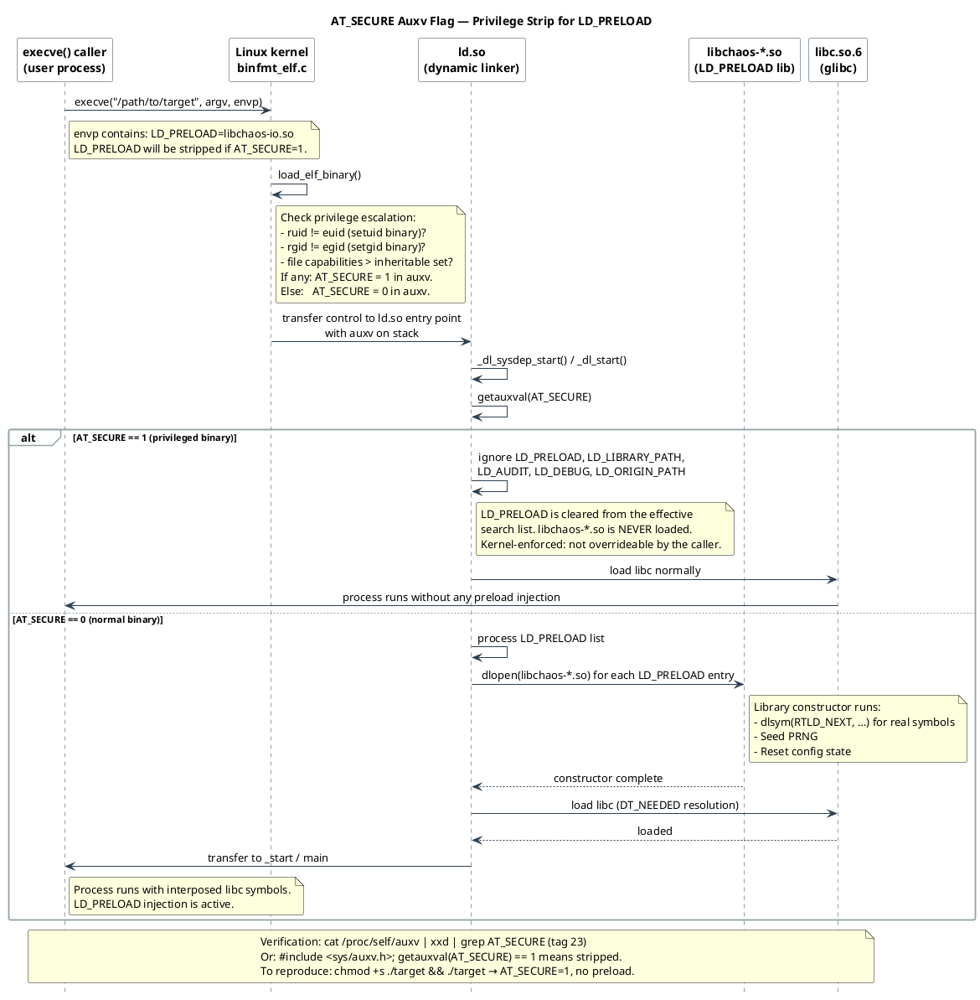

<!--
━━━━━━━━━━━━━━━━━━━━━━━━━━━━━━━━━━━━━━━━━━━━━━━━━━━━━━━━━━━━━
  Engineered by  Christian Schnapka
                 Embedded Principal+ Engineer
                 Macstab GmbH · Hamburg, Germany
                 https://macstab.com
━━━━━━━━━━━━━━━━━━━━━━━━━━━━━━━━━━━━━━━━━━━━━━━━━━━━━━━━━━━━━
-->

# Safety and Operational Boundaries

> *Engineered by* **[Christian Schnapka](https://macstab.com)** — Embedded Principal+ Engineer · [Macstab GmbH](https://macstab.com) · Hamburg, Germany

---

This document specifies the safety model, privilege constraints, and operational
hazards of the chaos preload libraries. It is not a security controls document;
these libraries are not security boundaries. It is a guide to what can go wrong
operationally and why specific design decisions prevent the worst failure modes.

---

## Table of Contents

1. [AT_SECURE and the Privilege Strip](#1-at_secure-and-the-privilege-strip)
2. [setuid, setgid, and File Capabilities](#2-setuid-setgid-and-file-capabilities)
3. [Container Capabilities and LD_PRELOAD](#3-container-capabilities-and-ld_preload)
4. [seccomp Interaction](#4-seccomp-interaction)
5. [Fail-Open Guarantee](#5-fail-open-guarantee)
6. [Reentrancy Invariant](#6-reentrancy-invariant)
7. [The "Never Preload Into Dev Shell" Footgun](#7-the-never-preload-into-dev-shell-footgun)
8. [Detectability and Audit Trail](#8-detectability-and-audit-trail)
9. [Config File Security](#9-config-file-security)
10. [Interaction with Sanitisers and Debug Runtimes](#10-interaction-with-sanitisers-and-debug-runtimes)
11. [Cross-Library Composition Hazards](#11-cross-library-composition-hazards)

---

## 1. AT_SECURE and the Privilege Strip

`AT_SECURE` is an auxiliary vector entry (tag 23) set to `1` by the Linux kernel
when the process was started with elevated privileges relative to the calling
user. Specifically, the kernel sets `AT_SECURE=1` when:

- The binary has the setuid bit (`S_ISUID`) and the real UID ≠ effective UID.
- The binary has the setgid bit (`S_ISGID`) and the real GID ≠ effective GID.
- The binary has file capabilities (`CAP_*` in the file capability set) that were
  not already in the process's inheritable set.
- The binary's effective UID is not in the kernel's "secure" set (platform-specific,
  unusual in standard Linux).

When `AT_SECURE=1`, the Linux dynamic linker (`ld.so`) silently ignores
`LD_PRELOAD`, `LD_LIBRARY_PATH`, `LD_AUDIT`, and other security-sensitive
`LD_*` environment variables. The chaos libraries are **never loaded** in this
case.

This is a kernel-enforced security boundary that the libraries cannot influence.
It is correct behaviour: allowing a lesser-privileged caller to inject code
into a setuid binary via `LD_PRELOAD` would be a privilege escalation.

Reference: `ld.so(8)` §"Secure-execution mode"; Linux kernel `fs/binfmt_elf.c`,
`ARCH_DLINFO` and `auxv` setup; `getauxval(3)`.

### 1.1 Verifying AT_SECURE

To verify that `AT_SECURE` is set for a given binary:

```sh
# Run a small probe under the target binary:
LD_PRELOAD=/path/libchaos-io-glibc-amd64.so printenv LD_PRELOAD
```

If the output is empty, `LD_PRELOAD` was stripped. Alternatively:

```c
#include <sys/auxv.h>
printf("AT_SECURE = %lu\n", getauxval(AT_SECURE));
```

### 1.2 Workarounds (and Why Not to Use Them)

The only way to preload into a setuid process is to run as root (then the
effective UID is root, equal to the binary's setuid owner, so no privilege
elevation occurs). Do not use `sudo` for this in test environments: running
chaos libraries under root in a test harness blurs the privilege model and can
cause collateral damage to system files.

### 1.3 AT_SECURE Flow Diagram

Full kernel-to-linker-to-library flow ([source](diagrams/atsecure.puml)):



---

## 2. setuid, setgid, and File Capabilities

Beyond `AT_SECURE`, the libraries have no special handling for privilege state.
Once loaded (in a non-setuid target), they run with the same UID/GID as the
target process.

File capabilities (`cap_get_file()` / `getcap`) are not a special case for the
library itself; they affect whether `AT_SECURE` is set for the target binary, as
described in §1.

The config file at `/tmp/.chaos-*.conf` is read with the target process's
privilege. If the process runs as a low-privilege user and `/tmp/.chaos-*.conf`
is owned by root with mode `0600`, the config read will fail (EACCES). The
library will fall back to passthrough (see §5). This is the correct operational
behaviour.

---

## 3. Container Capabilities and LD_PRELOAD

In containers, `LD_PRELOAD` is an ordinary environment variable visible to the
container process. There is no capability required to use `LD_PRELOAD` for
dynamically linked non-setuid binaries.

Common container-level concerns:

### 3.1 Read-Only Filesystem

If the container image has `/ readOnly: true` (Kubernetes `securityContext`),
the config file at `/tmp/.chaos-*.conf` may not be writable. Solutions:

- Mount a writable `emptyDir` volume at `/tmp`.
- Use a writable config path via `CHAOS_IO_CONFIG` environment variable override
  (not currently implemented; `/tmp` is hardcoded).

### 3.2 `no-new-privileges` securityContext

`securityContext.allowPrivilegeEscalation: false` (Kubernetes) sets `PR_SET_NO_NEW_PRIVS`
on the container's init process. This prevents `execve()` from gaining new
privileges (no setuid-binary privilege escalation). It does not affect
`LD_PRELOAD`. The chaos libraries are unaffected.

### 3.3 AppArmor and SELinux

AppArmor and SELinux profiles can restrict `LD_PRELOAD` by denying `mmap(PROT_EXEC)`
on the preloaded `.so` file or by denying `open()` of the library. This depends
on the specific policy. If the container's AppArmor/SELinux policy does not allow
loading external shared libraries, `LD_PRELOAD` will fail silently (the library
is not loaded; the target process runs normally without injection).

---

## 4. seccomp Interaction

`seccomp` (Secure Computing Mode) filters syscalls using a BPF program. Strict
`seccomp` filters (e.g., Docker's default `seccomp` profile) block unusual
syscalls while allowing common ones.

### 4.1 Syscalls Used by the Libraries

The chaos libraries use the following syscalls beyond what the target application
uses:

| Syscall         | Used by                           | Blocked by default seccomp? |
|-----------------|-----------------------------------|-----------------------------|
| `statx`/`stat`  | Config mtime check (all libs)     | No — in default allowlist   |
| `openat`        | Config file read (all libs)       | No                          |
| `read`          | Config file read (all libs)       | No                          |
| `nanosleep`     | LATENCY effect (all libs)         | No                          |
| `SYS_gettid`    | TLS PRNG seed (all libs, Linux)   | No                          |
| `getrandom`     | Process seed at startup           | In Docker default profile   |
| `open`          | Config, `/dev/urandom` (legacy)   | Deprecated in favor of openat|

If `getrandom(2)` is blocked by seccomp, the library falls back to seed
derivation from `getpid()` and `time(NULL)` — less entropy, but functional.

### 4.2 Detecting seccomp Filtering

If a syscall is blocked by `seccomp`, it returns `EPERM` or `ENOSYS` (depending
on the `SECCOMP_RET_ERRNO` filter action). The library treats any failure to open
`/dev/urandom` or `getrandom` at startup as a seed-quality degradation, not a
fatal error.

### 4.3 seccomp and Injected Syscalls

The chaos libraries inject failures at the libc boundary, before the real syscall.
A synthetic `ERRNO` fires before `real_write()` is called. The seccomp filter
is in the kernel and only sees real syscalls. Synthetic failures do not reach the
seccomp layer.

---

## 5. Fail-Open Guarantee

The most important operational safety property:

> **In any error condition, the library falls through to the real libc call.**
> It never fabricates a synthetic failure for a call that was not intended to
> be failed.

Conditions that trigger fail-open (passthrough):

- Config file absent: all calls pass through.
- Config file unreadable (EACCES, EIO): all calls pass through.
- Config file parse error (any invalid line): entire file rejected, all calls
  pass through.
- Config file too large (> `CHAOS_*_MAX_CONFIG_BYTES`): rejected, pass through.
- Selector match ambiguous or unresolvable (e.g., fd-to-path resolution failed):
  call passes through unchanged.
- Probability gate not triggered: call passes through.
- TLS guard set (reentrancy): call passes through immediately.

The fail-open guarantee means that removing the config file restores normal
behaviour immediately (on the next config mtime check, which happens on the
next interposed call).

---

## 6. Reentrancy Invariant

The reentrancy guard (`__thread int g_chaos_*_tls_guard`) is the mechanism that
prevents the library from injecting into its own internal calls.

**Invariant:** For any thread executing inside a chaos library wrapper, the TLS
guard is set. If that wrapper calls any interposed libc symbol (e.g., the LATENCY
path calling `nanosleep`, the config-reload path calling `open`/`read`/`stat`),
those calls bypass all injection logic and go directly to the real libc symbol.

**Why this is correct:** The library's own internal I/O to read the config file,
or its own calls to `nanosleep()` for LATENCY, must not themselves be subject to
injection. If they were, the library would inject into itself: `open()` of the
config file would fail (potentially forever), or `nanosleep()` called for LATENCY
would trigger another LATENCY, causing infinite recursion.

**Corollary:** Calls made by the library internals while the guard is set do
not count as application calls. They are not subject to rule matching, and they
do not advance `FAIL_AFTER` counters.

**Guard restoration:** The guard is restored to its previous value (not
unconditionally set to 0). This means nested wrapper calls (rare but possible
during TLS initialisation) are handled correctly. See `docs/MEMORY.md` §14 for
the full protocol.

---

## 7. The "Never Preload Into Dev Shell" Footgun

The most common operational error with preload chaos libraries:

```sh
export LD_PRELOAD=/path/libchaos-io-glibc-amd64.so
# ... forget to unset it ...
# ... run git, ls, your editor, your CI tool, anything ...
```

With `LD_PRELOAD` set in the shell environment, **every dynamically linked
process spawned by that shell** inherits the preload library. This includes:

- `git` — file I/O on `.git/` objects fails → corrupted working tree
- `ssh` — connection failures → broken terminal sessions
- `cron` — `fork()`/`exec()` failures → missed jobs
- `systemd` user units — process lifecycle failures → unit start failures
- Your test harness runner itself — failures in the runner's own I/O

**Mitigation pattern:**

Always scope `LD_PRELOAD` to the specific target invocation:

```sh
LD_PRELOAD=/path/libchaos-io.so TARGET_BINARY [args]
```

Never `export LD_PRELOAD` in a shell session. If you need it for a test suite,
set it only in the test runner's subprocess environment, not the parent shell.

In Makefiles:

```makefile
run-with-chaos:
    LD_PRELOAD=$(CHAOS_LIB) $(TARGET_BIN)
```

Not:

```makefile
export LD_PRELOAD = $(CHAOS_LIB)   # WRONG — affects all make recipes
```

---

## 8. Detectability and Audit Trail

### 8.1 How to Detect a Loaded Preload Library

From outside the process (Linux):

```sh
# Check process maps
cat /proc/<pid>/maps | grep "libchaos"

# Check environment
cat /proc/<pid>/environ | tr '\0' '\n' | grep LD_PRELOAD

# Check loaded DSOs
cat /proc/<pid>/maps | grep "\.so"
```

From inside the process (C):

```c
// Check the link-map
#include <link.h>
struct link_map *lm;
dlinfo(RTLD_SELF, RTLD_DI_LINKMAP, &lm);
while (lm != NULL) {
    printf("%s\n", lm->l_name);
    lm = lm->l_next;
}
```

### 8.2 No Built-In Logging

The chaos libraries emit no logs by default. This is a deliberate design choice:

1. Logging from inside a preload library requires calling `write()`/`fprintf()`,
   which is interposed by `libchaos-io`. Logging inside `libchaos-io` would
   trigger the reentrancy guard and log nothing (it would call real `write()`),
   but it creates a confusing call pattern.
2. Logging to `stderr` (fd 2) is excluded from injection, but writing large
   volumes to `stderr` from inside every `write()` call would corrupt application
   output and degrade performance.
3. The correct observability signal is the **application's own behaviour**: the
   error it reports, the latency it measures, the retry it performs. That is
   exactly what the library is testing.

### 8.3 Indirect Audit Signals

Operators can confirm injection is active by:

- Running with a deliberate `*:ERRNO:ENOENT:1.0` (100% failure rate) and
  confirming the application receives `ENOENT`.
- Using `strace` on the target process to observe when the real libc call is
  not reached: `strace -e trace=write ./target` will show gaps where `write()`
  never appears (because the injection fired pre-call).
- Using `perf trace` for the same observation.

---

## 9. Config File Security

The config files (`/tmp/.chaos-*.conf`) are fully trusted by the library. An
attacker who can write to these files can control the failure patterns applied
to the target process.

**Default location:** `/tmp/.chaos-*.conf`. `/tmp` is world-writable on Linux
(sticky bit, mode `1777`). Any user on the system can create these files.

**Consequence:** In a multi-tenant environment, any user can:
1. Create `/tmp/.chaos-io.conf` with `*:write:EIO:1.0`.
2. Any process running with `LD_PRELOAD=libchaos-io.so` on that machine
   will immediately fail all writes.

**Mitigations:**

1. **Use a non-world-writable path.** The config path is currently hardcoded.
   Operators can work around this by mounting a private tmpfs at `/tmp` inside
   a container (isolates the namespace).
2. **Container isolation.** Running target processes in separate container
   namespaces with separate `/tmp` mounts ensures that a malicious host-level
   user cannot inject config files into the container's `/tmp`.
3. **Verify file ownership before use** (currently not implemented). A future
   version could `stat()` the config file and reject it if the file is not
   owned by the target process's UID or by root.

This is a known design limitation in the current implementation. It is acceptable
for test/staging environments where the entire machine is controlled by the test
operator. It is not appropriate for multi-tenant production environments.

---

## 10. Interaction with Sanitisers and Debug Runtimes

### 10.1 AddressSanitiser (ASan)

ASan (`-fsanitize=address`) installs its own `LD_PRELOAD`-like interceptors for
memory allocation and deallocation. ASan intercepts `malloc`, `free`, `mmap`,
`munmap`, and signal-safe I/O.

**Interaction with libchaos-memory:** ASan's `mmap` interceptor and
`libchaos-memory`'s `mmap` wrapper are both PLT-level interposers. Their ordering
depends on `LD_PRELOAD` load order. If `libchaos-memory` is in front:

1. Application calls `mmap()`.
2. `libchaos-memory` wrapper fires, checks rules, optionally injects.
3. `libchaos-memory` calls `real_mmap()` (via RTLD_NEXT).
4. RTLD_NEXT resolves to ASan's `mmap` interceptor (which is earlier in the
   link-map than glibc).
5. ASan's interceptor runs, then calls the real glibc `mmap`.

This chain is correct; double-interposition is handled by RTLD_NEXT walking
past each layer. The reentrancy guard in `libchaos-memory` prevents re-entry
from ASan's own internal `mmap` calls (which go directly to the real `mmap`
via ASan's internal bypass).

### 10.2 ThreadSanitiser (TSan)

TSan intercepts `pthread_create`, `pthread_mutex_*`, and memory accesses. If
`libchaos-process` and TSan are both loaded, `pthread_create()` goes through:

1. `libchaos-process` wrapper.
2. TSan's `pthread_create` interceptor (via RTLD_NEXT).
3. Real glibc `pthread_create`.

TSan may report false positives if it observes the `libchaos-process`
wrapper's internal config access without understanding the TLS guard protocol.
TSan's suppressions file should suppress races on `g_chaos_process_*` globals
if they appear.

### 10.3 Valgrind

Valgrind instruments code at the machine-instruction level, not at the PLT level.
All `mmap`, `munmap`, `malloc`, `free` calls are tracked by Valgrind regardless
of `LD_PRELOAD`. Chaos library injected `munmap` failures that leave mappings
alive will appear as memory leaks in Valgrind's memcheck tool — this is expected
and correct (the synthetic failure models the mapping not being freed).

Suppression pattern for Valgrind:

```
{
  chaos-munmap-leak
  Memcheck:Leak
  fun:mmap
  ...
  fun:chaos_memory_munmap
}
```

---

## 11. Cross-Library Composition Hazards

When multiple chaos libraries are simultaneously loaded via `LD_PRELOAD`, several
interaction hazards arise.

### 11.1 Config Reload Cascades

Each library performs `stat(its_config_path)` on every interposed call. When all
six libraries are loaded:

- Every `write()` triggers `libchaos-io`'s `stat("/tmp/.chaos-io.conf")`.
- If `libchaos-io`'s LATENCY path calls `nanosleep()`, the `nanosleep` wrapper in
  `libchaos-time` fires — but the `libchaos-io` TLS guard is set, so the
  `libchaos-time` wrapper calls real `nanosleep` directly.

This is correct. The per-library TLS guard prevents cross-library re-injection
for the LATENCY sleep path.

### 11.2 Simultaneous FAIL_AFTER Counters

`FAIL_AFTER` counters in `libchaos-process` count invocations globally. If both
`libchaos-process` and `libchaos-net` are loaded and `libchaos-net` internally
creates sockets (e.g., for epoll fd resolution), those socket-creation calls
are not `fork()` or `pthread_create()` calls, so they do not advance process
counters. The counters are per-symbol within each library; there is no cross-library
counter sharing.

### 11.3 LD_PRELOAD Order and Link-Map

The `LD_PRELOAD` string lists DSOs left-to-right. The dynamic linker adds them
to the link-map in that order (before the executable's `DT_NEEDED` entries).

For the `one symbol, one owner` invariant: since no two chaos libraries own the
same symbol, load order does not affect which library owns each interposed call.
Load order only matters if two libraries owned the same symbol (which is the
prohibited state).

For `RTLD_NEXT` resolution: each library calls `dlsym(RTLD_NEXT, name)` in its
constructor. RTLD_NEXT starts from the caller's position in the link-map and
walks forward. For `libchaos-io`'s `write` wrapper: `RTLD_NEXT("write")` finds
glibc's `write` (because no other chaos library owns `write`). Correct.

### 11.4 Constructor Ordering

ELF shared object constructors (`__attribute__((constructor))`) run in
dependency-resolved order, with `LD_PRELOAD` libraries running before the main
executable's constructors. The order among `LD_PRELOAD` libraries themselves is
left-to-right in the `LD_PRELOAD` string.

Each chaos library's constructor resolves its real libc symbols and seeds its
PRNG. There are no cross-library dependencies in the constructor path. Order
among chaos constructors does not matter for correctness.

---

<div align="center">

*Architecture, implementation, and documentation crafted with Love and Passion by*

**[Christian Schnapka](https://macstab.com)**  
Embedded Principal+ Engineer  
[Macstab GmbH](https://macstab.com) · Hamburg, Germany

*Building systems that operate correctly at the edges — including the ones you deliberately break.*

</div>
