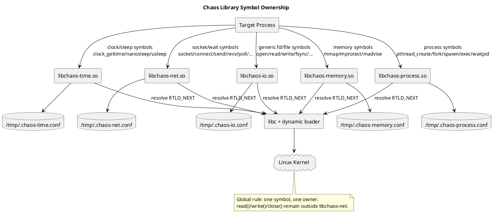
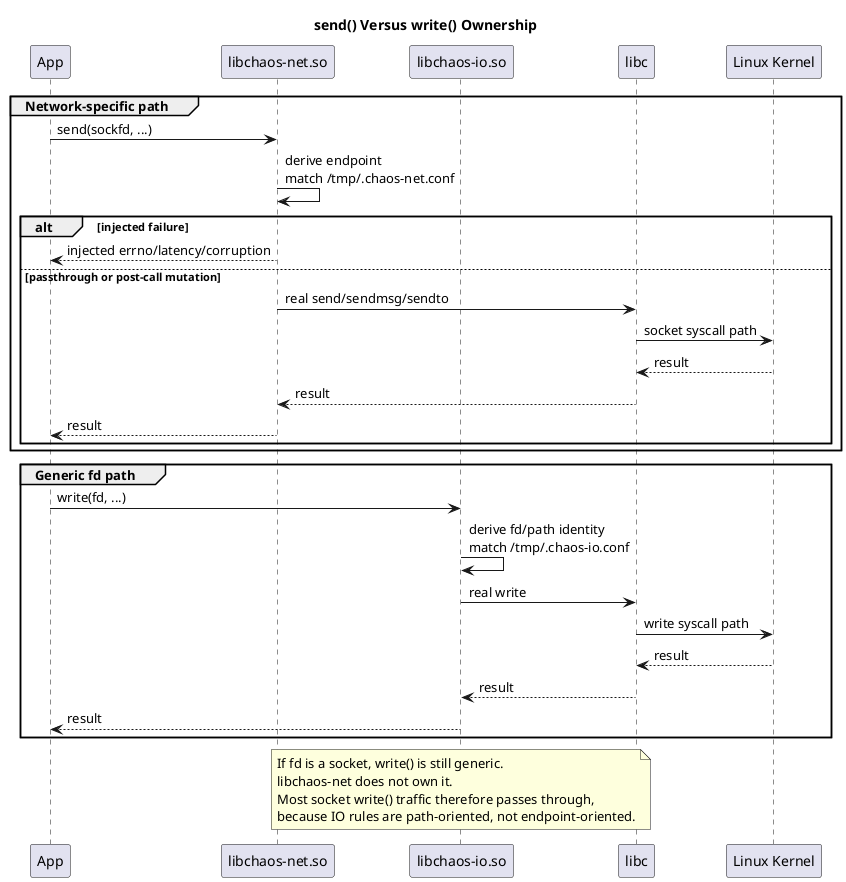
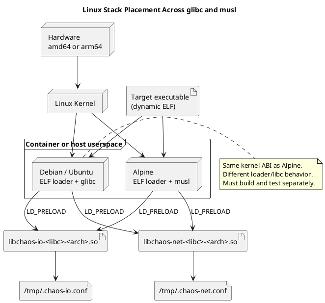
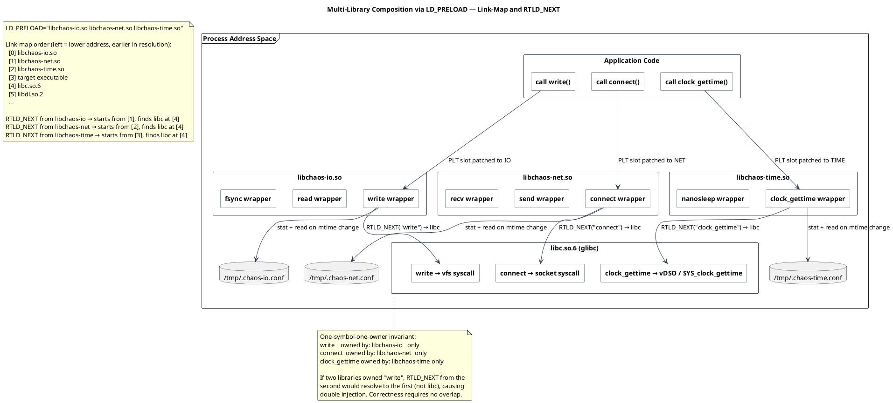

<!--
━━━━━━━━━━━━━━━━━━━━━━━━━━━━━━━━━━━━━━━━━━━━━━━━━━━━━━━━━━━━━
  Engineered by  Christian Schnapka
                 Embedded Principal+ Engineer
                 Macstab GmbH · Hamburg, Germany
                 https://macstab.com
━━━━━━━━━━━━━━━━━━━━━━━━━━━━━━━━━━━━━━━━━━━━━━━━━━━━━━━━━━━━━
-->

# Chaos Testing Libraries System Manual

> *Engineered by* **[Christian Schnapka](https://macstab.com)** — Embedded Principal+ Engineer · [Macstab GmbH](https://macstab.com) · Hamburg, Germany

---

## Table of Contents

- [1. Overview](#1-overview)
- [2. Architectural Context](#2-architectural-context)
- [3. Key Concepts and Terminology](#3-key-concepts-and-terminology)
- [4. End-to-End Behavior](#4-end-to-end-behavior)
- [5. Architecture Diagrams](#5-architecture-diagrams)
- [6. Component Breakdown](#6-component-breakdown)
- [7. Data Model and State](#7-data-model-and-state)
- [8. Concurrency and Threading Model](#8-concurrency-and-threading-model)
- [9. Error Handling and Failure Modes](#9-error-handling-and-failure-modes)
- [10. Security Model](#10-security-model)
- [11. Performance Model](#11-performance-model)
- [12. Observability and Operations](#12-observability-and-operations)
- [13. Configuration Reference](#13-configuration-reference)
- [14. Extension Points and Compatibility Guarantees](#14-extension-points-and-compatibility-guarantees)
- [15. Stack Walkdown](#15-stack-walkdown)
- [16. References](#16-references)
- [17. Platform Internals Reference](#17-platform-internals-reference)

## 1. Overview

### Purpose

This repository provides small Linux `LD_PRELOAD` fault-injection libraries that
operate at the libc symbol boundary of a target process. The current implemented
libraries are:

- `libchaos-io`
- `libchaos-net`
- `libchaos-dns`
- `libchaos-time`
- `libchaos-process`
- `libchaos-memory`

The business and engineering purpose is narrow and deliberate: make real
applications observe controlled failures at the same libc call boundary they
already use, without requiring source changes, RPC shims, JVM agents, sidecars,
or kernel traffic-control rules.

### Scope

In scope:

- dynamic-process fault injection through `LD_PRELOAD`
- libc-level interposition on Linux
- per-library config files
- glibc and musl support
- amd64 and arm64 build and runtime validation
- composition of multiple chaos libraries in a single target process

Out of scope:

- static binaries
- kernel-space interception
- packet-level network shaping
- syscall tracing frameworks
- eBPF-based policy engines
- code instrumentation inside language runtimes
- overlapping symbol ownership across chaos libraries

### Assumptions

- The target executable is dynamically linked ELF and honors `LD_PRELOAD`.
- The target path actually traverses the intercepted libc symbol.
- Operators can inject environment variables and config files into the target
  environment, including containers.
- Correctness is defined by behavior on glibc/musl and amd64/arm64, not by one
  host-local success case.

### Non-Goals

- One giant preload library that owns every possible symbol.
- A single universal selector grammar across unrelated fault domains.
- Best-effort overlap between libraries.
- Hiding architectural trade-offs such as socket `read()`/`write()` coverage
  gaps.

### Documentation Standard

This document is the repository-level documentation contract. Subsystem
documents in this repository are expected to meet the same bar.

Required properties:

- describe current implemented behavior before discussing extensions
- label future work explicitly rather than mixing it into current-state prose
- state ownership boundaries, invariants, and non-goals directly
- state failure and passthrough behavior directly
- state libc, loader, kernel, distro, and architecture constraints when they
  materially affect correctness
- state the validation bar, especially the glibc/musl and amd64/arm64 matrix
- use diagrams only when they improve precision more than prose alone

The goal is not decorative documentation. The goal is an operational and
architectural reference a maintainer can trust during implementation, review,
debugging, and incident analysis.

### Global Invariant

The most important repository rule is:

`one symbol, one owner`

No interposed libc symbol may be owned by more than one chaos library.

That rule is not style guidance. It is a hard correctness boundary. It exists to
avoid preload-order-dependent behavior, double injection, inconsistent matching,
and libc-specific edge failures that become almost impossible to debug on musl
versus glibc.

Current ownership boundary:

| Library | Owns | Must Not Own |
| --- | --- | --- |
| `libchaos-io` | generic fd/file symbols such as `open`, `openat`, `close`, `read`, `write`, `pread`, `pwrite`, `fsync`, `fdatasync`, `readv`, `writev`, `sendfile`, `copy_file_range`, `ftruncate`, `fallocate`, `renameat`, `unlinkat` | socket/DNS/wait symbols |
| `libchaos-net` | socket/wait symbols such as `socket`, `socketpair`, `bind`, `listen`, `connect`, `accept`, `accept4`, `shutdown`, `send*`, `recv*`, `poll`, `ppoll`, `select`, `pselect`, `epoll_wait`, `epoll_pwait` | generic `read`, `write`, `readv`, `writev`, `close`, DNS symbols |
| `libchaos-dns` | resolver symbols such as `getaddrinfo` and `getnameinfo` | generic fd/file symbols, socket symbols, wait symbols |
| `libchaos-time` | clock/sleep symbols such as `clock_gettime`, `nanosleep`, `usleep` | any symbol already owned by IO, NET, or DNS |
| `libchaos-process` | process lifecycle symbols such as `pthread_create`, `fork`, `posix_spawn`, `posix_spawnp`, `execve`, `execveat`, and `waitpid` | any symbol already owned by IO or NET |
| `libchaos-memory` | memory-management symbols such as `mmap`, `munmap`, `mprotect`, and `madvise` | any symbol already owned by IO or NET |

This has an intentional consequence:

- if an application performs network I/O through `send()`/`recv()`-style calls,
  `libchaos-net` owns that behavior
- if an application performs network I/O through generic `read()`/`write()`,
  `libchaos-net` does not own it
- `libchaos-io` may still see those generic calls, but its selector model is
  path/fd-oriented, not endpoint-oriented, so socket traffic will usually pass
  through unchanged

That boundary is deliberate. It is the cost of strict composability.

## 2. Architectural Context

### System Boundaries

The repository lives inside one process-local boundary:

- target application process
- dynamic loader
- preloaded chaos libraries
- libc
- Linux kernel

It does not cross into:

- kernel modules
- cgroups controllers
- sidecar daemons
- external control planes

### Stable External Contracts

The stable contracts are intentionally small:

- shared object identity, for example `libchaos-io-<libc>-<arch>.so`
- the set of libc symbols owned by each library
- the config file path per library
- the config grammar per library
- the logical operations and effects exposed by each config
- the repository-level cross-target validation gate

### Internal Contracts

The following are internal and may change without being treated as public API:

- source file layout
- helper names
- exact constructor helper decomposition
- exact config snapshot implementation
- exact per-thread state layout
- exact test harness structure

### Dependency Direction

The dependency direction must remain one-way:

- target process calls libc symbols
- chaos library interposes the symbol
- chaos library decides whether to inject or passthrough
- chaos library calls the real libc symbol through `dlsym(RTLD_NEXT, ...)`
- libc enters the kernel through its normal implementation path

Chaos libraries must not depend on each other at runtime. Composition is by
shared process placement through `LD_PRELOAD`, not by intra-library linking.

### Trust Boundaries

This is not a security boundary.

The chaos library executes in-process with the same privilege as the target.
That means:

- config is trusted operator input
- application payloads, paths, DNS names, socket addresses, and timing are not
  trusted data, but they are not privilege boundaries either
- corruption and failure injection are deliberate behavior, not exploit
  mitigations

### Deployment and Runtime Context

The supported deployment model is a dynamically linked Linux process, often
inside a container. Typical distros in scope are:

- Debian or Ubuntu images using glibc
- Alpine images using musl

The kernel is still Linux in both cases. The major differences are in:

- dynamic loader behavior
- libc wrappers
- resolver behavior
- some ABI/header surface details

That is why the repository treats these as four release tuples, not one:

- glibc amd64
- glibc arm64
- musl amd64
- musl arm64

### DNS Injection Modes

DNS deserves an explicit note because there are two valid fault-injection
boundaries and they are not interchangeable.

Mode 1: process-local preload DNS

- boundary: `getaddrinfo()` and `getnameinfo()` inside the target process
- mechanism: `LD_PRELOAD` interposition through `libchaos-dns`
- strengths:
  - per-process targeting
  - no `NET_ADMIN`
  - deterministic failure at the libc contract boundary
  - low operational footprint
- limitations:
  - only affects dynamically linked callers that actually traverse
    `getaddrinfo()` or `getnameinfo()`
  - does not model resolver packets, nameserver failover, or wire-level DNS
    behavior
  - current implementation is still limited to the `getaddrinfo()` and
    `getnameinfo()` libc boundaries, not legacy resolver APIs

Mode 2: stack-level or container-level DNS

- boundary: resolver path below the process, typically via redirected DNS or a
  replacement resolver inside the container or namespace
- mechanism: operating-system or container networking controls such as
  iptables, traffic control, or an injected resolver like CoreDNS
- strengths:
  - broader runtime coverage inside the container
  - can model synthetic answers, NXDOMAIN, SERVFAIL, REFUSED, rewrites, and
    nameserver-path behavior
  - exercises more of the real resolver stack
- limitations:
  - higher privilege and setup cost
  - more moving parts
  - less precise per-process targeting unless the container topology is also
    scoped carefully

Both modes are valid and should be documented as complementary, not mutually
exclusive.

If both are enabled, execution order is:

1. application calls `getaddrinfo()` or `getnameinfo()`
2. `libchaos-dns` may inject latency, rewrite forward queries or reverse
   outputs, synthesize numeric answers for forward lookup, or return a
   synthetic `EAI_*` failure
3. if preload DNS passes through, libc and the resolver continue to the
   stack-level DNS path
4. stack-level DNS may then inject its own behavior

So the practical rule is:

- use preload DNS when the test target is the application's resolver-call
  handling
- use stack-level DNS when the test target is the broader DNS stack or when
  synthetic answers and resolver realism matter
- use both when you explicitly want layered DNS fault models

## 3. Key Concepts and Terminology

- Interposer
  A shared object that exports the same symbol name as libc and is loaded before
  the real implementation through `LD_PRELOAD`.
- Real symbol
  The libc implementation resolved with `dlsym(RTLD_NEXT, ...)`.
- Logical operation
  The config-level operation name exposed to users. One logical operation may
  map to multiple libc symbols.
- Selector
  The config-side identity used for matching.
  IO uses path prefixes.
  NET uses endpoints.
  DNS uses DNS names.
- Effect
  The injected behavior after a rule matches, for example `ERRNO`, `LATENCY`,
  `TORN`, `CORRUPT`, `TIMEOUT`, or `GAI`.
- Passthrough
  The library delegates unchanged to the real libc symbol.
- Internal mode
  The recursion-guard state indicating that library internals must not be
  re-intercepted.
- Cross-target gate
  The required validation matrix across glibc/musl and amd64/arm64.

## 4. End-to-End Behavior

### Startup Lifecycle

At process start:

1. The Linux dynamic loader observes `LD_PRELOAD`.
2. Preloaded chaos libraries are loaded into the target process.
3. Each library constructor resolves the real libc symbols it owns.
4. Each library seeds process-local and thread-local PRNG state.
5. Each library resets config state to safe passthrough defaults.
6. The application begins running with the interposed symbols in place.

If required symbol resolution fails, the correct behavior is fail-fast rather
than silent partial preload success. A half-initialized interposer is worse than
no interposer.

### Normal Call Lifecycle

For every intercepted call, the intended execution model is:

1. Check recursion guard.
2. Derive the selector for the current domain.
3. Refresh config snapshot if the backing config changed.
4. Select the best matching rule.
5. If no rule matches, passthrough.
6. If a rule matches, apply the effect before and/or after the real call as the
   operation semantics require.
7. Return the result as libc would, except for the intentionally injected fault.

### Why Domain Separation Matters

The same fd can represent:

- a regular file
- a directory
- a pipe
- a socket
- an eventfd
- an epoll instance

`read()` and `write()` are therefore generic fd operations, not network
operations. If `libchaos-net` also owned them, the repository would lose a
clear domain boundary. The result would be ambiguous semantics on every mixed
workload.

### Concrete Routing Rules

The routing model today is:

- file/path/fd operations route to `libchaos-io`
- socket lifecycle, payload, and readiness-wait operations route to
  `libchaos-net`
- resolver operations route to `libchaos-dns`
- clock/sleep operations route to `libchaos-time`
- memory mapping, protection, and advice operations route to `libchaos-memory`
- process lifecycle and wait hooks route to `libchaos-process`

### Distinct Failure Boundaries

`libchaos-io` reasons about:

- path prefixes
- fd-to-path resolution
- write tearing
- durability failures

`libchaos-net` reasons about:

- endpoint identity
- DNS identity
- receive-side corruption
- readiness timeouts

Trying to flatten these into one grammar or one ownership model would make both
systems less correct.

## 5. Architecture Diagrams

### Component Ownership

Question answered: Which library owns which symbols, and how do the libraries
compose without overlap?



Main takeaway: composition is achieved by strict symbol partitioning, not by
cooperative overlap.

### Call Routing

Question answered: Why does socket `send()` belong to NET while socket
`write()` still must not?



Main takeaway: non-overlap is preserved even when applications use generic fd
calls on sockets.

### Linux Stack Placement

Question answered: Where do distro, libc, loader, kernel, and architecture
differences actually matter?



Main takeaway: Debian/Ubuntu and Alpine differ primarily in loader and libc
behavior, not in the kernel beneath them.

### Multi-Library LD_PRELOAD Composition

Link-map ordering, per-library RTLD_NEXT chains, and the one-symbol-one-owner
invariant ([source](diagrams/composition.puml)):



## 6. Component Breakdown

### `libchaos-io`

Responsibilities:

- generic file/fd interposition
- path-based selector matching
- write tearing
- read corruption
- fd-to-path recovery

Owned concerns:

- path rule grammar
- fd cache
- durability semantics

Dependencies:

- libc
- `libdl`
- `/tmp/.chaos-io.conf`
- Linux fd metadata such as `/proc/self/fd`

Important extension rule:

- new generic fd/file symbols belong here unless they are unambiguously another
  domain

### `libchaos-net`

Responsibilities:

- endpoint-based selector matching
- socket lifecycle faults
- socket payload faults
- readiness-wait faults

Owned concerns:

- endpoint grammar
- socket/wait symbol ownership
- receive-side corruption
- timeout semantics for readiness APIs

Dependencies:

- libc
- `libdl`
- `/tmp/.chaos-net.conf`
- Linux socket API
- Linux `/proc/self/fdinfo` for best-effort epoll watch discovery

Important extension rule:

- no generic `read`, `write`, `readv`, `writev`, or `close`

### `libchaos-dns`

Responsibilities:

- DNS-name selector matching
- resolver failure injection
- hostname and service rewrite
- synthetic answer override and answer-list manipulation

Owned concerns:

- resolver symbol ownership
- resolver-specific selector grammar
- answer-list filtering, shuffle, and limiting

Dependencies:

- libc
- `libdl`
- `/tmp/.chaos-dns.conf`

Important extension rule:

- keep resolver ownership separate from `libchaos-net` socket ownership

### `libchaos-time`

Current state:

- implemented

Intended responsibility:

- `clock_gettime`
- `nanosleep`
- `usleep`
- related time-domain hooks such as future `clock_nanosleep`

### `libchaos-process`

Current state:

- implemented

Current responsibility:

- `pthread_create`
- `fork`
- `posix_spawn`
- `posix_spawnp`
- `execve`
- `execveat`
- `waitpid`
- future process-domain hooks such as `waitid`, `kill`, and `clone*`

### `libchaos-memory`

Current state:

- implemented

Intended responsibility:

- `mmap`
- `munmap`
- `mprotect`
- `madvise`
- future memory-domain hooks such as `mmap64`, `brk`, and `sbrk`

### Shared Internal Scaffold

The repository may reuse source-level helper modules for:

- stub/shared constructor scaffolding
- parser mechanics
- Docker matrix logic
- effect helper patterns

It must not introduce a runtime `libchaos-common.so`. Each preload library must
remain standalone.

## 7. Data Model and State

### Config Files

Current config files:

- `/tmp/.chaos-io.conf`
- `/tmp/.chaos-net.conf`
- `/tmp/.chaos-dns.conf`
- `/tmp/.chaos-time.conf`
- `/tmp/.chaos-process.conf`
- `/tmp/.chaos-memory.conf`

### Rule Model

`libchaos-io` rule shape:

```text
<path-prefix>:<operation>:<effect>:<value>
```

`libchaos-net` rule shape:

```text
<endpoint-selector>:<operation>:<effect>:<value>
```

`libchaos-dns` rule shape:

```text
<selector>:<effect>:<value>
```

`libchaos-time` rule shape:

```text
<selector>:<effect>:<value>
```

`libchaos-process` rule shape:

```text
<selector>:<effect>:<value>
```

`libchaos-memory` rule shape:

```text
<selector>:<effect>:<value>
```

The grammars are intentionally separate. Path prefixes and endpoints are not the
same domain.

### Mutable State

Common state patterns:

- process-global resolved libc function pointers
- process-global config snapshots
- thread-local recursion guard
- thread-local PRNG state

IO-only mutable state:

- thread-local fd cache

NET-specific design choice:

- no persistent socket identity cache that depends on owning `close()`
- endpoint identity is derived per call whenever possible
- Linux epoll watch identity is derived on demand from `/proc/self/fdinfo`

### Invariants

- missing or unreadable config yields passthrough
- invalid config yields passthrough
- ambiguous selector derivation yields passthrough
- a library must not attempt to partially own another domain's symbol
- constructor state must be valid before any wrapped call executes

## 8. Concurrency and Threading Model

### Execution Model

The libraries execute synchronously on the caller's thread.

There are:

- no worker threads
- no background config watcher threads
- no background timers

### State Ownership

Process-global state:

- resolved symbol pointers
- config snapshot buffers and active-index metadata

Thread-local state:

- recursion guard
- PRNG state
- IO fd cache

### Publication Model

Config snapshots are published by double-buffering and atomic index updates.
That design is intentionally simple:

- reload into inactive snapshot
- memory barrier
- flip active index
- memory barrier

This is sufficient for the repository's current state model and avoids bringing
in heavy locking.

### Race Expectations

Acceptable behavior:

- one thread sees old config while another has just published new config
- the next call converges on the new snapshot

Deliberately avoided behavior:

- partial snapshot visibility
- per-call heap allocation or queueing

### JVM Relevance

Not relevant. This repository is C99 preload code. There is no Java Memory
Model boundary here. Any Java, Python, Ruby, or other higher-level runtime is
relevant only insofar as it eventually traverses dynamically linked libc
symbols.

## 9. Error Handling and Failure Modes

### Intended Failure Model

The repository follows one rule consistently:

`uncertainty degrades to passthrough`

That means:

- unknown config lines do not produce partial injection
- unsupported selectors do not produce guessed matches
- unresolved endpoint identity does not produce fabricated endpoint matches

### Expected Failures

Expected and intentionally handled failures:

- config open/read failure
- invalid rule parse
- endpoint parse failure
- unsupported socket family
- DNS rule mismatch
- wait set with no matching endpoint

### Unexpected Failures

Unexpected and fail-fast conditions:

- required real libc symbol missing
- constructor unable to establish a valid interposition baseline

### Cross-Library Failure Risk

The highest-severity architectural failure is overlapping symbol ownership.

Symptoms would include:

- preload-order-dependent behavior
- multiple libraries attempting to inject on the same call
- different selector models interpreting the same symbol differently
- libc-specific divergence on musl versus glibc

The repository prevents this by design, not by best-effort runtime detection.

### Known Coverage Limitations

These are explicit, not accidental:

- static binaries bypass `LD_PRELOAD`
- direct syscall users can bypass libc interposition
- some Go or custom runtimes may avoid the expected libc path
- network traffic through generic `read()` or `write()` is not endpoint-aware in
  `libchaos-net`
- file-copy tools only trigger injection when their actual data path is hooked

## 10. Security Model

### Threat-Oriented Explanation

These libraries are not security controls. They are controlled in-process
failure injectors.

Implications:

- they can deliberately corrupt reads
- they can deliberately fail opens, writes, connects, and DNS resolution
- they can deliberately stall calls

That makes them suitable for:

- test
- staging
- controlled experiments

It does not make them suitable as:

- isolation boundaries
- policy enforcement
- audit substitutes

### Secrets and Sensitive Data

The current libraries intentionally avoid extensive built-in logging because:

- logging inside preload interposers creates recursion risk
- logging increases binary size
- logging creates sensitive-data leakage risk

Operational visibility must therefore come from:

- the target application's own logs
- test harness output
- external process observation

### Least Privilege

The library inherits the target process privilege. The correct operational model
is to run the target process with the minimum privilege already required for the
test.

## 11. Performance Model

### Hot Paths

IO hot path cost comes from:

- path matching
- fd-to-path recovery
- config snapshot checks
- deliberate latency when injected

NET hot path cost comes from:

- sockaddr normalization
- endpoint matching
- optional `getsockname()` or `getpeername()`
- optional `/proc/self/fdinfo` scan for epoll
- deliberate latency or synthetic timeout behavior

### Size Discipline

The repository chooses:

- explicit wrappers
- no runtime common shared library
- minimal dependency footprint
- small config formats

This keeps both source and artifact size under control.

### Why Not a Monolith

A monolithic preload library would:

- increase constructor complexity
- widen recursion risk
- blur domain-specific config semantics
- make musl/glibc portability harder
- make coverage and runtime proof less trustworthy

Separate libraries keep the hot path and reasoning surface smaller.

## 12. Observability and Operations

### Current Operational Signals

Built-in observability is intentionally minimal.

Operators should expect to validate behavior through:

- application-observed errno paths
- application-observed latency
- Docker/runtime probe binaries in this repository
- unit coverage gate
- cross-target Docker build and runtime matrix

### Health Semantics

There is no out-of-process health endpoint. Operational health is inferred from:

- library loads successfully
- constructor resolves symbols successfully
- process behavior matches the configured fault model

### Debugging Workflow

When behavior appears wrong, the correct debugging order is:

1. confirm the target is dynamically linked
2. confirm the correct libc/arch artifact is loaded
3. confirm the target actually traverses the expected libc symbol
4. confirm the rule grammar and selector are valid
5. confirm the domain owner for that symbol is correct
6. confirm the behavior on both glibc and musl if the path is portability
   sensitive

### What Must Be Monitored

In CI and release validation:

- all four libc/arch build tuples
- strict source coverage gate
- glibc runtime probes
- musl runtime probes

## 13. Configuration Reference

### `libchaos-io`

Config path:

```text
/tmp/.chaos-io.conf
```

Rule shape:

```text
<path-prefix>:<operation>:<effect>:<value>
```

Current effects:

- `ERRNO`
- `LATENCY`
- `TORN`
- `CORRUPT`

### `libchaos-net`

Config path:

```text
/tmp/.chaos-net.conf
```

Rule shape:

```text
<endpoint-selector>:<operation>:<effect>:<value>
```

Current effects:

- `ERRNO`
- `LATENCY`
- `CORRUPT`
- `TIMEOUT`
- `GAI`

### Future Libraries

Reserved config paths:

- `/tmp/.chaos-process.conf`

### Safe and Unsafe Assumptions

Safe assumptions:

- separate config files per domain
- separate selector grammars per domain
- unsupported rule/effect combinations are rejected

Unsafe assumptions:

- assuming one config file can describe every chaos domain cleanly
- assuming a network selector grammar can be reused for file paths
- assuming a path selector grammar can be reused for sockets

## 14. Extension Points and Compatibility Guarantees

### Stable Extension Rule

The stable rule for extension is:

- add a symbol only if its domain ownership is unambiguous
- add it to exactly one library
- prove it on glibc/musl and amd64/arm64 before calling it complete

### Compatibility Guarantees

The repository should preserve:

- one-symbol-one-owner
- per-library config files
- libc/arch matrix discipline
- no-public-SDK model

### Migration Rule

If a future feature appears to require a symbol already reserved by another
library, the correct response is not overlap. The correct response is one of:

- keep the limitation explicit
- redesign the selector/effect model
- move the feature boundary to a more domain-specific symbol

## 15. Stack Walkdown

### API and framework level

At the application level, code calls file, socket, DNS, and wait APIs through:

- C or C++ libc wrappers
- higher-level runtimes that eventually delegate to libc
- frameworks such as Java, Python, Ruby, Go, or Node where dynamically linked
  paths may still cross libc

Material effect:

- if the runtime eventually calls an owned libc symbol, the chaos library can
  interpose
- if the runtime bypasses libc or uses direct syscalls, interposition may be
  lost

### Application and runtime level

This repository does not care whether the caller is:

- a shell utility
- a Java service
- a Python app
- a C daemon

It cares only about the actual libc symbol path used at runtime.

Material consequence:

- `cp` may use `sendfile()` or `copy_file_range()` instead of `write()`
- some network stacks may use `send()`/`recv()`
- some may use generic `read()`/`write()` on socket fds

### JVM level

Not directly relevant, but still important to state precisely:

- there is no JVM agent here
- there is no bytecode instrumentation
- there is no JMM contract in this codebase

The JVM matters only as a producer of libc traffic through the hosting process.

### Memory and concurrency level

At the machine-code level the important properties are:

- constructors publish real symbol pointers before normal use
- config snapshots publish through barrier-backed index changes
- recursion guards are thread-local
- PRNG state is thread-local

This keeps interposition deterministic without introducing cross-thread lock
contention on every hot path.

### OS, libc, loader, and container level

This is the most important layer for correctness.

On Linux, the practical execution chain is:

1. ELF loader starts the process
2. `LD_PRELOAD` libraries are loaded
3. interposed symbols are visible before normal libc resolution
4. the chaos library calls `dlsym(RTLD_NEXT, ...)` for the real symbol
5. libc performs its normal work
6. libc enters the Linux kernel

Why Alpine versus Debian matters:

- Alpine typically means musl userland
- Debian or Ubuntu typically means glibc userland
- the kernel is still Linux in both cases
- loader and libc behavior still differ enough that both must be tested

Why amd64 versus arm64 matters:

- the C source is architecture-agnostic
- the artifact, ABI, calling convention, loader tuple, and optimizer behavior
  are not
- the repository therefore validates both architectures explicitly

### Hardware level

At the hardware level, the repository depends on very little:

- normal CPU execution of user-space code
- atomic primitives used for config publication
- ordinary Linux syscall transitions

There is no hardware-specific logic in the fault model itself. Hardware matters
mostly through ABI, code generation, and timing behavior across amd64 and arm64.

### Infrastructure level

In containerized environments the relevant infrastructure facts are:

- the container shares the host Linux kernel
- the container image determines musl versus glibc userland
- `LD_PRELOAD` and config files must be injected into the target container
- distroless or static-binary images may not be compatible with this model

## 16. References

- Reference: `ld.so(8)` - Linux dynamic loader semantics
- Reference: `dlsym(3)` - runtime symbol resolution
- Reference: `socket(7)` - socket API semantics and generic fd behavior
- Reference: `connect(2)` - connection establishment semantics
- Reference: `accept(2)` - accept semantics
- Reference: `send(2)` - socket send semantics
- Reference: `recv(2)` - socket receive semantics
- Reference: `poll(2)` - readiness wait semantics
- Reference: `ppoll(2)` - signal-aware readiness wait semantics
- Reference: `select(2)` - fd set wait semantics
- Reference: `epoll(7)` - Linux epoll model
- Reference: `getaddrinfo(3)` - forward DNS resolution boundary used by `libchaos-dns`
- Reference: `getnameinfo(3)` - reverse DNS lookup boundary used by `libchaos-dns`
- Reference: `proc(5)` - `/proc` filesystem semantics, including fd and fdinfo
- Reference: ELF gABI - executable and shared object model

## 17. Platform Internals Reference

The mechanics underlying this entire system — ELF link-map ordering, PLT/GOT
lazy binding, vDSO dispatch, `AT_SECURE` stripping, glibc/musl divergence, and
`STT_GNU_IFUNC` resolver interaction — are documented in detail in
[`docs/PLATFORM.md`](PLATFORM.md).

Key facts from PLATFORM.md that affect every library in this repository:

**Symbol resolution order (ELF gABI §5.2, Chapter 5):**
The dynamic linker resolves `dlsym(RTLD_NEXT, name)` by walking the link-map
in load order starting from the DSO _after_ the caller. Because `LD_PRELOAD`
libraries are loaded before the main executable's `DT_NEEDED` chain, `RTLD_NEXT`
from any chaos library always reaches glibc/musl first. This is the invariant
the entire preload model depends on.

**PLT/GOT cold/hot path:** The PLT slot for any interposed symbol is patched to
point to the chaos library on first call (cold path resolver dance via
`_dl_runtime_resolve`). All subsequent calls (hot path) go directly to the chaos
wrapper. The chaos wrapper's `dlsym(RTLD_NEXT, name)` pointer is cached on first
call. Diagram: `docs/diagrams/linkmap.puml`.

**vDSO and `clock_gettime`:** On Linux, glibc's `clock_gettime` uses the vDSO
internally (arch-specific, Linux 2.6.22+ on x86_64). Our PLT interposition fires
_before_ glibc's wrapper, so we own the result regardless of whether glibc used
the vDSO. Bypass surface: Go runtime (direct syscall), statically linked binaries.
Diagram: `docs/diagrams/vdso.puml`.

**`AT_SECURE` and LD_PRELOAD stripping:** The Linux kernel sets `AT_SECURE` in
the auxiliary vector when the target binary has elevated privileges (setuid,
setgid, file capabilities). The dynamic linker (`ld.so`) reads `AT_SECURE` and
silently strips `LD_PRELOAD` before mapping any preload DSO. The chaos libraries
are never loaded. This is a kernel-level security boundary, not a library-level
one. Reference: `PLATFORM.md` §6.

**glibc vs musl matrix:** PLATFORM.md §7 documents the full divergence matrix:
symbol versioning (`@@GLIBC_X.Y` vs unversioned musl), `STT_GNU_IFUNC` (glibc
uses IFUNC for `clock_gettime`, `memcpy`, etc.; musl does not), `execveat`
availability, `posix_spawn` implementation strategy (vfork+exec on glibc, fork+exec
on musl), and `madvise(MADV_FREE)` usage in `free()`. Per-library divergence notes
live in the respective library documents.

**Formal symbol-ownership theorem:**

> For any libc symbol `s`, let `owner(s)` be the unique chaos library that
> exports an interposed definition of `s`. The system is correct if and only if:
> - `∀s: |{L : L exports s}| ≤ 1`  (at most one owner per symbol)
> - `∀s: owner(s)` is defined by the domain table in §1 of this document
> - `LD_PRELOAD` load order does not change which library reaches glibc first for
>   any given symbol, because each symbol has exactly one owner by the above
>
> If two chaos libraries export the same symbol, the link-map winner is
> load-order-dependent; the losing library's `dlsym(RTLD_NEXT, s)` resolves to
> the winning library's interposer, causing double injection. This is the
> correctness violation the `one symbol, one owner` rule prevents.

This theorem is the formal basis for the architecture. It is enforced by
convention and audited by the coverage matrix, not by a runtime mechanism.

---

<div align="center">

*Architecture, implementation, and documentation crafted with Love and Passion by*

**[Christian Schnapka](https://macstab.com)**  
Embedded Principal+ Engineer  
[Macstab GmbH](https://macstab.com) · Hamburg, Germany

*Building systems that operate correctly at the edges — including the ones you deliberately break.*

</div>
