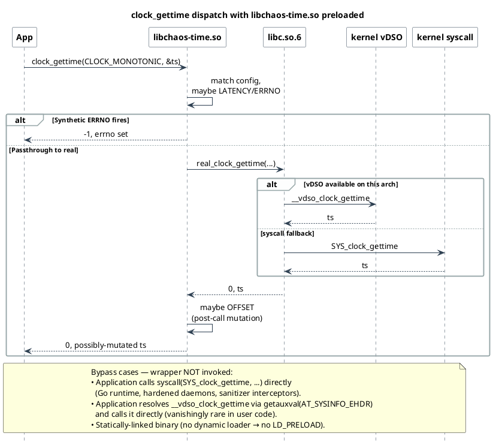

<!--
━━━━━━━━━━━━━━━━━━━━━━━━━━━━━━━━━━━━━━━━━━━━━━━━━━━━━━━━━━━━━
  Engineered by  Christian Schnapka
                 Embedded Principal+ Engineer
                 Macstab GmbH · Hamburg, Germany
                 https://macstab.com
━━━━━━━━━━━━━━━━━━━━━━━━━━━━━━━━━━━━━━━━━━━━━━━━━━━━━━━━━━━━━
-->

# libchaos-time Technical Reference

> *Engineered by* **[Christian Schnapka](https://macstab.com)** — Embedded Principal+
> Engineer · [Macstab GmbH](https://macstab.com) · Hamburg, Germany

---

`libchaos-time` is the dedicated clock/sleep preload library in this repository.
Repository-wide ownership and composition rules live in [`docs/SYSTEM.md`](SYSTEM.md).
Platform-layer internals (vDSO dispatch per arch, PLT/GOT cold/hot paths) are in
[`docs/PLATFORM.md`](PLATFORM.md). The vDSO dispatch sequence diagram and per-arch
kernel source table are embedded inline in §2 of this document.

Current implementation status:

- interposed symbols: `clock_gettime()`, `nanosleep()`, `usleep()`
- config path: `/tmp/.chaos-time.conf`
- unit-tested; runtime probe for glibc/musl and amd64/arm64 validation

---

## Table of Contents

1. [Clock Taxonomy](#1-clock-taxonomy)
2. [vDSO Offload Table per Architecture](#2-vdso-offload-table-per-architecture)
3. [Hardware Clock Sources — TSC, CNTPCT_EL0, and Friends](#3-hardware-clock-sources--tsc-cntpct_el0-and-friends)
4. [clock_gettime Selector Grammar](#4-clock_gettime-selector-grammar)
5. [OFFSET Effect — Monotonicity Implications](#5-offset-effect--monotonicity-implications)
6. [nanosleep — POSIX Cancellation Contract](#6-nanosleep--posix-cancellation-contract)
7. [usleep — Surface and Constraints](#7-usleep--surface-and-constraints)
8. [DSL Grammar and Rule Semantics](#8-dsl-grammar-and-rule-semantics)
9. [Per-Hook Call Flows](#9-per-hook-call-flows)
10. [Bypass Surfaces — When the Wrapper Is Not Invoked](#10-bypass-surfaces--when-the-wrapper-is-not-invoked)
11. [Non-Coverage: clock_nanosleep](#11-non-coverage-clock_nanosleep)
12. [Non-Coverage: gettimeofday](#12-non-coverage-gettimeofday)
13. [Non-Coverage: sleep and alarm](#13-non-coverage-sleep-and-alarm)
14. [Non-Coverage: setitimer and POSIX Timer APIs](#14-non-coverage-setitimer-and-posix-timer-apis)
15. [Non-Coverage: Futex Timeout Paths](#15-non-coverage-futex-timeout-paths)
16. [Non-Coverage: timerfd](#16-non-coverage-timerfd)
17. [Reentrancy Guard and TLS State](#17-reentrancy-guard-and-tls-state)
18. [PRNG Model](#18-prng-model)
19. [Config Reload Protocol](#19-config-reload-protocol)
20. [glibc vs musl Divergence](#20-glibc-vs-musl-divergence)
21. [Execution Boundary Summary](#21-execution-boundary-summary)

---

## 1. Clock Taxonomy

POSIX.1-2017 and the Linux kernel define a set of clock IDs that `clock_gettime`
accepts. Each has distinct semantic guarantees, hardware backing, and
vDSO-offload status.

### 1.1 POSIX-Mandatory Clocks

| Clock ID                   | Value (x86_64) | Semantics                                                                                           |
|----------------------------|----------------|-----------------------------------------------------------------------------------------------------|
| `CLOCK_REALTIME`           | 0              | Wall-clock time. Adjustable by NTP, `settimeofday`, `clock_settime`. Can jump forward or backward.  |
| `CLOCK_MONOTONIC`          | 1              | Monotonically increasing. Not adjustable. Stopped while system is suspended (no hibernation ticks). |
| `CLOCK_PROCESS_CPUTIME_ID` | 2              | CPU time consumed by all threads in the calling process. Kernel-tracked.                            |
| `CLOCK_THREAD_CPUTIME_ID`  | 3              | CPU time consumed by the calling thread only. Kernel-tracked.                                       |

### 1.2 Linux Extension Clocks

| Clock ID                 | Value (x86_64) | Semantics                                                                                                                  |
|--------------------------|----------------|----------------------------------------------------------------------------------------------------------------------------|
| `CLOCK_MONOTONIC_RAW`    | 4              | Like CLOCK_MONOTONIC but not NTP-slewed. Reads TSC/CNTPCT directly. No adjtime() correction.                               |
| `CLOCK_REALTIME_COARSE`  | 5              | Low-resolution REALTIME; updated once per jiffy (CONFIG_HZ ticks). Fast, not vDSO-precise.                                 |
| `CLOCK_MONOTONIC_COARSE` | 6              | Low-resolution MONOTONIC; once per jiffy. Suitable for approximate intervals.                                              |
| `CLOCK_BOOTTIME`         | 7              | Like CLOCK_MONOTONIC but includes time spent in suspend. Useful for elapsed-time across suspend.                           |
| `CLOCK_REALTIME_ALARM`   | 8              | Like CLOCK_REALTIME; wakes system from suspend for `timer_settime`. Requires `CAP_WAKE_ALARM`.                             |
| `CLOCK_BOOTTIME_ALARM`   | 9              | Like CLOCK_BOOTTIME; wakes system from suspend. Requires `CAP_WAKE_ALARM`.                                                 |
| `CLOCK_TAI`              | 11             | International Atomic Time. No leap seconds. `CLOCK_REALTIME + tai_offset`. TAI offset updated by `adjtimex(ADJ_TAI, ...)`. |
| `CLOCK_SGI_CYCLE`        | 10             | SGI MIPS cycle counter; not present on Linux mainline, historical artefact.                                                |

### 1.3 Semantic Distinctions for Injection

**CLOCK_REALTIME vs CLOCK_MONOTONIC:** REALTIME is the clock used for wall-clock
timestamps (log entries, SSL cert validation, JWT expiry). Injecting
`clock_gettime/realtime:OFFSET:+86400000` advances the process's view of wall
time by 24 hours, which exercises certificate expiry checks, token TTL logic, and
scheduled-job timing without actually waiting.

**CLOCK_MONOTONIC:** Used for interval measurement (latency timers, timeout
calculations, backoff loops). Injecting `OFFSET` here breaks interval invariants
— code that computes `delta = end - start` will see inflated deltas. Useful for
timeout testing. But see §5: monotonicity is broken by positive offsets and
definitionally violated by negative offsets.

**CLOCK_MONOTONIC_RAW:** NTP-free; used in performance benchmarks and kernel
subsystems that must not be affected by time-sync slews. Injecting OFFSET here
affects benchmark-quality timing code.

**CLOCK_PROCESS_CPUTIME_ID / CLOCK_THREAD_CPUTIME_ID:** Used by profilers and
CPU-time budget tracking (watchdog threads). Not vDSO-offloaded on all arches;
these always go through the kernel. Injecting ERRNO:EINVAL here tests budget-
tracking error paths. OFFSET injection is valid but affects CPU profiler readings.

**CLOCK_BOOTTIME:** Used by `systemd` unit start timing, `iproute2` statistics,
and any code that needs elapsed time including suspend. Injection here can cause
systemd unit timeout logic to fire prematurely.

**CLOCK_TAI:** Used by financial systems, telecom (PTP/PPSAPI), and any
application that needs UTC-without-leapseconds. TAI offset is typically 37 seconds
ahead of UTC as of 2024. Injecting OFFSET on TAI moves both the TAI reading and
the effective UTC-equivalent computation in the caller. TAI is rarely tested for
resilience; this is an underutilised injection surface.

---

## 2. vDSO Offload Table per Architecture

The vDSO (virtual Dynamic Shared Object) is a small kernel-mapped shared library
exported via `AT_SYSINFO_EHDR` in the auxiliary vector. It provides user-space
implementations of selected syscalls to avoid the ring-transition cost. The
`clock_gettime` entry in the vDSO reads the `vvar` page (a read-only kernel-mapped
page containing `struct vdso_data`) to compute the time without a syscall.

### 2.1 Per-Architecture vDSO Clock Support

Source ground-truth: `include/vdso/datapage.h` (`struct vdso_data`, `VDSO_BASES`),
`arch/<arch>/*/vgettimeofday.c` or `vclock_gettime.c` per arch, Linux 6.6 LTS.

| Architecture | Kernel source file                                                              | Hardware counter                                                                               | Clocks in vDSO                                                                                     |
|--------------|---------------------------------------------------------------------------------|------------------------------------------------------------------------------------------------|----------------------------------------------------------------------------------------------------|
| x86_64       | `arch/x86/entry/vdso/vclock_gettime.c`                                          | `VCLOCK_TSC` (`rdtsc`/`rdtscp`); `VCLOCK_PVCLOCK` (KVM/Xen PV); `VCLOCK_HVCLOCK` (Hyper-V)     | REALTIME, MONOTONIC, MONOTONIC_RAW, REALTIME_COARSE, MONOTONIC_COARSE, BOOTTIME, TAI               |
| aarch64      | `arch/arm64/kernel/vdso/vgettimeofday.c`                                        | `isb; mrs x0, cntvct_el0` (virtual counter) or `cntpct_el0` (physical; kernel decides at boot) | REALTIME, MONOTONIC, MONOTONIC_RAW, REALTIME_COARSE, MONOTONIC_COARSE, BOOTTIME, TAI               |
| i386         | `arch/x86/entry/vdso/vclock_gettime.c` (shared) + vsyscall legacy at 0xFFFFe000 | `VCLOCK_TSC`; vsyscall stub for compat                                                         | REALTIME, MONOTONIC (COARSE/BOOTTIME/TAI added Linux 4.13+)                                        |
| arm (32-bit) | `arch/arm/vdso/vgettimeofday.c`                                                 | `CP15` generic timer or platform coprocessor (arch-dependent)                                  | REALTIME, MONOTONIC                                                                                |
| riscv64      | `arch/riscv/kernel/vdso/vgettimeofday.c` (Linux 5.3+)                           | `rdtime` pseudo-instruction (reads `time` CSR; maps to M-mode/SBI timer)                       | REALTIME, MONOTONIC, MONOTONIC_RAW, REALTIME_COARSE, MONOTONIC_COARSE, BOOTTIME, TAI               |
| mips         | `arch/mips/vdso/vgettimeofday.c`                                                | `mfc0 t0, $9` (CP0 Count register, MIPS32 R2+)                                                 | REALTIME, MONOTONIC, REALTIME_COARSE, MONOTONIC_COARSE (Linux 4.6+)                                |
| powerpc64    | `arch/powerpc/kernel/vdso/gettimeofday.S`                                       | `mfspr rX, SPRN_TBRL` (time base lower)                                                        | REALTIME, MONOTONIC, MONOTONIC_RAW, REALTIME_COARSE, MONOTONIC_COARSE, BOOTTIME, TAI (Linux 5.11+) |
| s390x        | `arch/s390/kernel/vdso64/clock_gettime.S`                                       | `STCKF` (store clock fast; TOD clock; ~1 ns resolution; available z9-109+)                     | REALTIME, MONOTONIC                                                                                |

**`struct vdso_data` key fields** (`include/vdso/datapage.h`, Linux 5.6+):

```c
struct vdso_data {
    u32  clock_mode;          /* VCLOCK_NONE/TSC/PVCLOCK/HVCLOCK/… */
    u64  cycle_last;          /* last hardware counter snapshot */
    u64  mask;                /* counter bitmask */
    u32  mult;                /* NTP-adjusted ns multiplier */
    u32  shift;               /* NTP-adjusted shift */
    struct vdso_timestamp  basetime[VDSO_BASES]; /* per-clock base */
    s32  tz_minuteswest;
    s32  tz_dsttime;
    u32  hrtimer_res;
};
```

`VDSO_BASES` = `HRTIMER_BASE_TAI + 1` = 4 (Linux 5.6+). The COARSE clocks do not
get their own `basetime` entry; they read the same `CS_HRES_COARSE` clocksource data
but quantise to the jiffy boundary before returning. `PROCESS_CPUTIME_ID` and
`THREAD_CPUTIME_ID` have **no** vDSO entry on any architecture — they always trap to
`SYS_clock_gettime`.

Clocks not in vDSO always go through the `SYS_clock_gettime` syscall regardless of
vDSO availability.

### 2.2 Interposition and the vDSO

`libchaos-time` intercepts the libc symbol `clock_gettime` via PLT interposition.
glibc's `clock_gettime` wrapper internally calls `__vdso_clock_gettime` when the
vDSO entry is available. Our interposition fires **before** glibc's wrapper, so
the vDSO call is downstream of us — the OFFSET post-call mutation fires after the
vDSO returns its answer to glibc, which returns to our wrapper.

This is the key fact: our wrapper owns the result regardless of whether glibc used
the vDSO internally. Full dispatch sequence ([source](diagrams/vdso.puml)):



**Bypass case:** If application code calls `__vdso_clock_gettime` directly (by
resolving it from `getauxval(AT_SYSINFO_EHDR)` and calling the vDSO function
pointer), our interposition is bypassed. This is vanishingly rare in user-space
application code but common in the Go runtime (see §10).

### 2.3 Fallback to Syscall

If the vDSO is not available (container without vDSO mapping, kernel with
`CONFIG_VDSO=n`, or a clock ID not in the vDSO), glibc falls back to the
`SYS_clock_gettime` syscall. Our interposition is still effective in this path —
we intercept the libc symbol, not the syscall.

Reference: `vdso(7)` Linux man-pages; kernel `lib/vdso/gettimeofday.c`;
glibc `sysdeps/unix/sysv/linux/clock_gettime.c`.

---

## 3. Hardware Clock Sources — TSC, CNTPCT_EL0, and Friends

The vDSO reads `vvar` data to compute time. The `vvar` page is updated by the
kernel from a hardware clock source. Understanding the hardware layer clarifies
why `clock_gettime` returns nanosecond-precision without a syscall.

### 3.1 x86_64: TSC (Time Stamp Counter)

The TSC is a 64-bit monotonically incrementing counter in every modern x86
processor (Intel P6+, AMD K6-2+). It increments at the processor's base frequency
(not the variable boost frequency) when `X86_FEATURE_CONSTANT_TSC` is set.

**rdtsc variants:**

```c
// RDTSC — reads TSC; may be reordered by out-of-order execution
uint64_t tsc = __builtin_ia32_rdtsc();

// RDTSCP — serialising read; also returns processor ID in ecx
uint32_t pid;
uint64_t tsc = __builtin_ia32_rdtscp(&pid);
```

The kernel uses `rdtsc` (with memory barriers) to update `vvar.clock_data.cycle_last`
and computes `ns = (tsc - cycle_last) * mult >> shift + ns_offset` using a
multiply-shift algorithm calibrated at boot and periodically updated by NTP.

glibc's vDSO (`arch/x86/entry/vdso/vclock_gettime.c` in kernel source) reads
`vvar.clock_data.seq` (a seqlock counter), reads `cycle_last`, `mult`, `shift`,
`ns_offset`, calls `rdtsc`, computes the time, and validates the seqlock. If the
seqlock retry count is exceeded (kernel was updating `vvar` concurrently), it
falls back to the syscall.

### 3.2 aarch64: CNTPCT_EL0

The ARMv8 Generic Timer provides `CNTPCT_EL0` (Counter-timer Physical Count
register, EL0-accessible) which counts at the `CNTFRQ_EL0`-specified frequency
(typically 24 MHz or 100 MHz on embedded/server ARMv8).

```asm
mrs  x0, CNTPCT_EL0   // read 64-bit physical counter
mrs  x1, CNTFRQ_EL0   // read frequency (once, at init)
```

The vDSO on aarch64 reads `CNTPCT_EL0` directly from EL0 without a syscall.
`CNTPCT_EL0` is always-on and not gated by `CNTP_CTL_EL0.EN` when EL0 access is
enabled by `CNTKCTL_EL1.EL0PCTEN`.

### 3.3 riscv64: RDTIME

RISC-V provides the `rdtime` instruction (or `csrr t0, time` pseudo-instruction)
which reads the machine-level `mtime` register. It is a 64-bit counter at a
platform-defined frequency (e.g., 1 MHz on SiFive). The Linux vDSO on riscv64
(Linux 5.3+) uses `rdtime` in the vDSO implementation.

### 3.4 Relevance to Injection

The hardware counter is always monotonically increasing and cannot be modified by
user-space or by this library. The OFFSET effect modifies the value returned by
the libc `clock_gettime` symbol — it does not modify `CNTPCT_EL0`, the TSC, or
the `vvar` page. The hardware backing is untouched. This is correct: we are
injecting a fault at the software ABI boundary, not at the hardware level.

---

## 4. clock_gettime Selector Grammar

The `clock_gettime` selector family uses a name or numeric ID after the slash:

```
clock_gettime/<name-or-id>
```

### 4.1 Recognised Name Aliases

| DSL selector string                | Maps to clockid_t              | Notes           |
|------------------------------------|--------------------------------|-----------------|
| `clock_gettime/realtime`           | `CLOCK_REALTIME` (0)           |                 |
| `clock_gettime/monotonic`          | `CLOCK_MONOTONIC` (1)          |                 |
| `clock_gettime/monotonic_raw`      | `CLOCK_MONOTONIC_RAW` (4)      | Linux extension |
| `clock_gettime/realtime_coarse`    | `CLOCK_REALTIME_COARSE` (5)    |                 |
| `clock_gettime/monotonic_coarse`   | `CLOCK_MONOTONIC_COARSE` (6)   |                 |
| `clock_gettime/boottime`           | `CLOCK_BOOTTIME` (7)           |                 |
| `clock_gettime/tai`                | `CLOCK_TAI` (11)               | Linux 3.10+     |
| `clock_gettime/process_cputime_id` | `CLOCK_PROCESS_CPUTIME_ID` (2) |                 |
| `clock_gettime/thread_cputime_id`  | `CLOCK_THREAD_CPUTIME_ID` (3)  |                 |

The name match is case-insensitive in the parser. A numeric ID form (`clock_gettime/0`,
`clock_gettime/1`) is also accepted and compared directly to the `clockid_t`
argument.

The bare `clock_gettime` selector matches any `clock_gettime()` call regardless
of clock ID (wildcard within the symbol). The `clock_gettime/<name>` form is more
specific and takes precedence per the first-match rule.

---

## 5. OFFSET Effect — Monotonicity Implications

### 5.1 Semantics

`OFFSET:N` adds N milliseconds (signed) to the `timespec` returned by a
successful `clock_gettime()` call:

```c
ts->tv_sec  += offset_ms / 1000;
ts->tv_nsec += (offset_ms % 1000) * 1000000L;
// normalise tv_nsec overflow into tv_sec
if (ts->tv_nsec >= 1000000000L) { ts->tv_sec++; ts->tv_nsec -= 1000000000L; }
if (ts->tv_nsec < 0) { ts->tv_sec--; ts->tv_nsec += 1000000000L; }
```

### 5.2 Monotonicity Breaking — By Design

`CLOCK_MONOTONIC` has a POSIX.1-2017 guarantee: successive calls return
non-decreasing values. The OFFSET effect breaks this when:

1. **Positive offset then no offset** (transient injection): Two successive calls
   straddle the injection rule's probability gate. Call N sees the rule fire
   (`PRNG` ≤ threshold); call N+1 does not. Call N returns `T + offset`; call
   N+1 returns `T' < T + offset` (where `T' > T` but `T' - T << offset`). The
   delta appears negative. Any code computing `delta = end - start` and asserting
   `delta ≥ 0` will fail.

2. **Negative offset**: Explicitly moves the clock backward. `CLOCK_MONOTONIC`
   contract violated unconditionally on every injected call. Useful for testing
   "what if the application's interval computation sees a clock running backward"
   (which can happen on VMs with live migration or on hardware with TSC sync
   issues between CPU cores).

**This is documented as intentional.** The purpose of the OFFSET effect is to
test application resilience to clock anomalies that **do** occur in production
(NTP step adjustments, VM migration, PTP slew events). Code that assumes
`CLOCK_MONOTONIC` never goes backward is correct by POSIX — but fragile on
virtualised infrastructure where CLOCK_MONOTONIC_RAW and wall-clock synchronisation
interact with VM suspend/resume.

POSIX.1-2017 §11.2.2: "The value of the CLOCK_MONOTONIC clock is the amount of
time since an unspecified starting point. The clock is not allowed to be set."
POSIX says it cannot be set; it does not prohibit a middleware layer from
returning a different value. Our injection is above the POSIX ABI; it does not
violate the kernel's CLOCK_MONOTONIC implementation.

### 5.3 OFFSET and CLOCK_REALTIME

`CLOCK_REALTIME` is already adjustable by NTP and `clock_settime`. Injecting
`clock_gettime/realtime:OFFSET:+3600000` (advance wall clock by one hour)
simulates an NTP step or a leap-second smear event. This is the intended use:
exercise certificate expiry, session timeout, lease renewal, and log timestamp
correlation logic without actually modifying the system time.

### 5.4 Thread Safety of OFFSET

The OFFSET value is per-rule, read from the config. Config is reloaded atomically
(see §19). OFFSET application is per-call in the wrapper, after the real call
returns. No shared mutable state is involved in the offset arithmetic. Thread-safe.

---

## 6. nanosleep — POSIX Cancellation Contract

### 6.1 POSIX.1-2017 §2.4.3 Contract

`nanosleep(2)` is a cancellation point (POSIX.1-2017 Table 2-6). It is not
restarted by `SA_RESTART` (see `docs/PROCESS.md` §8.1). If a signal is delivered:

- Returns -1, `errno = EINTR`.
- If `*rem` is non-null, it is set to the remaining sleep duration.

### 6.2 Library Injection Model

`nanosleep:ERRNO:EINTR` injection fires before the real call:

```c
if (remaining != NULL) {
    *remaining = *requested;
}
errno = EINTR;
return -1;
```

The library sets `*remaining = *requested` because injection fires before any
real sleep elapsed. This is the conservative model: it gives the application the
maximum remaining time (none was consumed). A compliant caller will retry with
`nanosleep(remaining, &remaining)`.

POSIX.1-2017 §11.4.2 notes that the `rqtp` argument is not required to be a
multiple of the timer resolution, but `nanosleep` sleeps for at least `rqtp`.
The injection bypasses the actual sleep entirely; no time is actually consumed.

### 6.3 LATENCY on nanosleep

`nanosleep:LATENCY:200` adds 200 ms of pre-call sleep via `real_nanosleep`
(the cached real pointer, not the interposed symbol). This models "sleep call
encounters scheduler delays" — the application's intended sleep gets an extra
200 ms on top of its requested duration. Useful for testing timeout overshoot
handling.

The LATENCY nanosleep uses the reentrancy guard (TLS) to prevent recursive
invocation; `real_nanosleep` points directly to the kernel's libc `nanosleep`
wrapper without going through the PLT again.

### 6.4 POSIX Thread Cancellation

POSIX.1-2017 §9.2 defines thread cancellation points. `nanosleep` is a
cancellation point. If a thread is cancelled while in `real_nanosleep()`, the
thread receives a cancellation signal and unwinds. The pre-call injection
(`LATENCY` delay or `ERRNO` injection) fires before `real_nanosleep()` is called,
so it is not subject to the cancellation-point behaviour of the real `nanosleep`.
Once `real_nanosleep()` is called, normal POSIX cancellation applies.

---

## 7. usleep — Surface and Constraints

`usleep(3)` sleeps for a number of microseconds. It is a legacy POSIX function
(POSIX.1-2001, marked obsolescent; removed in POSIX.1-2008, but still exported
by both glibc and musl for backwards compatibility).

### 7.1 glibc Implementation

glibc implements `usleep` as:

```c
int usleep(useconds_t useconds)
{
    struct timespec ts = { useconds / 1000000, (useconds % 1000000) * 1000 };
    return nanosleep(&ts, NULL);
}
```

On glibc, `usleep` calls the libc `nanosleep` symbol via the PLT. If
`libchaos-time` is loaded, the `nanosleep` wrapper intercepts this. However,
`libchaos-time` also intercepts `usleep` directly at the PLT; when `usleep` is
called by the application, the `usleep` wrapper fires first. The internal
`nanosleep` call inside glibc's `usleep` is then intercepted by the TLS guard
(reentrancy protection), which lets it pass through to the real `nanosleep`.

### 7.2 musl Implementation

musl implements `usleep` via `nanosleep` as well (musl `src/time/usleep.c`).
Same reentrancy-guard logic applies.

### 7.3 No Returned Timestamp

`usleep` has no `struct timespec *remaining` output parameter. Therefore:

- `OFFSET` is not applicable.
- `ERRNO:EINTR` injection returns -1 + EINTR without any remaining-time output.
- The application has no way to know how much of the sleep elapsed; a robust caller
  either retries the full original duration or uses `clock_gettime` to measure
  elapsed time before retrying.

### 7.4 Deprecation Note

New code should use `nanosleep` or `clock_nanosleep` (not yet interposed; see §11).
`usleep` is covered here because a significant quantity of C/C++ library code
still calls it, and injecting `usleep:ERRNO:EINTR` is a valid test for any caller
that does not handle the return value of `usleep`.

---

## 8. DSL Grammar and Rule Semantics

### 8.1 Full ABNF (RFC 5234)

```abnf
rule-line      = selector ":" effect ":" value [ "@" probability ] CRLF / LF
selector       = "*"
               / "clock_gettime"
               / "clock_gettime" "/" ( clock-name / clock-id )
               / "nanosleep"
               / "usleep"
clock-name     = "realtime" / "monotonic" / "monotonic_raw"
               / "realtime_coarse" / "monotonic_coarse"
               / "boottime" / "tai"
               / "process_cputime_id" / "thread_cputime_id"
clock-id       = 1*DIGIT
effect         = "ERRNO" / "LATENCY" / "OFFSET"
value          = errno-name / latency-ms / offset-ms
errno-name     = 1*ALPHA *( ALPHA / DIGIT / "_" )
latency-ms     = 1*DIGIT
offset-ms      = [ "-" ] 1*DIGIT
probability    = "0." 1*DIGIT / "1.0" / "1"
```

`OFFSET` accepts a signed millisecond value. Negative values move the clock
backward. Positive values move it forward. Zero is a no-op but legal.

### 8.2 Effect Applicability per Symbol

| Symbol                  | LATENCY | ERRNO | OFFSET | Notes                                            |
|-------------------------|---------|-------|--------|--------------------------------------------------|
| `clock_gettime`         | yes     | yes   | yes    | OFFSET fires post-call, after real clock returns |
| `clock_gettime/<clock>` | yes     | yes   | yes    | Sub-selector; same effect availability           |
| `nanosleep`             | yes     | yes   | no     | No timestamp return value to mutate              |
| `usleep`                | yes     | yes   | no     | Same; no remaining-time output                   |

### 8.3 Valid errno Values

`clock_gettime()`: `EFAULT` (bad ts pointer), `EINVAL` (unknown clock ID or
unsupported on this kernel), `ENOSYS` (not supported at all — rare on Linux).

`nanosleep()`: `EFAULT` (bad rqtp/rem pointer), `EINTR` (signal), `EINVAL`
(negative tv_nsec or tv_nsec ≥ 1e9).

`usleep()`: `EINTR` (signal), `EINVAL` (useconds ≥ 1e6 on some implementations).

---

## 9. Per-Hook Call Flows

### 9.1 clock_gettime()

```
wrapper entry
  ├─ chaos_time_enter_internal()       TLS guard check (see §17)
  ├─ chaos_time_check_config()         mtime-CAS reload (see §19)
  ├─ LATENCY rule match (clock + sub-selector)
  │    if matched → real_nanosleep(latency_ns, NULL)
  ├─ ERRNO rule match
  │    if matched and PRNG ≤ probability → errno=value, return -1
  ├─ real_clock_gettime(clk_id, ts)    ← may use vDSO internally (invisible to us)
  ├─ if real call succeeded:
  │    OFFSET rule match
  │    if matched → apply signed ms offset to ts
  └─ chaos_time_leave_internal()
  return real_clock_gettime result (possibly with mutated ts)
```

The OFFSET is applied only on success. A synthetic ERRNO fire returns -1 before
`real_clock_gettime` is called, so `ts` is never written.

### 9.2 nanosleep()

```
wrapper entry
  ├─ chaos_time_enter_internal()
  ├─ chaos_time_check_config()
  ├─ LATENCY rule match
  │    if matched → real_nanosleep(latency_ns, NULL)
  ├─ ERRNO rule match
  │    if matched → write *rem = *req if rem != NULL; errno = value; return -1
  ├─ real_nanosleep(req, rem)
  └─ chaos_time_leave_internal()
```

### 9.3 usleep()

```
wrapper entry
  ├─ chaos_time_enter_internal()
  ├─ chaos_time_check_config()
  ├─ LATENCY rule match
  │    if matched → real_nanosleep(latency_ns, NULL)
  ├─ ERRNO rule match
  │    if matched → errno = value; return -1
  ├─ real_usleep(usec)
  └─ chaos_time_leave_internal()
```

---

## 10. Bypass Surfaces — When the Wrapper Is Not Invoked

This section enumerates all cases where `clock_gettime()` may be called without
passing through the `libchaos-time` wrapper.

### 10.1 Go Runtime

The Go runtime (gc compiler, not gccgo) calls `clock_gettime` via direct syscall
in `src/runtime/sys_linux_amd64.s` (x86_64) and equivalent architecture files.
It does not link `libc` for clock operations. `LD_PRELOAD` interposition does not
apply. Go programs are effectively invisible to `libchaos-time` for all time
operations.

For Go targets, time injection requires either:

- `libfaketime` with `FAKETIME_DONT_RESET_SYSCALL=1` (which patches the vsyscall
  interface — not the same as LD_PRELOAD)
- A Go-native time-injection shim using `time.Now` monkey-patching (goroutine-safe
  but architecture-specific JIT rewriting, e.g. `github.com/bouk/monkey`)

### 10.2 Direct vDSO Call

If user code resolves `__vdso_clock_gettime` from the vDSO DSO (via
`getauxval(AT_SYSINFO_EHDR)` + ELF symbol lookup) and calls the function pointer
directly, the PLT is bypassed. This is vanishingly rare in application code but
possible. The Go runtime does not use this path; it calls the syscall directly.

### 10.3 Direct Syscall

`syscall(SYS_clock_gettime, clkid, &ts)` or inline assembly `syscall` instruction
bypasses the libc symbol entirely. glibc itself uses the vDSO path internally, not
a raw syscall.

### 10.4 Statically Linked Binaries

Statically linked binaries have no dynamic loader and no PLT for libc symbols.
`LD_PRELOAD` is ignored. The binary's own statically linked `clock_gettime`
implementation runs without interposition.

### 10.5 Hardened Daemons

Some hardened daemons (OpenSSH, systemd) use `seccomp` or custom libc wrappers
that call `clock_gettime` through an internal sanitised code path. These are not
guaranteed to route through the PLT symbol.

Reference: `vdso(7)` Linux man-pages; Go source `src/runtime/sys_linux_amd64.s`;
`docs/diagrams/vdso.puml`.

---

## 11. Non-Coverage: clock_nanosleep

`clock_nanosleep(2)` (POSIX.1-2001, Linux 2.6) is a higher-precision sleep that
takes an explicit `clockid` and supports absolute wakeup time (`TIMER_ABSTIME`).
It is preferred over `nanosleep` in new code because:

1. It specifies which clock governs the sleep.
2. `TIMER_ABSTIME` avoids TOCTTOU between reading the clock and computing the
   relative sleep duration.
3. It returns `EINTR` with a more precise `*remain` semantics relative to the
   requested clock.

Why not yet interposed:

1. The `clockid` argument means the sub-selector grammar needs to be extended to
   cover `clock_nanosleep/<clock>`, matching the `clock_gettime/<clock>` pattern.
2. `TIMER_ABSTIME` sleep injection requires the library to understand absolute
   target time vs relative offset — a semantically richer injection model than
   the current millisecond-delay model.

Candidate for next time-surface expansion. POSIX.1-2017 §11.4.2.

---

## 12. Non-Coverage: gettimeofday

`gettimeofday(2)` is a POSIX-legacy function returning `struct timeval`
(microsecond resolution). It is vDSO-offloaded on all major Linux architectures.

Why not interposed:

1. POSIX.1-2008 marked `gettimeofday` as obsolescent, superseded by
   `clock_gettime(CLOCK_REALTIME)`.
2. glibc implements `gettimeofday` by calling the vDSO `__vdso_gettimeofday`
   entry directly. The libc `gettimeofday` symbol does not call `clock_gettime`;
   there is no transitive coverage.
3. Adding a `gettimeofday` wrapper would require a separate `OFFSET` path for
   `struct timeval` (tv_sec + tv_usec) rather than `struct timespec`.

New-code injection targets should use `clock_gettime/realtime:OFFSET:N`.
`gettimeofday` injection is a future addition for legacy-code targets.

Reference: `gettimeofday(2)` Linux man-pages; glibc
`sysdeps/unix/sysv/linux/gettimeofday.c`.

---

## 13. Non-Coverage: sleep and alarm

`sleep(3)` sleeps for integer seconds. glibc implements it via `nanosleep` (glibc
≥ 2.3, see glibc `sysdeps/posix/sleep.c`). Therefore `nanosleep:LATENCY:N` and
`nanosleep:ERRNO:EINTR` cover `sleep()` transitively on glibc.

However, on older glibc (< 2.3), `sleep()` was implemented using `alarm()` and
`pause()`. This is not a concern for modern targets.

`alarm(2)` sets a `SIGALRM` timer. It is a kernel mechanism; no libc symbol
interposition touches the signal delivery or the timer underlying it. `alarm`
injection requires `sigaction` interposition, which is outside this library's scope.

---

## 14. Non-Coverage: setitimer and POSIX Timer APIs

`setitimer(2)` (Linux heritage, not POSIX.1-2017 real-time) and the POSIX real-time
timer API (`timer_create`, `timer_settime`, `timer_gettime`, `timer_delete`,
POSIX.1-2001 §14.2) are not interposed.

Why not:

1. These are fire-and-forget mechanisms: the timer is set by one call and fires
   via signal delivery (SIGALRM, SIGEV_SIGNAL, or SIGEV_THREAD). Injecting a
   failure at `setitimer` or `timer_settime` is useful but requires separate
   signal-domain reasoning.
2. `timer_create` with `SIGEV_THREAD` creates a thread to deliver the notification;
   this interacts with `libchaos-process`'s `pthread_create` wrapper in a
   non-trivial way.
3. `timerfd_create` / `timerfd_settime` (Linux 2.6.25) are the recommended modern
   alternative; see §16.

POSIX timer API reference: POSIX.1-2017 §14.2.1 through §14.2.5.

---

## 15. Non-Coverage: Futex Timeout Paths

`futex(2)` with `FUTEX_WAIT` accepts a `struct timespec *timeout` parameter
controlling how long to block. This is the underlying primitive for:

- `pthread_mutex_timedlock`
- `pthread_cond_timedwait`
- `sem_timedwait`
- `std::timed_mutex::try_lock_for` (C++11)

The `timeout` passed to `FUTEX_WAIT` is not processed through `clock_gettime`.
The kernel reads the value directly from the syscall argument register. There is
no libc symbol for the timeout path; interposition is impossible via LD_PRELOAD.

This means: injecting `clock_gettime/monotonic:OFFSET:+5000` does NOT affect the
timeout in `pthread_cond_timedwait` — that function computes an absolute deadline
from `clock_gettime(CLOCK_MONOTONIC)` before calling `futex`, but the `futex`
syscall timeout is the raw kernel timeout value, not re-read through `clock_gettime`.

However: if `pthread_cond_timedwait` calls `clock_gettime` to compute the absolute
deadline, and our OFFSET fires, the deadline passed to `futex` is shifted by the
OFFSET. So there is indirect coverage through the deadline computation step.

This indirect path requires the application to use `CLOCK_MONOTONIC` for the
condition variable (the default on Linux; `pthread_condattr_setclock` can change it).

---

## 16. Non-Coverage: timerfd

`timerfd_create(2)` / `timerfd_settime(2)` / `timerfd_gettime(2)` (Linux 2.6.25)
create a file descriptor that delivers timer events readable via `read(2)` or
`epoll(2)`. The timer resolution and clock are specified at creation. No libc
symbol interposition point exists for the actual timer firing.

`timerfd_gettime` returns the current timer setting as a `struct itimerspec`.
It is not `clock_gettime`; our `clock_gettime` wrapper does not affect it.

Why not interposed: the primary value in timerfd chaos is controlling when the fd
becomes readable — which is a kernel timer event, not a libc symbol call. This
would require a `read`-level injection (intercept `read(timerfd_fd, ...)`) with
fd-type awareness. That is `libchaos-io` territory, not `libchaos-time`.

---

## 17. Reentrancy Guard and TLS State

Identical architecture to `libchaos-memory` and `libchaos-process`. The time
library uses:

```c
extern __thread int g_chaos_time_tls_guard;
extern __thread uint64_t g_chaos_time_tls_prng_state;
```

The LATENCY path calls `real_nanosleep` (cached pointer, bypasses PLT). Config
reload uses `open`/`read`/`fstat`. If `libchaos-io` is simultaneously loaded, the
guard is per-library and does not cross-suppress the IO wrapper. See
`docs/MEMORY.md` §14 for the full TLS guard protocol.

---

## 18. PRNG Model

The xorshift64* PRNG is structurally identical across `libchaos-time`,
`libchaos-memory`, and `libchaos-process`. See `docs/MEMORY.md` §15 for the
full analysis (SplitMix64 constants, per-thread seeding from process seed XOR TID
XOR stack address, GoldenRatio finaliser, period 2^64 − 1 per thread, zero-state
guard).

---

## 19. Config Reload Protocol

Identical two-snapshot CAS design with `CHAOS_TIME_MTIME_MISSING`,
`CHAOS_TIME_MTIME_RELOADING`, and `CHAOS_TIME_MTIME_UNKNOWN` sentinels. See
`docs/MEMORY.md` §16 for the full protocol. Config path: `/tmp/.chaos-time.conf`.

---

## 20. glibc vs musl Divergence

| Aspect                          | glibc                                                                                      | musl                                                                 |
|---------------------------------|--------------------------------------------------------------------------------------------|----------------------------------------------------------------------|
| `clock_gettime` vDSO            | Yes; `__vdso_clock_gettime` via `ifunc` resolver                                           | Yes on Linux; `__clock_gettime` vDSO entry                           |
| `clock_gettime` libc symbol     | `__clock_gettime` / `clock_gettime@@GLIBC_2.17`                                            | `clock_gettime` (no version symbol)                                  |
| Symbol versioning               | `@@GLIBC_2.17` (from Linux 3.10+); older: `@@GLIBC_2.2` with different prototype on 32-bit | Not versioned; single symbol                                         |
| `gettimeofday` implementation   | `__vdso_gettimeofday` via `ifunc`                                                          | `__vdso_gettimeofday` if available, else syscall                     |
| `usleep` implementation         | Calls `nanosleep` via PLT (glibc ≥ 2.3)                                                    | Calls `nanosleep` via PLT                                            |
| `nanosleep` cancellation point  | Yes (POSIX-compliant)                                                                      | Yes                                                                  |
| `clock_gettime` on CLOCK_TAI    | glibc 2.21+ (matches Linux 3.10+ kernel support)                                           | Passes clockid through; kernel returns EINVAL on unsupported kernels |
| STT_GNU_IFUNC for clock_gettime | Yes; resolver selects vDSO or syscall path at bind time                                    | Not used; simpler dispatch                                           |

**Symbol versioning note:** On 64-bit glibc targets, `clock_gettime` is exported
as `clock_gettime@@GLIBC_2.17`. The PLT slot for `clock_gettime` in a dynamically
linked binary resolves to the versioned symbol. `dlsym(RTLD_NEXT, "clock_gettime")`
returns the glibc implementation matching the default version for the current
symbol table. There is no ambiguity on 64-bit; on 32-bit x86 glibc the older
`@@GLIBC_2.2` variant exists but is not relevant for modern targets.

**IFUNC resolver for clock_gettime (glibc):** glibc uses `STT_GNU_IFUNC` to
resolve `clock_gettime` to either the vDSO-backed fast path or a pure-syscall
fallback at `dl_open` time. The resolution happens once during loading. Our
`dlsym(RTLD_NEXT, "clock_gettime")` captures the resolved address — which is
the post-IFUNC function pointer — so we correctly call the fast path or syscall
path that glibc selected. See `docs/PLATFORM.md` §3 for full IFUNC mechanics.

---

## 21. Execution Boundary Summary

`libchaos-time` operates at the libc clock/sleep boundary. It intercepts libc
symbols traversed via the PLT.

Covered:

- `clock_gettime()` — with sub-selector per clock ID; ERRNO, LATENCY, OFFSET effects
- `nanosleep()` — ERRNO, LATENCY
- `usleep()` — ERRNO, LATENCY

Not covered:

- `clock_nanosleep()` — richer sleep API, not yet interposed
- `gettimeofday()` — legacy; vDSO-only on glibc; candidates for future expansion
- `sleep()` — covered transitively via `nanosleep` on glibc/musl ≥ 2.3
- `alarm()` / `setitimer()` — signal-domain timers; outside scope
- POSIX timer APIs (`timer_create`, `timer_settime`, etc.) — outside scope
- `timerfd_create` / `timerfd_settime` — IO-domain timer fds; outside scope
- `futex(FUTEX_WAIT, ...)` timeout — kernel-internal; no libc symbol
- Direct vDSO calls — bypass surface; vanishingly rare
- Direct syscall (`SYS_clock_gettime`) — bypass surface; Go runtime, hardened daemons
- Statically linked binaries — no PLT; no coverage

---

<div align="center">

*Architecture, implementation, and documentation crafted with Love and Passion by*

**[Christian Schnapka](https://macstab.com)**  
Embedded Principal+ Engineer  
[Macstab GmbH](https://macstab.com) · Hamburg, Germany

*Building systems that operate correctly at the edges — including the ones you deliberately break.*

</div>
